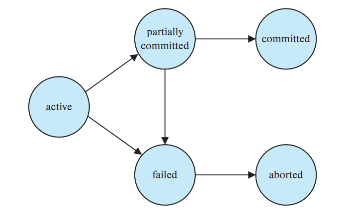

# Transactions

## Transactions

A **transaction（事务）** is a *unit* of program execution that accesses and possibly updates various items.

- A transaction can consist of multiple steps, delimited by statements such as `BEGIN TRANSACTION` and `END TRANSACTION`.
  - The collection of steps must appear to the user as a single, indivisible unit.

### ACID Constraints

> Atomicity, Consistency, Isolation, Durability

#### Atomicity（原子性）

- **"All-or-none".** Either all operations of the transaction are reflected properly in the database, or none are.
  - Could be challenging as some changes to the database might be stored in the main memory, while others might have been written to the disk.

#### Consistency（一致性）

- **"Correctness".** Execution of a transaction in isolation (i.e., with no other transaction executing concurrently) preserves the consistency of the database.

#### Isolation（隔离性）

- **"As if alone".** Each transaction must be unaware of other concurrently executing transactions.

#### Durability（耐故障性）

- **"Recoverable".** After a transaction completes successfully, the changes it has made to the database should persist, even if there are (other) system failures.
  - A transaction's actions must persist across crashes.

### Storage Structure

- **Volatile Storage.** Information residing in volatile storage *usually does not survive system crashes*.
  - e.g., main memory, cache
  - high access speed, low storage space
- **Non-Volatile Storage.** Information residing in non-volatile storage *survives system crashes.*
  - Typically slower than volatile storage, particularly for random access.
- **Stable Storage.** *Does not exist.* Information residing in stable storage *never losts*.
  - Can be approximated by techniques that make data losses extremely unlikely (e.g., multiple copies).

### States of a Transaction

#### Abort and Commit

- A transaction is **aborted** if it fails to complete its execution successfully.
  - An aborted transaction *must have no effect* on the state of the database.
  - Any changes made by the aborted transaction must be *undone*.
  - Once the changes have been undone, the transaction is said to be **rolled back**.
- A transaction completes its execution successfully is said to be **committed**.
  - A commited transaction updates the database into a new state, which must persist across system failures.
  - The effect of a completed transaction cannot be undone by aborting it.
    - Can only be undone by executing a **compensating transaction**. The user of DBMS is responsible for implementing the compensating transaction.

#### List of Transaction States

- **Active.** The initial state; The transaction stays in this state while it is executing.
- **Partially Committed.** After the final statement has been executed.
- **Failed.**  After the discovery that normal execution can no longer proceed
- **Aborted.** After the transaction has been rolled back and the database has been restored to its state prior to the start of the transaction
- **Committed.** After successful completion.

**Note.** Any uncommitted transactions could potentially fail (even those that have executed the last statement).

##### Observable External Writes

Observable external writes should be handled carefully (e.g., write on screen, send emails, etc.).

> *"转账还没做完就报喜“转账成功”，然后停电了。"*

- They cannot be erased as they might have been seen external to the DBMS.
- Most DBMS only allows external write after the transaction commits.
  - Store the writes in the DBMS temporarily and perform write after the database enters commited state.

### Transaction Isolation

Transaction processing systems usually allow multiple transactions to run concurrently.

- It is far easier to run the transactions *serially*, but concurrent transactions have two benefits.
  - **Improved throughput and resource utilization.** Exploit parallelism of CPU and I/O to run more transactions in a given amount of time and decrease the idle time for CPU and I/O devices.
  - **Reduced waiting time.** A short transaction does not need to wait for a long transaction to complete.
    - Reduces **average response time** (the average time for a transaction to be completed after it has been submitted).

Several transactions running concurrently might violate the isolation property.

- Even if all transactions are correct on their own, concurrently running multiple transactions might still destroy the consistency of the database.
- The DBMS controls the interactions among concurrent transactions to prevent the consistency from destroyed.

### Schedules

A **schedule** represents the chronological order in which instructions are executed in the system.

- A schedule for a set of transactions must
  1. consist of all instructions of those transactions
  2. preserve the order in which the instructions appear in each individual transaction

#### Serial Schedules

In a **serial schedule**, instructions belonging to a single transaction appear together in the schedule

- A *serial schedule* executes transactions sequentially
- For a schedule containing $n$ transactions, there are $n!$ valid serial schedules
  - Different order of transactions might yield different results, but all maintain the consistency of the database.

#### Concurrent Schedules

- Interleaving allows maximizing concurrency, but may lead to results inconsistent with those of sequential execution if a bad interleaving schedule is applied
  - A good schedule requires that the effect must be *equivalent to the transactions running serially in some order*

### Serializability

- A schedule is **serializable** if it is equivalent to some serial execution of the transactions
- If each transaction preserves consistency, then every serializable schedule perserves consistency

#### Conflicts of Transactions

Two operations of two *different transactions* **conflict** if they

1. access the same object and
2. at least one of them is a write

- **Read-Write Conflicts.** A transaction reads the value of the same object twice. Another transaction modifies the value between the two reads.
  - *Unrepeatable Read.* The order of $I$ and $J$ affects the result of the read.
- **Write-Read Conflict.** A transaction reads a value written by another transaction that has not yet committed.
  - *Dirty Read.* The order of $I$ and $J$ affects the result of the read.
- **Write-Write Conflict.** Two transactions write the same object, the second write overwriting the first change. The order of $I$ and $J$ affects any further read on the item, as well as the final value of the item.
- **Read-Read.** *No conflict.*
