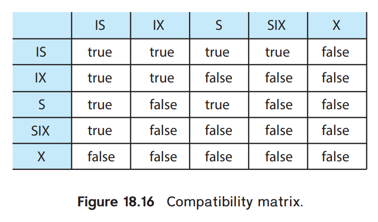

# Concurrency Control

- Multiple concurrent transactions might break the consistency of a database.
- The system thus must control the interactions among concurrent transactions.
- The most frequently used schemes are *two-phase locking* and *snapshot isolation*.

## Lock-Based Protocols

- Require data items to be accessed in a *mutually exclusive* manner.
  - When a transaction is accessing an item, no other transaction can modify that item.
- **Lock.** Allow a transaction to access an data item only if the transaction is holding a **lock** on that item.

### Locks

- Two types of locks.
  - **Shared Lock (S).** If a transaction $T$ holds a **shared-mode lock** on item $Q$, $T$ can read, but cannot write, $Q$.
  - **Exclusive Lock (X).** If a transction $T$ holds an **exclusive-mode lock** on item $Q$, $T$ can both read and write $Q$.
- Every transaction is required to **request** a lock (in an appropriate mode) on data $Q$; it can proceed only after the concurrency-control manager **grants** the lock to it.

#### Compatibility of Locks

| Mode  |   S   |   X   |
| :---: | :---: | :---: |
|   S   | true  | false |
|   X   | false | false |

- Mode A is **compatible** with mode B if transaction $T$ can be immediately granted a mode-A lock in the presence of a mode-B lock.
- If the data item is locked in an incompatible mode, the concurrency-control manager will not grant the lock until all locks in incompatible mode have been released.

!!!note Waiting for Locks
    To access a data item, the transaction must hold the lock on that item. The lock is only granted if all incompatible locks held by other transactions are released.

    Otherwise, the transaction has to wait until it acquires the lock (i.e. wait until all incompatible locks are released)

!!!info Releasing Locks
    *It is not always desirable to immediately release the lock after a transaction's final access to the item, because this may lead to inconsitencies in some schedules.*

    “在你放锁的时候，可能发生很多事情。”

#### Deadlocks

- A **deadlock** occurs when a cycle of transactions wait for locks to be released by each other.
  - *“拿着锁等锁”*
- When a deadlock occurs, the system must roll back one (or more) transactions and release their locks.

### Locking Protocol

- A set of rules indicating when a transaction might lock and unlock each of the data items.

#### Terminologies

- Transaction $T_i$ **precedes** $T_j$ ($T_i \to T_j$) if there exists a data item $Q$ s.t. $T_i$ has held a lock $A$ on $Q$ and $T_j$ has held lock $B$ on $Q$, and $\mathtt{comp}(A, B) = \texttt{false}$.
- A schedule $S$ is **legal** under a given locking protocol if $S$ is a possible schedule for a set of transactions that follows the rules of the locking protocol.
- A locking protocol **ensures conflict serializability** if and only if all legal schedules are conflict serializable.
- A transaction is said to be **starved** if it keeps waiting for a lock without any progress.

#### Two-Phase Locking Protocol (2PL)

- **2PL** ensures conflict serializability.
- The protocol requires that each transaction issue lock and unlock requests in *two phases*
  1. **Growing Phase.** A transaction may obtain locks, but may not release any lock.
  2. **Shrinking Phase.** A transaction may release locks, but may not obtain any new locks.
- 2PL does NOT avoid deadlocks.
- 2PL does NOT avoid cascading rollbacks.

##### Lock Point

The point in the schedule where the transaction has obtained *its final lock* (the end of its growing phase) is called the **lock point** of the transaction.

- Transactions can be ordered according to their lock points.
- The ordering is a serializability ordering for the transactions.

> *事务：“我要读 $Q$！”*
> *系统：“不行。你去死。”*

##### Variants of 2PL

- **Strict 2PL (严格两阶段锁).**
  - Requires that all exclusive locks must be held until the transaction commits.
  - Avoids cascading rollbacks.
- **Rigorous 2PL (强两阶段锁).**
  - Requires that all locks must be held until the transaction commits.
  - With rigorous 2PL, transactions can be serialized in the order in which they commit.

##### Lock Conversions

- **Upgrade.** Conversion from shared to exclusive modes.
- **Downgrade.** Conversion from exclusive to shared modes.
- **2PL with Lock Conversion.**
  - In growing phase, transactions can acquire or upgrade locks.
  - In shrinking phase, transactions can release or downgrade locks.

Lock conversions allows better concurrency, and it also guarantees conflict serializability.

!!! note 2PL and Conflict Serializability
    There may be other conflict-serializable schedules that *cannot be obtained by 2PL*.

    - Obtaining other conflict-serializable schedules requires additional information, or specific structure or ordering of the database.
    - 2PL always produces conflict-serializable schedules.

### Implementation of Locking

Lock and unlock requests are handled by the lock manager. It maintains a **lock table**: a hash table over the lock entries, it maps locks to their entry queues.

#### Lock Table

- Essentially a hash table `Map<DataItem, LockEntryQueue>`
  - `DataItem` are the data items in the database.
  - `LockEntryQueue` is a linked list of transactions that have made request on the lock.
- On a lock request, the transaction is added to the entry queue.
  - Grants the lock if the item is not currently locked, or if the locks are compatible with the requested lock.
- On an unlock request, the first transaction in the queue is re-activated
- The lock table may also keep a list of locks held by each transaction
  - when a transaction aborts, the locks held by this transaction can be released efficiently

### Graph-based Locking Protocols

Assumes there exists a *partial ordering* $\to$ on the dataset $D = \{ d_1,\dots,d_h \}$ such that if $ d_i \to d_j $ then any transaction accessing $d_j$ must first access $d_i$.

#### Database Graph

**Database Graph.** The partial ordering implies that the dataset could be viewed as a *directed acyclic graph*.

#### Tree Protocol

- Designed for graphs that are *rooted trees.*
- Restricted to employ only exclusive locks.
  1. The first lock by $T_i$ may be on any item.
  2. Subsequently, a data item $Q$ can be locked by $T_i$ only if the parent of $Q$ is currently locked by $T_i$.
  3. Data items may be unlocked at any time.
  4. A data item that has been locked and unlocked by $T_i$ cannot be subsequently relocked by $T_i$.
- All legal schedules under the tree protocol are conflict serializable.

!!! info Remarks on Tree Protocol
    - Conflict Serializable.
    - Avoids deadlocks.
    - Better concurrency (compared with 2PL) because locks can be released any time.
    - In some cases, a transaction may have to lock items it does not access.
    - There may be conflict-serializable schedules that cannot obtained through the tree-protocol.

### Deadlock Handling

The remedy to deadlock is to roll back some of the transactions involved in the deadlock.

- Two principal methods for deadlock handling
  - **Deadlock Prevention.** Ensure the system will *never* enter a deadlock state.
  - **Deadlock Detection and Deadlock Recovery.** Allow the system to enter a deadlock state and try to recover from it.

#### Deadlock Prevention

##### Naive Prevention Scheme

Requires that each transaction locks all its data items before it begins execution.

Impose all ordering / Tree Protocol / All-or-None

- It is often hard to predict what items need to be locked before the transaction begins.
- Data utilization may be very low.

##### Preemptive Deadlock Prevention

- **Wait-Die.**
- **Wound-Wait.**

##### Lock Timeouts

#### Deadlock Detection and Recovery

##### Wait-for Graph

- **Wait-for Graph.** $G=(V,E)$
  - Vertices $V$ represents all transactions in the system
  - Edges $E$ is an ordered pair $T_i \to T_j$
    - $T_i \to T_j$ means $T_i$ is waiting for a lock held by $T_j$
- A deadlock exists if and only if the wait-for graph *contains a cycle*.
  - Each transaction in the cycle is said to be deadlocked.
- A function is periodically invoked to check for cycles in the graph.

### Multiple Lock Granularity

Allows the system to define multiple levels of locking granularity to improve concurrency.

- The lock can be placed on a tuple, a page, a table or the entire database
- Tradeoff between overhead and concurrency
  - Finer granularity: high concurrency, high locking overhead (both time and space cost)
  - Coarser granularity: low locking overhead, low concurrency
- The database hierarchy can be represented as a tree
  - When a transaction locks a node in the tree explicitly, all child nodes are also implicitly locked
  - However, a lock at lower level also affects locking the parent nodes
  - Cannot find conflict unless we traverse the entire tree, which is not efficient.
    - A more sophisticated locking mode is required

### Intention Locks

If a node is locked in an intention mode, it means some *explicit locking is done at a lower level (finer granularity)* of the tree.

- Intention locks are put on all ancestors of a node before that node is locked explicitly.
  - When locking a node, the transaction must traverse from the root to the node, during which the nodes on the path could be locked in intention mode.

#### Types of Intention Locks

- **Intention Shared (IS).** Explicit shared-mode locks are done at lower level.
- **Intention Exclusive (IX).** Explicit exclusive- or shared- mode locks are done at lower level.
- **Shared and Intention Exclusive (SIX).** The subtree rooted at the target node is explicitly shared-locked, and explicit exclusive-locks are done at lower level.
  - e.g., finding and updating a tuple in a table

#### Compatibility Matrix for Intention Locks

#### Multi-Granularity Locking Protocol

- $T$ must observe the compatibility matrix
- $T$ must lock the root of the tree first before it can lock other nodes
- $T$ can lock a node $Q$ in S or IS mode only if $T$ has the parent of $Q$ locked in either IX or IS mode.
- $T$ can lock a node $Q$ in X, SIX or IX mode only if $T$ has the parent of $Q$ locked in either IX or SIX mode.
- $T$ can lock a node only if $T$ has not previously unlocked any node (i.e., two-phase locking)
- $T$ can unlock a node $Q$ only if $T$ has none of the children of $Q$ locked

##### Remarks

- Locks are acquired in top-down order, and released in bottom-up order
- Ensures serializability, but does not avoid deadlocks
- Enhances concurrency and reduces lock overhead
- Particularly useful when the applications involve a mix of
  - Short transactions that access only a few data items
  - Long transactions that produce reports from an entire file or set of files

### Insert, Delete and Predicate Read

## Timestamp-based Protocols

- Lock-based protocol determines the order between conflict transactions by the order of acquiring locks
- Another method is to select an ordering among transactions *in advance*, e.g., **timestamp-ordering scheme**

### TImestamps

- With each transaction $T_i$, we associate a unique fixed timestamp $TS(T_i)$.
- If $T_i$ has timestamp $TS(T_i)$, and a new transaction $T_j$ enters the system, then $TS(T_i) < TS(T_j)$
  - Could be the value of the *system clock*
  - Or a *logical counter* that is incremented after a new timestamp has been assigned
- The timestamps of transactions determines the serializability order
  - If $TS(T_i) < TS(T_j)$, then $T_i$ should appear before $T_j$ in the equivalent serial schedule.
- For each data item $Q$, we associate with each data item $Q$ two timestamps
  - $WTimestamp(Q)$. Denotes the largest timestamp of any transaction that executed `write(Q)` successfully. 
  - $RTimestamp(Q)$. Denotes the largest timestamp of any transaction that executed `read(Q)` successfully.

#### The Timestamp-Ordering Protocol

> “孔夫子在读历史，他一看，吔，怎么是司马迁写的。”
> “我们只能对他说：对不起，你重新投胎吧。”
> “重新投胎就变成后人啦。”

- Suppose $T_i$ issues `read(Q)`.
  - **($T_i$ 读了后人写过的值).** If $TS(T_i) < WTimestamp(Q)$, then $T_i$ is reading a value of $Q$ that was already overwritten (by some new transactions). Therefore the read is rejected, and $T_i$ is rolled back.
  - If $TS(T_i) \ge WTimestamp(Q)$, then the `read` is executed, and $RTimestamp(Q) \coloneqq \max(RTimestamp(Q), TS(T_i))$.
- Suppose $T_i$ issues `write(Q)`.
  - **($T_i$ 写了后人读过的值).** If $TS(T_i) < RTimestamp(Q)$, then $T_i$ is producing a value that was previously needed (by some new transactions). Therefore the `write` is rejected and $T_i$ is rolled back.
  - **($T_i$ 写了后人写过的值).** If $TS(T_i) < WTimestamp(Q)$, then $T_i$ is writing an obsolete value. Hence, the `write` is rejected and $T_i$ is rolled back.
  - Otherwise, the `write` is executed and $WTimestamp(Q) \coloneqq TS(T_i) $

#### Properties

1. Ensures conflict serializability.
   - Edges in the precedence graph points from old transactions to new transactions.
   - There would be no loops.
2. Ensures freedom from deadlock, since no transaction ever waits.
   - However, there could be starvations where a long transaction had multiple conflicts with a sequence of short transactions.
3. There are schedules that are possible under 2PL but not possible under timestamp-ordering, and vice versa.

#### Recoverability and Cascasedless Rollback

- Timestamp-ording protocol can generate schedules that are not recoverable.
  - e.g., if $T_i$ aborted, but $T_j$ has read $Q$ written by $T_i$, then $T_j$ must also abort
  - Any transactions reading items written by $T_j$ must also abort (cascading rollback)
  - If $T_j$ has commited, then the schedule is not recoverable.
- Fixes
  - Recoverability and cascadelessness can be guaranteed by performing all writes together at the end of the transaction (in atomic manner)
  - Recoverability and cascadelessness can also be guaranteed by using a limited form of locking: reading of uncommitted items are postponed until the transaction that performed the update has committed.
  - Recoverability alone can be ensured by tracking uncommitted writes and allowint $T_i$ to commit only after all transactions that wrote the values $T_i$ read commits.

#### Thomas' Write Rule

- Under certain cases, obsolete writes could be omitted, instead of rolling back the transaction.

1. If $TS(T_i) < RTimestamp(Q)$, roll back $T_i$.
2. If $TS(T_i) < WTimestamp(Q)$, the write can be ignored.
3. Otherwise, perform `write` and $WTimestamp(Q) \coloneqq TS(T_i)$.

Thomas' Write Rule allows schedules that are *not conflict serializable, but are nevertheless correct*. Such schedules are **view serializable**.

##### View Serializability

Two schedules $S$ and $S'$ are said to be **view equivalent** if

1. **(初值由同一个 $T$ 读).** For each data item $Q$, if $T_i$ reads the initial value of $Q$ in $S'$, then $T_i$ must also read the initial value of $Q$ in $S'$.
2. **(最终值由同一个 $T$ 更新).** For each data item $Q$, the transaction that performs the final `write(Q)` in $S$ must also perform the final `write(Q)` in $S'$.
3. **(中间的数据变化一致).** For each data item $Q$, if $T_i$ reads the value of $Q$ produced by $T_j$ in $S$, then $T_i$ must also read the value produced by the same `write(Q)` of $T_j$ in $S'$.

- A transaction is **view serializable** if it is view equivalent to some serial schedule.
- Every conflict serializable schedule is also view serializable, but not vice versa.

## Validation-based Protocol

Also known as the **Optimistic Concurrency Control (OCC)** scheme since transactions are executed optimisitically and assumed to be able to finish execution and validate at the end.

- Suitable in cases where the majority are read-only transactions (low conflict rate).
  - Most of the transactions would not break the consistency.

The **validation protocol** requires that each transaction $T_i$ executes in three phases

1. **Read Phase.** The system executes $T_i$. All `write` operations are performed on local temporary variables, without updating the actual database.
2. **Validation Phase.** The sytem performs a **validation test** on $T_i$ to check whether $T_i$ violates serializability. If $T_i$ fails the validation test, it is aborted.
3. **Write Phase.** If $T_i$ passes the check, the local variables are updated to the database. Read-only transactions omit this phase.

Note that phases of concurrent transactions could be interleaved.

### Validation Test

Each transaction $T$ is associated with 3 timestamps

- $StartTS(T)$. The time when $T$ started its execution
- $ValidationTS(T)$. The time when $T_i$ finishes its read phase and enters its validation phase.
- $FinishTS(T)$ The time when $T$ finishes its write phase.

The system uses the timestamp of $ValidationTS(T)$, i.e., $TS(T) = ValidationTS(T)$.

The validation test for $T_i$ requires that for all $T_k$ with $TS(T_k) < TS(T_i)$

1. $FinishTS(T_k) < StartTS(T_i)$. $T_k$ finishes before $T_i$ started, which maintains serializability.
2. $StartTS(T_i) < FinishTS(T_k) < ValidationTS(T_i)$. The set of data items written by $T_k$ does not intersect with the set of items read by $T_i$. This condition ensures the writes of $T_i$ and $T_k$ does not affect each other.

#### Properties

- Prevents cascade rollback. Write ops are isolated in local variables; all actual writes happen after the transactions commit.
- Could have starvation of long transactions. A sequence of conflicting short transactions might cause repeated restarts.

## Multiversion Schemes

> Keeps old versions of a data item in the system.

- In **multiversion concurrency control schemes**, each `write(Q)` creates a new **version** of $Q$.
- When a transaction issues a `read`, the system selects one of the versions to be read.

### Multiversion Timestamp Ordering

- Each data item $Q$ is associated with a sequence of versions $[Q_1,\dots,Q_m]$.
- For each verison $Q_k$, it contains 3 fields
  1. **Content.** Value of $Q$.
  2. **W-Timestamp($Q_k$).** The timestamp of the transaction that created version $Q_k$.
  3. **R-Timestamp($Q_k$).** The latest timestamp of any transaction that successfully read $Q_k$.
- If a transaction $T_i$ writes $Q$, it creates a new version of $Q$. W-/R-Timestamp($Q$) are set to the timestamp of $T_i$.
- If a transaction $T_i$ reads $Q$ and R-Timestamp($Q$) $< TS(T_i)$, then the R-Timestamp is updated accordingly

#### Multiversion Timestamp Ordering Scheme

- Let $Q_k$ be the largest version of $Q$ s.t. W-Timestamp($Q$) $\le TS(T_i)$.
- If $T_i$ reads $Q$, returns $Q_k$
- If $T_i$ writes $Q$
  - If $TS(T_i) < RTimestamp(Q_k)$, then $T_i$ is rolled back (because a later read has already occurred)
  - If $TS(T_i) = WTimestamp(Q_k)$ then overwrite the value of $Q_k$
  - If $TS(T_i) > WTimestamp(Q_k)$ then a new version of $Q$ is created

#### Properties

- **Valid Interval** of a version $Q_i$.
  - If $Q_i$ is the latest version, then $[t, \infty]$.
  - Otherwise $[t, s)$, where $s$ is the W-Timestamp of $Q_{i+1}$.
- If a read of $T$ returns $Q_i$, then $TS(T) \in ValidInterval(Q_i)$
- Values that are no longer needed are removed
  - If $WTimestamp(Q_j) < WTimestamp(Q_k) < TS(T_{oldest})$, then $Q_j$ could be deleted
- Pros.
  - Read operations never fails and never waits
- Cons.
  - Read requires two disk IOs (to update R-Timestamp)
  - Conflicts are resolved by rolling back, which can be expsensive
- Ensures serializability. Does not ensure recoverability or cascadelessness.

### Multiversion 2PL

- This protocols differentiates between **read-only transactions** and **update transactions**.
- Update transactions follow *rigorous 2PL protocol*.
- Each data item holds a timestamp (based on a logic counter) that updates during commit processing.
- For a read-only transaction
  - The timestamp of a read-only transaction is the value of $TSCounter$ before the read-only transaction starts.
  - Read-only transactions follow the protocol in multiversion timestamp ordering: read values of the latest version s.t. version timestamp is less than or equal to its timestamp.
- For an update transaction
  - If it reads an item, it gets a shared lock and reads the latest version
  - If it writes an item, it gets an exclusive lock and create a new version, whose timestamp is temporarily set to $\infty$ (because the transaction has not yet committed).
    - When it commits, it first sets the timestamp of every version it has created to $TSCounter + 1$; then increments $TSCounter$, then commits.
    - At most one transaction is allowed to commit at a time.

#### Properties

- Read-only transactions see the old ts-counter until $T_i$ has successfully committed.
- Read-only transactions never waits
- Ensures recoverability and cascadelessness
- To remove unused versions, remove the oldest version that will not be read by even the oldest transaction.

### Snapshot Isolation

- A transaction is given a **snapshot** of the database at the time it starts execution.
- It then operates on the snapshot in complete isolation from concurrent transcations.
  - The data values in the snapshot consist only of values written by committed transactions
- Read-only transactions never wait and are never aborted
- Updates performed by a transaction must be validated before the transaction is allowed to commit
  - Updates are kept in the transaction’s private workspace until the transaction is validated
- Transition of $T$ to committed state and updating the database must be done as (conceptually) an atomic action.
  - I.e., any snapshot created for another transaction either contains all updates or none of them.

#### Multiversion in Snapshot Isolation

- Transactions are given two timestamps.
  - $StartTS(T_i)$. The time when $T_i$ starts.
  - $CommitTS(T_i)$. The time when $T_i$ requests validation.
- Versions of data items only have one write timestamp.
  - The timestamp of the version created by $T_i$ is set to $CommitTS(T_i)$.
- When $T_i$ reads a data item, the latest version whose timestamp $\le StartTS(T_i)$ is returned.
  - $T_i$ cannot see the updates of any transactions that committed after it started.

#### Validation Steps for Update Transactions

- **Lost Update.** When two update transactions update the same data item, one of the updates will be overwritten.
- Two transactions $T_i$ and $T_j$ are concurrent if
  - $StartTS(T_j) \le StartTS(T_i) \le CommitTS(T_j)$
  - or $StartTS(T_i) \le StartTS(T_j) \le CommitTS(T_i)$

##### First Committer Wins

- Check if any transaction that was concurrent with $T$ has already written an update to the database for some $Q$ that $T$ indends to write
  - By checking if there is a version whose timestamp is between $StartTS(T_i)$ and $CommitTS(T_i)$
- If exists, $T$ aborts
- Otherwise $T$ can perform the upate

##### First Updater Wins

- Uses a locking mechanism on update transactions.
- When $T$ attempts to update an item, it first requests a write lock.
  - If the lock is not held by a concurrent transaction
    - If the item has been updated by any concurrent transaction, then $T_i$ aborts
    - Otherwise $T_i$ could perform the update
  - If a concurrent $T_j$ is holding the lock
    - $T_i$ waits until $T_j$ aborts or commits.
    - If $T_j$ aborts, then $T_i$ acquires the lock and perform previous check.
    - If $T_j$ commits, then $T_i$ must abort.

#### Problems of Snapshot Isolation

- Pro.
  - Long read-only transactions does not interfere with short update transactions.
- Cons.
  1. Cannot check the integrity constraints on the database
     - e.g., two students are assigned the same student ID, violating primary key constraints
     - Solution. Also perform integrity check during validation.
  2. Does not ensure serializability.
     - **Write Skew.** Two transactions read a data item that is written by each other, but the set of data items written by them do not overlap.

Serializability issues are relatively rare

1. Checking integrity constraints on the database helps avoid inconsistencies in many situations.
2. Two transactions having skew writes might have conflicts on other data items and cannot be executed concurrently.

- The impact of nonserializable execution is not very severe for many applications.
- Allowing long read transactions to execute without blocking update transactions is a large enough benefits for many applications to live with occasional glitches.
- There are also several possible solutions.
  - **Serializable Snapshot Isolation (SSI).** The key reason for nonserializability with snapshot isolation is read-write conflicts.
    - Tracks all read-write conflicts between concurrent transactions.
    - It can be proved that in nonserializable cases there must be a transaction that has both an incoming and outgoing read-write conflict edge.
    - If a transaction has both an incoming and an outgoing read-write conflict edge ($T_1 \to T \to T_2$), then one of the three transactions is rolled back.
