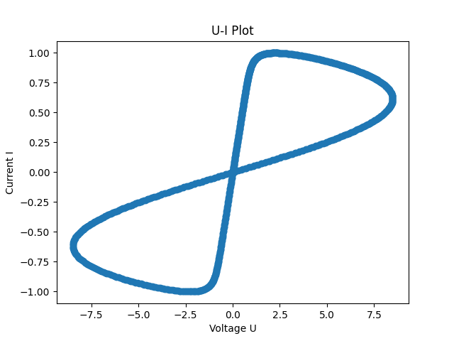

# 忆阻器简介

> SNN 主要解决仿真过程中的算法问题。忆阻器用于解决 SNN 部署时的算力问题

## 忆阻器的基本概念

- 存储墙
  - 冯诺依曼架构下，计算过程中需要将数据从内存通过数据总线搬移到计算单元
  - 耗时
  - 忆阻器用于缓解存储强问题

### 电路回顾

- 理想基本电路元件
  - 二端元件
    - 可以通过电压和电流按数学方式描述
    - 不能被分解为其他元件
- 理想基本电路元件
  - 电阻、电容、电感（无源）
  - 电压源、电流源（有源）
- 有源/无源 按其是否产生电能区分
- 理想电压源
  - 假设输出电压恒定
  - 假设无内阻

### 基本电路元件的数学模型

#### 电阻

$$ \mathrm{d}V = R\mathrm{d}i $$

#### 电容

$$ \mathrm{d}q = C\mathrm{d}V $$

#### 电感

$$ \mathrm{d}\Phi = L\mathrm{d}i $$

#### 忆阻器 Memristor

$$ \mathrm{d}\phi = M\mathrm{d}q $$

### 忆阻器的理论推导

#### 形式一（电荷控制型）

类比 $U, I$ 有 $U(t) - RI(t) = 0$，
假设 $\phi, q, t$ 满足某个 $f(\phi, q, t) = 0$，且存在某个解 $\phi = \hat{\phi}(q, t)$。

进一步假设上述函数分段连续、斜率有界，则可定义 $ \mathrm{d}\phi = M(q(t))\mathrm{d}q $

代入 $\mathrm{d}\phi = v(t)\mathrm{d}t$ 与 $\mathrm{d}q = i(t)\mathrm{d}t$ 则

$$ v(t) = M(q(t))i(t) $$

- 量纲与电阻一致，但是其“电阻”值与电荷有关，具有记忆功能

#### 形式二（磁通控制型）

假设解的形式为 $q = \hat{q}(\phi, t)$，类似地有 $ \mathrm{d}q = W(\phi(t))\mathrm{d}\phi $

$W$ 表示忆导值

$$ i(t) = W(\phi(t))v(t) $$

- 量纲为电导，但是值与通过地磁通量相关，同样具有记忆功能

### 忆阻器特性

- 非线性电阻。器件电阻值能随输入电流或电压的 *历史* (电荷/磁通量) 而发生变化

### 忆阻器与存算一体计算

$$ v(t) = M(q(t)) \cdot i(t) $$

使用 $M(q(t))$ 用于存储，以电流为输入、电压为输出，即可实现存算一体的乘法计算

### 其他

一个本征关系为 $\phi(q) = q + \frac{1}{4}q^5$ 的忆阻器的李萨如图

- 忆阻器的记忆功能主要有其本征关系曲线的高次项决定
- 忆阻器的李萨如图 (U-I Plot) 的某个区间可能表现出类似电阻的性质 (U-I 曲线近似为直线)
  - 在忆阻器被充电的过程中，其电阻会发生急剧变化 (相变区)
  - 由于实际使用时需要使用忆阻器存储参数，忆阻器的线性区的范围越大越好
    - 这里的 **线性区** 不是指 UI 曲线的线性区（否则就是电阻了），而是 “可以尽可能均匀地调整忆阻器阻值的区域”

### 广义忆阻器理论

广义忆阻系统满足如下关系

$$ \dot{x} = f(x, p(t), t), \quad \dot{x} = \mathrm{d}x / \mathrm{d}t $$

$$ y(t) = g(x, p(t), t) \cdot p(t) $$

- $p(t)$ 为输入信号
- $y(t)$ 为输出信号
- $g(t)$ 为记忆模块

- 广义忆阻器的忆阻值由其系统的内部状态变量 $x$ 决定，不再仅受 $q$ 的限制
- 电荷控制型忆阻器是广义忆阻器的特例之一，要求 $f$ 等于 $i(t)$ 或与 $i(t)$ 成比例
  - 因为 $x = q$ 要求 $\dot{x} = i$

得到 李萨如图 后，可以使用泰勒展开反推得到本征关系函数 (?)

#### 广义忆阻器的存在性

- 在二元氧化物、复杂钙钛矿氧化物、固态电解质材料、非晶碳材料、有机高分子材料等材料中都存在捏滞回线的特征
- 二端器件只要能产生捏滞回线就可以认为是忆阻器

##### 判断依据

1. 双极性周期电信号的激励下，器件在 VI 平面的电特性为一个捏滞回线
2. 电信号扫描频率增大时，回线波瓣面积减小
3. 扫描频率趋近无穷大时，回线收缩为一条单值函数 (忆阻特性随频率增加而减弱)

- 如果不要求二端器件，而放宽到三端器件，则 MOSFET 及其衍生也可以实现类似功能
  - “用造U盘的技术造一个忆阻器芯片”
  - 工业界使用三端器件实现忆阻器的工艺相对更加成熟
  - 但是学术界更多研究的是二端器件
    - 但是的但是，二端器件能进一步提升芯片的集成度
    - ~~“打败NVIDIA”~~

### 忆阻器分类

|      分类      |              电流控制型               |               电阻控制型               |
| :------------: | :-----------------------------------: | :------------------------------------: |
|   通用忆阻器   | $v(t) = R(x)i(t)$ $\dot{x} = f(x, i)$ | $i(t) = G(x)v(t)$ $\dot{x} = g(x, v)$  |
| 理想通用忆阻器 |  $v(t) = R(x)i(t)$ $\dot{x} = f(x)i$  |  $i(t) = G(x)v(t)$ $\dot{x} = g(x)v$   |
|   理想忆阻器   |    $v(t) = R(q)i(t)$ $\dot{q} = i$    | $i(t) = G(\phi) v(T)$ $\dot{\phi} = v$ |

## 忆阻器的物理实现

一般而言，无源忆阻器时金属-绝缘层-金属 (Metal-Insulator-Metal MIM) 的单元结构

- 容易扩展为三端、四端器件
- 也便于通过十字交叉阵列 (crossbar) 结构实现大规模集成

### Crossbar

- 由一排横向和一排纵向的电线组成的网络
  - 横向和纵向的电线之间不连通
  - 通过选通器选择某一行、某一列的忆阻器单元
    - 然后可以写入规定的阻值 (称为 Programming)
- 如果在列方向输入电流，以行方向为输出，则可以使用 crossbar 实现矩阵-向量乘法

## 忆阻器神经网络

### Crossbar-1T1R

> 1 Transistor 1 Memristor

- 列向量（输入）：电压
- 权重矩阵：忆阻
- 行向量（输出）：电流
- 使用两组 Crossbar 分别处理正/负权重
  - 然后使用运放进行比较运算实现正负权重结果的汇总
  - 通常激活函数选用 ReLU 避免处理输入信号为负的情况

$$ I = (G_{pos} - G_{neg}) V $$

#### 部署过程

1. 计算机训练深度神经网络
   - 压缩、剪枝、权重量化
2. 对 Crossbar 编程
   - 选中对应的忆阻器，改变其阻值达到指定数值
3. 部署推理
   - 输入信号量化 -> 输入电路 -> 输出电流

#### 噪声

- 深度神经网络的量化噪声
- 充电时的测量噪声
- 推理时输入信号的量化噪声、输出电流的噪声
- 经验公式
  - $ \theta \sim \theta_0 \cdot \exp^{N(0, \sigma^2)} $