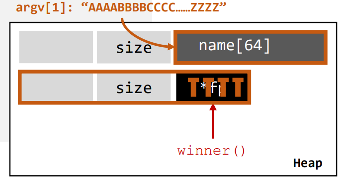

# 堆

- 堆从低地址向高地址扩张。
- 进程可以动态地请求一定大小的内存，并在用完之后归还给堆区。
  - 动态分配和回收，利用指针引用动态分配地内存。
  - 全局性，只要是用户空间内的指令，都能进行堆内存的分配。

## 堆溢出

```cpp
// protostar heap1
struct data {
    char name[64];
};

struct fp {
    int (*fp)();
};

void winner() {
    printf("level passed\n");
}

void nowinner() {
    printf("level has not been passed\n");
}

int main(int argc, char **argv)
{
    struct data *d;
    struct fp *f;

    d = malloc(sizeof(struct data));
    f = malloc(sizeof(struct fp));
    f->fp = nowinner;

    printf("data is at %p, fp is at %p\n", d, f);
    strcpy(d->name, argv[1]);
    f->fp();
}
```


