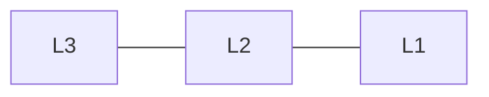

# Image Formation

> 事实：计算机视觉的拼音首字母是 JSJSJ。

## Imaging

- Projection of 3D scene onto 2D plane.

### Pinhole Imaging

- Object: $(x_o,y_o,z_o)$
- Image: $(x_i,y_i,f)$
  - $f$: Effective Focal Length

$$ \frac{x_i}{f} = \frac{x_o}{z_o} $$

$$ \frac{y_i}{f} = \frac{y_o}{z_o} $$

#### Image Magnification

> 鸽子为什么这么大

- Image plane
  - $A_i:(x_i,y_i)$
  - $B_i:(x_i+\delta x_i, y_i + \delta y_i)$
- Planar plane
  - $A_o:(x_o,y_o,z_o)$
  - $B_o:(x_o + \delta x_o, y_o + \delta y_o, z_o)$
- Magnification
  - $|m| = \frac{\|d_i\|}{\|d_o\|}=\frac{\sqrt{\delta x_i^2+ \delta y_i^2}}{\sqrt{\delta x_o^2 + \delta y_o^2}}$
- From pinhole imaging
  - $\frac{\delta x_i}{f}=\frac{\delta x_o}{z_o}$
  - $\frac{\delta y_i}{f}=\frac{\delta y_o}{z_o}$

Therefore

$$ m = \frac{f}{z_o} $$

- Image size is **inversely propertional** to depth $z_o$.
- Note that $m$ can be assumed to be **constant** if the range of scene depth $\Delta z_o$ is much smaller than the average scene depth $\tilde{z_o}$

#### Vanishing Point

- Parallel straight lines converge at a single image point
- Location of vanishing point depends on the orientation of parallel straight lines

##### Locating Vanishing Points

Let

- $O(0,0,0)$ be the pinhole
- $X(x_o,y_o,z_o)$ and $Y(x_o',y_o',z_o')$ be two points on two parallel lines with orientation vector $(l_x,l_y,l_z)$.

We can write the two straight lines as

$$\begin{cases}
    x &= x_o + l_xt\\
    y &= y_o + l_yt\\
    z &= z_o + l_zt
\end{cases}
\quad
\begin{cases}
    x &= x_o' + l_xt\\
    y &= y_o' + l_yt\\
    z &= z_o' + l_zt
\end{cases}$$

When projected on the image plane, the coordinate of points can be written as

$$ x_i = f\cdot\frac{x_o+l_xt}{z_o+l_zt} \quad x_i' = f\frac{x_o'+l_xt}{z_o'+l_zt} $$

$$ y_i = f\cdot\frac{y_o+l_yt}{z_o+l_zt} \quad y_i' = f\frac{y_o'+l_yt}{z_o'+l_zt} $$

Let $t \to \infty$

$$x_{vp} = f\cdot\frac{l_x}{l_z} \quad y_{vp} = f\cdot\frac{l_y}{l_z} $$

#### Ideal Pinhole Size

- The pinhole must be **tiny**
- But if it is too small it will cause **diffraction**
- Idea diameter $d \approx 2\sqrt{f\lambda}$
  - $f$: Effective focal length
  - $\lambda$: Wavelength

#### Exposure Time

- Pinholse pass less light and hence require **increased exposure time**.
- Problem: Time too long
  - $f=73mm, d=0.2mm \Longrightarrow T=12s$

> “你给你女朋友拍张照要12秒，这可以接受吗？”

### Lens

- Same projection as pinhole, but gathers more light.

#### Gaussian Lens (Thin Lens) Law

$$ \frac{1}{i} + \frac{1}{o} = \frac{1}{f} $$

- Parameters
  - $f$: Focal length
  - $i$: Image distance
  - $o$: Object distance

#### Find the Focal Length

- Focal Length: Distance at which incoming rays that are parallel to the optical axis converge.
- If $o \to \infty$, then $f=i$.

#### Image Magnification of Lenses

$$ m = \frac{h_i}{h_o} = \frac{i}{o} $$

#### Defocus

- Blur occurs when incoming rays do not converge on the image plane.

##### Size of Blur Circle

$$ \frac{1}{i} + \frac{1}{o} = \frac{1}{f} \quad \frac{1}{i'}+\frac{1}{o'} = \frac{1}{f}$$

Let $D$ be the diameter of the lens, let $i$ and $i'$ be the ideal depth of imaging (which should be the focal length) and the actual depth of imaging. By similar triangles

$$\frac{b}{D} = \frac{|i-i'|}{i'}$$

Therefore the diameter of a blur circle $b$ is given by

$$ b = \frac{D}{i'}\cdot|i'-i| $$

Further

$$ i=\frac{of}{o-f}, \quad i'=\frac{o'f}{o'-f} $$

$$ i-i' = \frac{f}{o'-f}\cdot\frac{f}{o-f}(o-o') $$

Therefore

$$ b = D\left|\frac{f(o-o')}{o'(o-f)}\right| $$

#### Depth of Field (DoF)

- Range of object distances $(o-o')$ over which the image is *sufficiently well focused*. i.e., $\textrm{Range}(o-o')$ for which blur $b$ is less than one pixel size.

- Large Aperture
  - Bright image (Small exposure time)
  - Shallow DoF
- Small Aperture
  - Dark image (Long exposure time)
  - Wide DoF

#### $f$-number

- DoF is a function of both focus distance $f$ and aperture diameter $d$
- $f$-number $f/\# = N = f/d$
  - $f$: focal length
  - $d$: aperture diameter
- Usually written as f/#: $f/1.4$, $f/2$, ...
- Large f-number
  - Small aperture
  - Wide DoF

#### Drawbacks of Lens

##### Vignetting

- Consider a compund lens with 3 lenses with different aparture sizes.

- More light passes through L3 to points on the optical axis than other points.
- Causing a smooth fall-off in brightness from the center to corners.

##### Chromatic Aberration

- Refractive index (and hence focal length) of lens is different for rays of different wavelengths.

##### Geometric Distortion

- Due to imperfections of lens
- Radial distortion
- Tangential distortion

### Digital Camera

#### Common sensors

> 光电效应

##### Charge-Coupled Device, CCD

- Photon to electron
- Electron to voltage
- Analog to digital
- Low noise
- Moderate power cost

##### Complementary Metal Oxide Semiconductor, CMOS

- Direct conversion from photon to voltage within each pixel
- Moderate noise
- Low power cost

#### Colors

- Color: Biological response to different wavelengths
- Human sensation of nearly all colors can be produced with three wavelengths.

##### Sensing Colors

- RGB filters

$$\begin{matrix}
  R & G & R & G & R\\
  G & B & G & B & G\\
  R & G & R & G & R\\
  G & B & G & B & G\\
  R & G & R & G & R\\
\end{matrix}$$

- Interpolation is required to smooth the results

#### High Dynamic Range

- Assume camera response $f$ is linear
- Let $M_1, M_2, M_3, M_4$ be four images with different exposures.
- Aggregate images

$$ M_{HDR} = M_1 + M_2 + M_3 + M_4 $$
