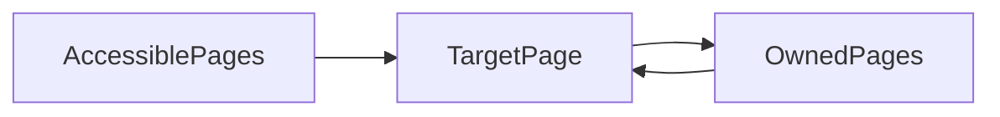

# Link Analysis

## Web as a Graph

- Nodes: Websites
- Edges: Hyperlinks

### Organization of Webs

- Web directories
- Search engines

#### Challenges of Web Search

1. Determining which websites are trust-worthy
   - Trick: trustworthy pages may link to each other
2. Finding the best reply to a user query
   - Trick: e.g. pages that know about newspapers may point to many newspaper websites

### Link Analysis

- Rank the importance of webpages by the link structure

## PageRank

### Intuition of PageRank

- Use links as votes
  - A page is more important if it has more links
  - Use incoming-links as votes
  - Links from important pages have more importance

### Random Surfer

- Webpages are important if people visit them a lot
- But cannot track all web users
- Assume people follow links randomly as a surrogate model
- Random Surfer Model
  - Start at a random page and follow outlines repeatedly
  - PageRank is defined by the limiting probability of visiting a page

### PageRank

- Importance of a page = its share of the importance of each of its predecessor pages
- Technically, the importance is given by the principal eigenvector of the matrix

### Flow Formulation

- Each link's vote is proporional to the importance of its source page
- If page $j$ with importance $r_j$ has $n$ outgoing links, then each link gets $r_j/n$ votes
- The importance of a page $j$ is the sum of the votes on its incoming links
- The rank of a page is given by

$$ r_j = \sum_{i\to j}\frac{r_i}{d_i^{(out)}} $$

- $d_i^{(out)}$ is the degree of outgoing edges

#### Linear Equation Formulation

- We can write the flow equations as a set of linear equations
- The equation has more than one solutions
  - So we manually force the sum of all ranks to be $1$
- Can be solved by Gaussian elimination
- Works with small graphs
  - But not suitable for large networks like the Internet due to high time complexity

### Matrix Formulation

Define a stochastic transition matrix $M$. Let page $i$ has $d_i$ outgoing links

- If $i\to j$, then $M_{ji} = \frac{1}{d_{i}}$
- Otherwise $M_{ji}=0$
- A column stochastic matrix
  - Note this is the transpose of the transition matrix mentioned in Stochastic Processes

Then the limiting probability distribution is given by

$$ r = M \cdot r $$

The distribution $r$ is an eigenvector of matrix $M$, with eigenvalue $1$

- In fact $r$ is the first or principal eigenvector
- Because $M\cdot r \le 1$

#### Power Iteration

1. Init $r = [1/N, 1/N, \dots, 1/N]$
2. Update $r_{t+1} = M\cdot r_t$
3. Stop when $|r_{t+1} - r_t| < \epsilon$

- Actually the power iteration iteratively computes $M^t r$

### PageRank as a Markov Chain

#### Problems

- Unlike the random walk on an undirected graph, the graph of websites are directed
- Which causes problems

##### Deadends

- Random surfer goes into a node with no outgoing edges
- The matrix is no longer column stochastic so the initial assumption fails

##### Spider Traps

- Random surfer gets stuck in a loop
- Eventually the loop absorbs all importance
- The distribution does not converge to the distribution we want

##### Teleports

- A solution proposed by Google
- At each node
  - Follow a link at random with probability $\beta$
  - Jump to a random page with probability $1 - \beta$
  - Typical value of $\beta$ is $0.8 \sim 0.9$

The PageRank equation

$$ r_j = \sum_{i \to j}\beta \frac{r_i}{d_i} + (1-\beta)\frac{1}{N} $$

The Google Matrix

$$ A = \beta M + (1-\beta) \left[\frac{1}{N}\right]_{N\times N} $$

Then we solve for $r = A\cdot r$

- The matrix $A$ is not sparse

## Real-World PageRank Implementations

### Tackling Non-Sparsity

- $r = Ar$ where $A_{ji} = \beta M_{ji} + (1-\beta)/N$
- $r_j = \sum_{i=1}^{N} A_{ji}r_i$

Since $\sum_i r_i = 1$,

$$ r_j = \sum_{i=1}^N\left[ \beta M_{ji} + \frac{1-\beta}{N} \right] \cdot r_i = \sum_{i=1}^{N} \beta M_{ji}\cdot r_i + \frac{1-\beta}{N} $$

So we get

$$ r = \beta M\cdot r + \left[ \frac{1-\beta}{N} \right]_N $$

- In each iteration, we
  - Compute $r^{(new)} = \beta M\cdot r^{(old)} $
  - Add a constant $(1-\beta)/N$
  - Normalize $r$ to make it sum to 1

The complete algorithm

- Init $r^{(old)}_j = 1/N$
- Repeat until convergence $ \sum_j |r^{(new)}_j - r^{(old)}_j| < \epsilon $
  - $\forall j$, $r'^{(new)}_j=\sum_{i \to j}\beta \frac{r_i^{(old)}}{d_i}$, and $0$ if in-degree of $j$ is 0
  - $\forall j$, $r_j^{(new)} = r'_j + (1-S)/N$
  - Where $S = \sum_j r'_j$

### Sparse Matrix Encoding

- In real world applications, even if sparse, the matrix may still not fit in the memory (but it may fit on the disk)
- The adjacency matrix is compressed into a 3-tuple `(source, out_degree, destinations)`

```python
init r_new[node] = (1 - beta) / N for node in range(N_NODES)
for page in pages:
    node, deg, dests = read_into_memory(page)
    for dst in dests:
        r_new[dst] += beta * r_old[node] / deg
```

#### Block-Based Update

- In the case where $r^{(new)}$ does not fit in memory
- Break $r$ into blocks that fit in memory
- Scan $r^{(old)}$ amd matrix $M$ once for each block

#### Block-Stripe Update

- $M$ is much bigger than $r$, and we can break $M$ into stripes
- Each strip contains only destination nodes in the corresponding blocks of $r^{(new)}$

### Problems of PageRank

- Measures generic popularity of a page
  - Biased against topic-specific authorities
  - Solution
    - Topic-Specific PageRank
- Uses a single measure of importance
  - Solution
    - Hubs-and-Authorities
- Susceptible to Link Spam
  - Solution
    - TrustRank

## Topic-Specific PageRank

- Want to measure popularity within a topic
  - Evaluate web pages not just according to their popularity, but by how close they are to a particular topic
- Topic-Specific PageRank maintains a topic-specific teleport set of relevant pages
  - At each step the random walker has a chance to warp into other pages in the teleport set (instead of any other pages)

$$ A_{ij} = \begin{cases}
  \beta M_{ij} + (1-\beta) / |S| &\quad \text{if $i \in S$}\\
  \beta M_{ij} + 0 &\quad o.w.
\end{cases} $$

- Each page in $S$ can also have different weights
- Topic-specific teleport sets can be fould emprically
  - Let user choose a topic
  - Classify query into a topic
  - Use browser history, bookmarks or search history
- If only one node exists in the teleport set, it is known as Random Walk with Restarts

### Measuring Proximity in Graphs

- Shortest path may not work
  - No effect on degree-1 nodes
  - Multi-faceted relationships
- Maximum flow may not work
  - Does not punish long links

#### SimRank

- Random walk from a fixed node on a $k$-partite graph
- Consider a $k$-partite with $k$ types of nodes
- The teleport set of node $u$ is $\{u\}$
- Measures similarity to $u$
- Problem
  - Must be done once for each $u$
  - Applicable to sub-web scale problems, but not scalable to extremely large graphs

##### Application of SimRank: Pixie Random Walk

- Recommendation algorithm to suggest similar items
- Consider a bipartite graph $V = (V_1, V_2)$ where $V_1$ is a set of similar items, and $V_2$ is the set of customers who liked items in $V_1$

```python
pin_node = QUERY_NODES.sample_by_weight()
for i in range(N_STEPS):
    board_node = pin_node.get_random_neighbour()
    pin_node = board_node.get_random_neighbour()
    pin_node.visited += 1
    if random() < 0.5:
        pin_node = QUERY_NODES.sample_by_weight()
```

- Does not require the entire graph
- Only requires each node to maintain their neighbours

###### Graph Pruning

- Some pins may have millions of boards
  - If the pixie visits the pin, the signal just disperses
- Not useful
- So we only keep good boards for pins
  - Compute the similarity between pin's topic vector and each of its boards
  - Only retain boards with high similarity

###### Advantages

- Blazingly fast
- Can fit entire graph in RAM
- Parallelable

## Hubs-And-Authorities

- New measurement
  - HITS Hypertext-Induced Topic Selection
- Not popular and is gradually discarded
  - Modern search engines are mainly based on PageRank and its variations

### Idea

- A page is more important if it has more links
- Authority
  - Pages containing useful information
  - Importance is measured by votes coming from hub
- Hubs
  - Pages that points to authorities
  - Importance is measured by the total sum of votes of the authorities they point to

### Procedure

1. Authorities collect initial votes from hubs
2. Hubs update their score by votes of authorities
3. Reweight and rerun until convergence

### Modeling

- A good hub links to good authorities
- A good authorities is pointed to by good hubs
- Each page $i$ has two scores $a$ and $h$
- Let $a=(a_1,\dots,a_N)$ and $h = (h_1,\dots,h_N)$ be the vector of scores, and let $A$ be the adjacency matrix

$$ a_i^{(t+1)} = \sum_{j\to i}h_j^{(t)} $$

$$ h_i^{(t+1)} = \sum_{i \to j}a_j^{(t)} $$

Also need to renormalize $a$ and $h$

#### Matrix Interpretation

$$ h_i = \sum_j A_{ij}a_j $$

Therefore

$$ h = Aa \quad a = A^Th $$

- Initialize $a_i = h_i = 1/\sqrt{N}$
- Repeat until convergence

## Web Spam

- Spamming
  - Deliberate actions to boost a web page's position in search engine results

### Term Spam

- Early search engines are based on matching key words in pages, weighted by the position of the keyword
- Can be spammed by adding specific keywords into the webpage, or copying contents of top-listed pages into the page and make them invisible

### Link Spam

- Design specific link structures that boost PageRank of a particular page
- From the spammer's point of view, there are three kinds of pages
  - Inaccessible pages
  - Accessible pages
    - Not owned, but the spammer can post links to these pages
  - Owned pages
- Spammer's goal
  - Maximize the PageRank of a target page $t$


