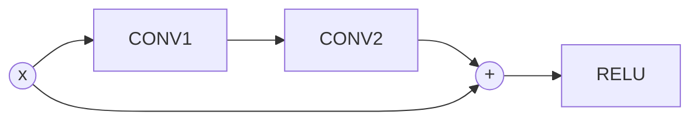

# Convolutional Neural Networks

## Operators in CNN

### Convolutional Layer

$$ OutputSize = ( N - F) / Stride + 1 $$

### Pooling Layer

- No parameters

### Batch Normalization

- Consider a mini-batch $B$ of size $m$
$$\mu_B = \frac{1}{m}\sum_ix_i$$

$$\sigma_B^2=\frac{1}{m}\sum_i(x_i-\mu_B)^2$$

$$\hat{x} = \frac{x_i-\mu_B}{\sqrt{\sigma_B^2+\epsilon}}$$

$$y_i = \gamma\hat{x}_i+\beta$$

## Weight Initialization

### Xavier Glorot Initialization

- For a fully connected layer with $m$ inputs and $n$ outputs, sample

$$ W_{ij} \sim Uniform\left( -\frac{\sqrt{6}}{\sqrt{m+n}}, \frac{\sqrt{6}}{\sqrt{m+n}} \right) $$

#### Why?

Let
$$ Y = WX $$

Consider the forward phase

$$ Y_j = \sum_i W_{ij}X_i $$

$$ Var(Y_j) = Var\left(\sum_i W_{ij}X_i\right) $$

Assume $X_i$'s are i.i.d.

$$ Var(Y_j) = m\cdot Var(W_{ij})Var(X_i) $$

We want the variance between input and output to be small. i.e. want $Var(Y_j)$ and $Var(X_i)$ to be as close to each other as possible. So we choose

$$ Var(W_{ij}) = \frac{1}{m} $$

Similarly in the backward phase, we have

$$ Var(W_{ij}) = \frac{1}{n} $$

Combining the forward and backward phase, we have

$$ Var(W_{ij}) = \frac{2}{m+n} $$

## CNN Architectures

### AlexNet

### VGG

- Stack of 3 `3x3` filters have the same reception field as a `7x7` filter, with fewer number of parameters and more non-linearity.

### GoogleNet (Inception)

### ResNet

#### Residual Connections

$$x_{l+1} = h(x_l) + x_l$$

### DenseNet

- More residual connections
- Use pooling to reduce computation complexity

$$ x_{l+1} = h([x_0,\dots,x_l]) $$
