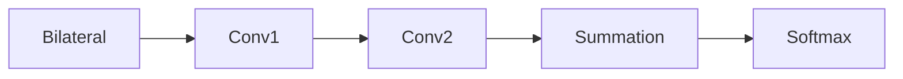
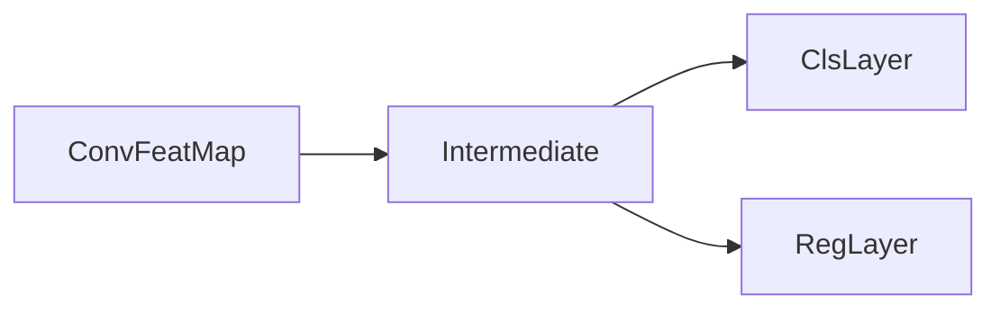

# CNN Applications in Computer Vision

## Semantic Segmentation

- Classify every pixel in an image

### Datasets

- Pascal VOC
  - 10K images
  - 20 classes
- Cityscapes
  - 5K images
  - 19 classes
- ADE20K
  - 20K images
  - 150 classes
- MS COCO
  - 160K images
  - 172 classes
  - Coarse labels

### Metrics

- $n_{ij}$: number of pixels of class $i$ predicted to be $j$
- $n_{CL}$: number of different classes
- $t_i = \sum_{j}n_{ij}$ total number of class $i$

- pixel accuracy
- mean accuracy
- mean Intersection over Union

### Methods

#### Primitive Method

- For each pixel, extract a patch and classify the patch with a CNN
  - The class for the pixel is the class for the patch
    - Slow
    - Some patches are too local to be classified

#### Fully Convolutional Networks

- Replace FC layer with `1x1` convolutional layers
- Fully convolutional
- Pixel-to-pixel
- Upsample at the final layer to fit the size of original image
  - Interpolation
  - Max unpooling
  - Learnable layer

##### Transposed Convolution

- aka. Fractionally-strided convolution or deconvolution
- A convolutional operation can be implemented with matrix multiplication

$$Output = Input * h = C\cdot Input$$

- The backward (upsampling) pass is obtained by transposing $C$

##### Skip Connections

- Provide extra information for the last coarse layer

##### Loss Function: Dice Loss

$$\mathcal{L}_{Dice} = \frac{2|A\cap B|}{|A|+|B|}$$

#### U-Net

- It's hard for FCNs to recover edge details
  - Solution: Use encoder-decoder models
- Used in medical image classification
  - But not only used for medical purposes

#### Atrous Convolution (Dilated Convolution)

- Need more context than image classification
  - Solution: Use larger receptive field
- Dilated convolution increases receptive filed by 'skipping' a certain number of pixels when performing convolution

#### Conditional Random Field

- Neglects spatial consistency
  - Poor object delineation
- Solution: CRFs

##### CRF in Segmentation

- View an image as a graph
- Each pixel is a node
  - Each node takes value from labels
  - The most probable assignment for the CRF is the final segmentation result

$$ \mathbb{P}[X_1=x_1,X_2=x_2,\dots,X_N=x_N|l] = \mathbb{P}[X=x|l] = \frac{1}{Z}exp\left( -E(x|l) \right) $$

- $Z$ is a normalizing factor
- Maximizing probability is equivalent to minimizing energy $E$
- Generally, the energy is given by
  - $E = unary\_cost + binary\_cost$
  - unary cost is given by the pixel-wise classifier
    - penalty when the label does not agree with the prediction
  - pairwise cost is given by similarities of adjacent pixels
    - penalty when two similar labels are assigned with different labels
    - similarity can be measured by location and color

##### Dense CRF

$$ E(x) = \sum_i \phi_u(x_i) + \sum_{i<j}\phi_p(x_i,x_j) $$

- Can be solved with approximation algorithms
  - Mean field iteration

#### CRF as Recurrent Networks

> Fully Connected CRFs as a CNN

- The mean field iteration procedure can be approximated by a neural network unit

- Can embed the CRF iteration into a RNN unit

### Summary

- Encoder-decoder
- Skip connection
- Context aggregation
- CRF for spatial consistency

## Object Detection

> Assign a label and a bounding box to all objects in an given image

### Datasets

- Pascal
- COCO

### Metrics

- Set IoU threshold and use Precision-Recall

### Tow-Stage Methods

#### Object Detection as Classification

- Use a sliding window
  - Expensive
  - Cannot test all scales of windows at all positions

#### Region Proposals

- Find image regions that are likely to contain objects
  - Selective Search
  - Multiscale Combinatorial Grouping, MCG

#### Workflow

1. Input
2. RoI (about 2k RoIs)
3. Warp (resize to fit CNN input size)
4. CNN
5. Output

#### R-CNN

##### Bounding Box Regression

- A bounding box is represented by $(x,y,h,w)$
- Let $p$ be predicted elements and $g$ be ground-truth elements
- $t_x = (g_x-p_x)/p_w$; $\hat{g}_x = p_wd_x(p)+p_x$
- $t_y = (g_y-p_y)/p_h$; $\hat{g}_y = p_hd_y(p)+p_y$
- $t_w = \log(g_w/p_w)$; $\hat{g}_w=p_w\exp(d_w(p))$
- $t_h = \log(g_h/p_h)$; $\hat{g}_h=p_h\exp(d_h(p))$

##### Pipeline

> Not end-to-end

1. Train network on proposals
2. Train SVM and bounding box regressor using CNN output features
3. Non-Maximum Suppression + Score threshold

##### Non-Maximum Suppression NMS

1. Select the box with the highest objectiveness score
2. Compare the IoU of this box with other boxes
3. Remove boxes with overlap $\ge 50\%$
4. Move to the next and repeat the procedure

##### Problem

- Slowa
- Stage-wise training. CNN and SVM are trained independently.

#### Fast R-CNN

Share computation of convolutional layers between region proposals for an image.

- Map the input onto a feature map
- Directly extract features of RoIs from the feature map

##### RoI Pooling

- Divide mapped RoI features into grids
- Pool within each grid cell to get inputs of fixed sizes

##### Problem

- Fast. But still slow if we include time for region proposals

#### Faster R-CNN

> Learn proposals end-to-end sharing parameters with the classification network

##### Region Proposal Network

- Anchor
  - predefined bounding boxes of various sizes and scales
  - 9 anchors (3 scales and 3 aspect ratios) work well in practice

##### Problem

- Faster. But cannot real-time

### One-Stage Methods

#### You Only Look Once YOLO

- Proposal-free object detection pipeline

##### Pipeline

1. Divide input image to 7x7 cells
2. Each cell output 2 bounding boxes $(conf,x,y,w,h)$ and shared class probability $(p_{c_1},\dots, p_{c_{20}})$
   - Total output: 30 for each cell
   - Final output `7x7x30`
3. The ground truth object corresponds to the cell where the center locates
4. The ground truth object corresponds to the predicted bounding box with larger IoU

##### Loss

- Localization Loss
- Confidence Loss
- Classification Loss

#### Single Shot MultiBox Detector SSD

- YOLO + Several predictors at different stages in the network

### Multi-Stage Methods

#### IoU

- If too high, there will be too few samples to train
- If too low (actually even if 50%), there will be samples of low quality

#### Cascading Object Detection

- Cascading multiple object detectors with increasing IoU thresholds
- Gradually improving proposal quality

## Instance Segmentation

> Segmenting each instance (instead of labeling all persons as person)

### Evaluation Metrics

- Mask AP
  - IoU for mask prediction

### Methods

#### Overview

- R-CNN driven
  - Object detection + Semantic segmentation
- FCN driven
  - Semantic segmentation + Object detection

#### Mask R-CNN

> Faster R-CNN with FCN on RoIs

##### RoIAlign

- RoI pooling includes quantization
  - Rounding RoIs to the nearest grid
  - Breaks translation-equivariance of convolution
- Divide RoIs into fixed-sized sub-cells
- Bilinear interpolate and pool RoIs to get RoIAlign output
- Other implementation should also work

##### Feature Pyramid Network FPN

###### Different ways

1. Resize image into multiple sizes
   - Multiple inputs, can be slow
2. Single input, multiple feature maps, predict on each feature map
   - First levels of layers do not have adequate semantics

###### FPN Implementation

> Like U-Net

- Exactly like U-Net
  - Upsampling + direct connect
- Except that each upsampling layer produces a prediction

#### Cascading Mask R-CNN
