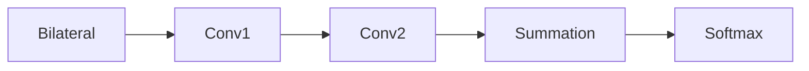
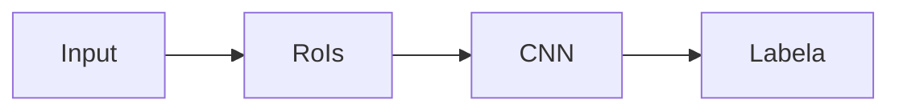

# CNN Applications in Computer Vision

## Semantic Segmentation

- Classify every pixel in an image

### Datasets

- Pascal VOC
  - 10K images
  - 20 classes
- Cityscapes
  - 5K images
  - 19 classes
- ADE20K
  - 20K images
  - 150 classes
- MS COCO
  - 160K images
  - 172 classes
  - Coarse labels

### Metrics

- $n_{ij}$: number of pixels of class $i$ predicted to be $j$
- $n_{CL}$: number of different classes
- $t_i = \sum_{j}n_{ij}$ total number of class $i$

- pixel accuracy
- mean accuracy
- mean Intersection over Union

### Methods

#### Primitive Method

- For each pixel, extract a patch and classify the patch with a CNN
  - The class for the pixel is the class for the patch
    - Slow
    - Some patches are too local to be classified

#### Fully Convolutional Networks

- Replace FC layer with `1x1` convolutional layers
- Fully convolutional
- Pixel-to-pixel
- Upsample at the final layer to fit the size of original image
  - Interpolation
  - Max unpooling
  - Learnable layer

##### Transposed Convolution

- aka. Fractionally-strided convolution or deconvolution
- A convolutional operation can be implemented with matrix multiplication

$$Output = Input * h = C\cdot Input$$

- The backward (upsampling) pass is obtained by transposing $C$

##### Skip Connections

- Provide extra information for the last coarse layer

##### Loss Function: Dice Loss

$$\mathcal{L}_{Dice} = \frac{2|A\cap B|}{|A|+|B|}$$

#### U-Net

- It's hard for FCNs to recover edge details
  - Solution: Use encoder-decoder models
- Used in medical image classification
  - But not only used for medical purposes

#### Atrous Convolution (Dilated Convolution)

- Need more context than image classification
  - Solution: Use larger receptive field
- Dilated convolution increases receptive filed by 'skipping' a certain number of pixels when performing convolution

#### Conditional Random Field

- Neglects spatial consistency
  - Poor object delineation
- Solution: CRFs

##### CRF in Segmentation

- View an image as a graph
- Each pixel is a node
  - Each node takes value from labels
  - The most probable assignment for the CRF is the final segmentation result

$$ \mathbb{P}[X_1=x_1,X_2=x_2,\dots,X_N=x_N|l] = \mathbb{P}[X=x|l] = \frac{1}{Z}exp\left( -E(x|l) \right) $$

- $Z$ is a normalizing factor
- Maximizing probability is equivalent to minimizing energy $E$
- Generally, the energy is given by
  - $E = unary\_cost + binary\_cost$
  - unary cost is given by the pixel-wise classifier
    - penalty when the label does not agree with the prediction
  - pairwise cost is given by similarities of adjacent pixels
    - penalty when two similar labels are assigned with different labels
    - similarity can be measured by location and color

##### Dense CRF

$$ E(x) = \sum_i \phi_u(x_i) + \sum_{i<j}\phi_p(x_i,x_j) $$

- Can be solved with approximation algorithms
  - Mean field iteration

#### CRF as Recurrent Networks

> Fully Connected CRFs as a CNN

- The mean field iteration procedure can be approximated by a neural network unit

- Can embed the CRF iteration into a RNN unit

### Summary

- Encoder-decoder
- Skip connection
- Context aggregation
- CRF for spatial consistency

## Object Detection

> Assign a label and a bounding box to all objects in an given image

### Datasets

- Pascal
- COCO

### Metrics

- Set IoU threshold and use Precision-Recall

### Tow-Stage Methods

#### Object Detection as Classification

- Use a sliding window
  - Expensive
  - Cannot test all scales of windows at all positions

#### Region Proposals

- Find image regions that are likely to contain objects
  - Selective Search
  - Multiscale Combinatorial Grouping, MCG

#### R-CNN

