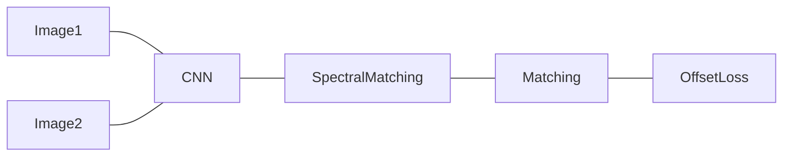
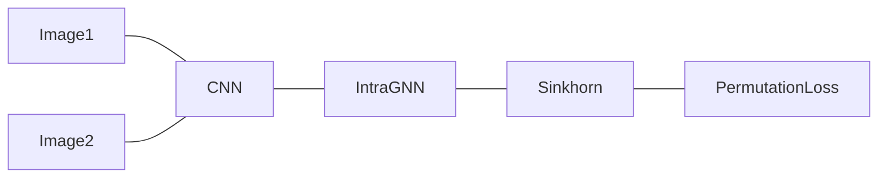

# Graph Machine Learning and Combinatorial Optimization

## Graph Matching

### Overview and Formulation

- Find node correspondence among graphs

Suppose two graphs have $m$ and $n$ nodes respectively. Assume a permutation matrix $X \in \mathbb{R}^{m\times n}$ that represents the matching of nodes on two graphs such that

$$ X\mathbf{1} \le \mathbf{1}; \quad X^T \mathbf{1} = \mathbf{1} $$

#### Linear Assignment

- Only considers information from nodes
- Extract features from nodes
- Compute similarities of nodes, stored in a matrix $K_p$

$$ \max\mathrm{Tr}(XK_p) $$

#### Edge

- Compute similarities of edges, stored in another matrix $K_q$

#### Affinity Matrix

Define affinity matrix $K \in \mathbb{R}^{mn \times mn}$, indexed by $a_ib_j$, where

- The node similarities are on the diagonal
- Edge-to-edge similarities are on non-diagonal indicies
- $K$ is sparse

Therefore we can formulate the problem into a Quadratic Assignment Problem

$$ \begin{aligned}
    \max_X &\quad\mathrm{flatten}(X)^TK\mathrm{flatten}(X)\\
    \mathrm{s.t.} &\quad X \in \{0,1\}\\
    &\quad X\mathbf{1} \le \mathbf{1}\\
    &\quad X^T\mathbf{1} = \mathbf{1}
\end{aligned} $$

!!!note
    $K$ contains only the information between edges and nodes. The exact information of an individual node or edge is not included. Therefore this formulation is natually privacy-preserving.

### Composition-based Affinity Optimization

#### CAO

#### CAO-C Gradually Consistency-Weighted CAO

## DL-based Combinatorial Optimization

- Features of nodes/edges
- Weight when computing similarity or loss function
- Similarity
- Learning Graph Structure
  - Weights of nodes and edges

### Classic ML-Methods

- Not agnostic
  - If we only have a model for matching ducks, we will need a new model when we have to deal with cows

### Deep Learning of Graph Matching

- Only the CNN module is learnable
- The entire pipeline is end-to-end

#### Spectral Matching

- Matching two graphs by approximately solving graph matching via clustering
- Performance can be poor

#### Problems

- A properly-trained CNN may be forced to learn in an illed way because of the poor performance of SM
- The choice of offset loss may be not good
  - If a left ear is matched to a right ear, the offset loss can be small but the matching is incorrect
  - Permutation is not regression

### Embedding Approach for Deep Graph Matching

- IntraGNN models graph affinity feature
- Sinkhorm layer solves correspondence efficiently
- Permutation loss
