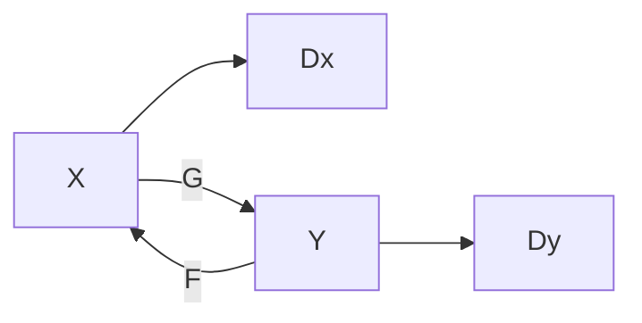

# Applications of GANs

## Pix2Pix

Application: Image Translation

### Workflow

- Generator
  - Input
    - Random variable $z$ and Input picture $x$
  - Output
    - Output picture $y$
- Discriminator
  - Input
    - $x$ and $y$
  - Output
    - $x$ matches $y$ or not

### Loss and Objective

$$ \min_G\max_D L = L_{cGAN} + \lambda L_{L1} $$

where $L_{cGAN}$ is the loss of the conditional GAN

and $L_{L1}$ is a reconstruction loss

$$ L_{L1}(G) = \mathbb{E_{x,y,z}}[\|y - G(x,z)\|_1] $$

### Generator Architecture

- Encoder-Decoder
- U-Net

### Discriminator Architecture

PatchGAN

- Regardless of input size, the input is divided into patches and fed into a CNN network
  - $L_{L1}$ prevents global distortion
  - So the discriminator only needs to focus on local (patch) distortion
  - Patch size should be tuned

## CycleGAN

### Dataset Difference with Pix2Pix

- Pix2Pix requires each input $x_i$ and $y_i$ are paired
- CycleGAN only requires two unpaired classes of images

### Architecture

Two sets of Generators and Discriminators

- Generators $F$ and $G$
- Discriminators $D_X$ and $D_Y$
  - $D_X$ discriminates $x$ and $F(y)$
  - $D_Y$ discriminates $y$ and $G(x)$

### Objective

Loss = Adversarial Losses + Cycle Consistency Loss

#### Adversarial Losses

$$L_{GAN}(G,D_Y,X,Y) = \mathbb{E}_y[\log D_Y(y)] + \mathbb{E}_x [\log (1-D_Y(G(x)))] $$

$$L_{GAN}(F,D_X,Y,X) = \mathbb{E}_x[\log D_X(x)] + \mathbb{E}_y [\log (1-D_X(F(y)))] $$

- $G$ generates $G(x)$ that are expected to be similar to images in domain $Y$

#### Cycle Consistency Loss

- Requires cycled image $F(G(x))$ and $G(F(y))$ are similar to images in their original domain

$$ L_{cyc}(G,F) = \mathbb{E}_x[\|x-F(G(x))\|_1] + \mathbb{E}_y[\|y-G(F(y))\|_1] $$

#### Final Loss

$$ L = L_{GAN}(G,D_Y,X,Y) + L_{GAN}(F,D_X,Y,X) + \lambda L_{cyc}(G,F) $$

## StarGAN

## SSGAN

> Semi-Supervised GAN

### Discriminator
