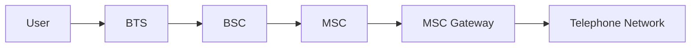
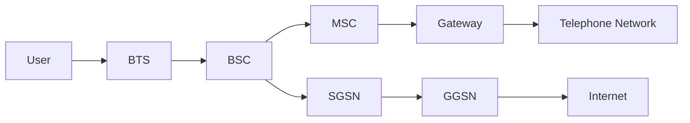

# 移动通信网络演进

## 1G

> 怎么样从0到1.

### 设计理念

#### 蜂窝小区（Cellularization）

- 用多组低功率的无线电覆盖整个服务区
- 每一组无线电服务区域称为一个小区
- 小区的覆盖面积近似地认为是一个正多边形，一般是正六边形

#### 频率复用（Frequency Reuse）

##### 频分多址（Frequency Division Multiple Access, FDMA）

将一个频段划分为多个子频段

- 假设区群大小为 $N$，则频分多址后的各小区将包含可用信道总数的 $1/N$
- 假设每个小区有 $J$ 个信道，其中 $K$ 个信道在 $N$ 个小区进行分配，则 $K = JN$
- 设每个区群经过 $M$ 次复制，则整个系统的容量 $C = MJN$
  - 若减小 $N$，则为了覆盖相同的面积，就必须将更小的区群复制更多次
  - 因此 $M$将增加，进而使得 $C$ 增加
  - 因此减小 $M$ 可以增大系统容量
  - 但是减小 $M$ 同时会增加同频段的干扰

##### 区群（Cluster）

- 相邻同信道小区之间的间隔区域可以设置采用不通频段的其他小区

##### 区群大小

经验上，每个区群包含的小区个数 $N$ 通常取值为

$$ N = i^2 + ij + j^2 \quad (i,j=1,2,\cdots) $$

确定和某个小区同频段的小区的方法：

- 从这个小区出发先走 $i$ 步
- 逆时针旋转 $60\degree$ 后再走 $j$ 步

##### 几何结构

- 一个小区中心与最近的同信道小区中心之间的实际距离为 $D = \sqrt{3N}R$
- 对于六边形小区而言，每个小区都有6个最近的同信道小区。第 $k$ 层被 $6k$ 个小区包围
- 第 $k$ 层同信道小区连接而成的六边形半径为 $kD$

##### 频率复用比

设正六边形边长为 $R$，两个同频段小区中心的距离为 $D$，则频率复用比 $q$ 定义为

$$ q = \frac{D}{R} = \sqrt{3N} $$

$q$ 随着 $N$ 的增大而增大

##### 同频干扰（Co-channel Interference）

设 $S$ 和 $I$ 分别是有用信号输出功率和同信道干扰功率，$N_i$ 是产生同信道小区的个数，$I_i$ 是滴 $i$ 个同频段小区的干扰功率，则干扰功率比（Signal-to-Interference Ratio）为

$$ \frac{S}{I} = \frac{S}{\sum_{i=1}^{N_i}I_i} $$

同时，有用信号功率 $S$ 正比于 $r^{-\alpha}$，类似地， $I_i$ 可以用 $D_i^{-\alpha}$ 近似，故

$$ \frac{S}{I} = \frac{r^{-\alpha}}{\sum_{n=1}^{N_i}D_i^{-\alpha}} $$

在只考虑第一层、忽略外层同信道小区的干扰时，$N_i=6$。进一步假设 $r=R$、$D_i \approx D$，则

$$ \frac{S}{I} = \frac{(\sqrt{3N})^k}{N_i} $$

$$ q = \left( N_i \times \frac{S}{I} \right)^{1/k} = \left( 6\times \frac{S}{I} \right) $$

#### 移动性管理

> Core networks for seamless handover

当移动用户从一个小区进入另一个小区，通常由移动交换中心处理信道切换。

## 从1G到4G

> 核心：和互联网相连

### 2G：Global System for Mobile Communication (GSM)

> 以中国使用的GSM标准为例

- 术语解释
  - BTS: Base Transceiver Station
  - BSC: Base Station Controller
  - MSC: Mobile Switching Center
- GSM并未接入互联网
- 相较于1G移动通信，GSM已经是数字化的移动通信系统

### 2.5G：General Packet Radio Service (GPRS)

- 术语解释
  - SGSN：Serving GPRS Support Node
  - GGSN：Gateway GPRS Support Node
- GPRS在GSM架构基础上增加了一条支路，从而接入了互联网。

### 3G：Universal Mobile Telecommunication System (UMTS)

> 以中国使用的UMTS标准为例

使用CDMA（码分多址）代替FDMA和TDMA

#### CDMA

### 4G: Long-Term Evolution

#### OFDMA

#### Packet Switching

- IP Multimedia Subsystem, IMS

### 5G

- E-UTRAN: Evolved Universal Terrestrial Radio Access Network
- EPC: Evolved Packet Core

#### Centralized Radio Access Network, C-RAN

- BBU 与 RRU 解耦合
- BBU 集中维护管理
  - 降低成本

##### 优势

- 便宜
- Frequency reuse = 1，CoMP
- 覆盖率提升

#### 核心网络

##### 4G EPC

- MME: Mobility Management Entity
- HSS: Home Subscriber Server
- S-GW: Serving Gateway
- P-GW: PDN Gateway
  - PDN: Packet Data Network
- PCRF: Policy and Charging Rules Function

##### 5G Core

- Pigeoned. Too many.
