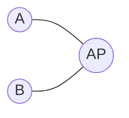

# Carrier Sensing Multiple Access with Collision Avoidance

## Computer Networking: The OSI Model

### ISO/OSI Model

- 物理层 Physical Layer
  - Physical level signal transmission
- 数据链路层 Data Link Layer
  - `frame`s
  - How to send data to the *next* 'node' in the network
  - Access control
- 网络层 Network Layer
  - `packet`s
  - Routing
  - Forwarding
- 传输层 Transport Layer
  - TCP Protocol
    - Reliable. Guarantees no packet gets lost
  - UDP Protocol
    - Relatively faster
    - Not reliable as packets may get lost
- 应用层 Application Layers
  - HTTP protocol
  - Socket

## Aloha Network

- Works on data link layer
- On data arrival
  - Send immediately
  - Resend with probability $p$ if collision happens
    - Increase interval to avoid collision again
  - But still result in high collision rate

## Carrier Sensing Multiple Access

- Listen before speak
  - send data if the channel is idle
  - defer transmission otherwise
- Collision may still occur due to
  - broadcasting in wireless networks
  - propagation delay of signal

## CSMA/CD

> CSMA with Collision Detection
> Adopted by the Ethernet
> Works on the data link layer

### CSMA/CD in Ethernet

#### Overview

- Listen before Speak
- Stop when Colliding
- Backoff scheme

#### Workflow

1. Check if the channel is idle
2. If idle, start transimssion. Defer otherwise
3. If node trainsmits entire frame without detecting other transmissions, then the frame transmission is *done*
4. Otherwise abort and send jam signal
5. After aborting, enter **binary exponential backoff**
   - Consider after the $m$-th abort. Random choose $K$ from $\{0,1,2,\dots,2^m-1\}$
   - Wait for $512 \cdot K$ before returning to channel sensing

- CSMA/CD cannot be directly applied to Wi-Fi due to
  - Hidden terminal problem: two terminals that are out of range of each other transmit simultaneously to a common receiver.
  - Exposed terminal problem: A sender is prevented from transmitting a frame due to interference with another transmitting station

## CSMA/CA

> CSMA with Collision Avoidance

### Overview

- Listen before speak
- ACK
- Backoff Scheme

### Workflow

1. Listen to check if channel is idle
   - DIFS: Distributed Inter-Frame Spacing
   - Checking if the channel is busy
2. Suppose device A is sending the first frame, as long as the channel is idle, A can immediately send the frame to AP
   - Suppose, however, B is sending a second frame. After DIFS, B has to wait for another randomly selected time before sending.
     - If during the count down, the channel is busy, then the count down is frozen until the channel becomes idle again.
     - Why count down for non-first transmission: Fairness; To avoid continuous collision
3. After AP receives a frame, it check if the channel is idel and returns an acknowledgement signal.
   - SIFS: Short Inter-Frame Spacing
     - DIFS > SIFS: Give ACK higher priority to aviod re-sending originally successfully sent frames
   - Why ACK: To solve the hidden terminal problem

## Modeling CSMA/CA with Markov Chain

### Assumptions

- Stable conditions
  - fixed number of users
  - only consider non-first time communication
- Saturation condition
  - exist backoff between sequential transmissions
  - ignore DIFS
  - In order to estimate the worst-case performance
- Collision occurs with probability $p$

### Backoff Stage

- Let the **contention window** $W$ be the length of count down
- $W_{min}$: Minimum contention window space
- $s$: Number of collisions experienced
- $W_s = 2^s W_{min}$: Max window size after $s$ collisions
- $W_{max} = 2^m W_{min}$: Maximum upper threshold of window size, i.e., widow size after a maximum of $m$ collisions
- Contention window size $W \in [0, W_s-1]$
  - where $W_s = 2^sW_{min}$, $s\in[0,m]$
- $i = s(t)$: Number of collisions encountered at $t$
- $k = b(t)$: Backoff countdown timer at $t$

### State Transition

#### Timer Count-Down

$$(i,0) \xleftarrow{1} (i,1) \xleftarrow{1} \cdots \xleftarrow{1} (i, W_i-1)$$

#### Collision

$$ (i,X) \xleftarrow{p/W_i} (i-1, 0) \quad X\sim Uniform(0, W_i-1) $$

#### Collision at Stage $m$

From $(m,0)$ to $(m,X)$ where $X\sim Uniform(0, W_s-1)$

#### Successful Transmission

From $(i,0)$ to $(0,X)$ with probability $(1-p)/W_0$

#### Analysis

Claim

$$ \mathbb{P}[i-1,0] \cdot p = \mathbb{P}[i,0] $$

$$ \mathbb{P}[m-1,0] \cdot p = \mathbb{P}[m,0] \cdot (1-p)$$

Then we can write $\mathbb{P}[i,k]$ as

$$ \mathbb{P}[i,k]= $$

The summation over all $i$ and $k$ should equal to 1, solving it yields

The probability that a node succeed in transmitting

$$ \tau = \sum_{i=0}^m \mathbb{P}[i,0] = \frac{\mathbb{P}[0,0]}{1-p} $$

Probability at least one station transmits

$$ P_{tr} = 1 - (1-\tau)^n $$

Probability that some station successfully transmits

$$ P_s = \frac{n\tau(1-\tau)^{n-1}}{P_{tr}} $$
