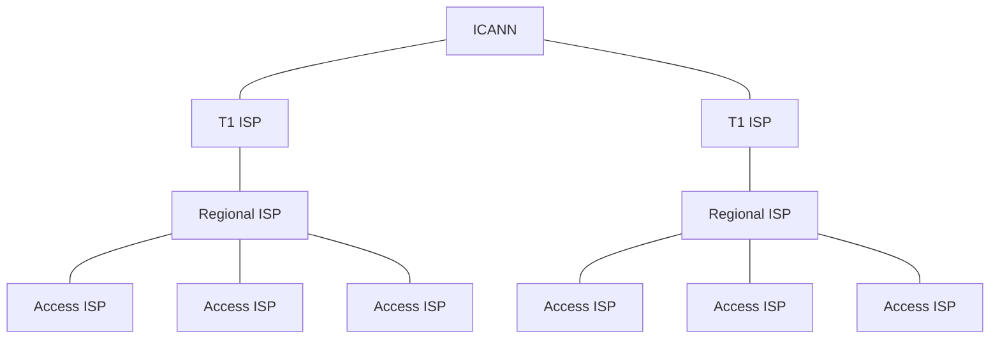
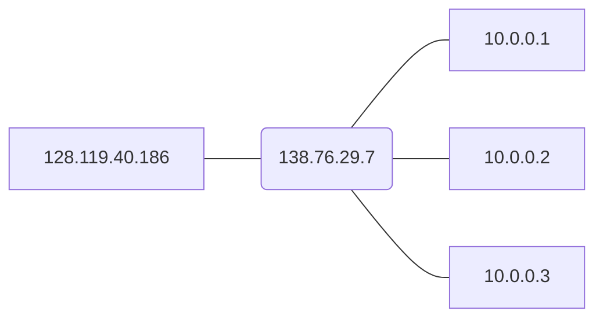

# Internet Protocol

## Structure of IP Address

- Address Allocation
  - ICANN: Internet Corporation for Assigned Names and Numbers

### Hierarchy of the Internet

### Hierarchical Structure of the IP Address

- An IP address block: `200.23.16.0/20`
  - The `/20` marks that the first 20 bits of the address is the network ID
    - known as the **Network ID**
  - The remaining 12 bits are the available addresses within this block
    - known as the **Host ID**
    - can further divide host id address into smaller blocks

### IP Address in a Network Domain

- All the devices in a given domain share the network ID
- Different network domains have different network IDs
  - Cannot be addressed if move into another domain

## Forwarding and Routing

### Forwarding

- Each router has a forwarding table
- Forward datagram to output interfaces according to the forwarding table

#### Longest Prefix Matching

- Use the longest prefix that matches the destination address when looking for forwarding table entry for a given destination address

#### Network Addresss Translation NAT

Each router has a NAT Translation Table that maps the WAN side address to the LAN side address

1. Suppose host `10.0.0.1` send request to `128.119.40.186:80`
2. It sends the request to router
3. The router translates the source IP address to `138.76.29.7:5001` and forward the datagram
4. When reply arrives at `138.76.29.7` with port number `5001`, the router checks the NAT table and forward the respond to `10.0.0.1`

### Routing Algorithms

#### Link-State Routing Algorithm

> Dijkstra
> Bellman-Ford

#### Inter-AS Routing

> Beyond the scope

## The Mobile IP

### Elements of Mobile IP

#### Elements in Home Network

- Home Network: The mobile is in when it starts to communicate
- Permanent Address: Can always be used to reach mobile
- Home Agent: Perform mobility functions on behalf of mobile when the mobile is remote

#### Elements in Visited Network

- Visited Network: Network in which the mobile is currently residing
- Care-of Address: Address in the visited network
- Foreigh Agent

### RFC 5944

#### Agent Discovery

- Agent Advertisement
  - Foreign/Home agents advertise service by broadcasting ICMP messages

#### Registration

- Foreign agent contacts home agent to acknowledge the location of the mobile

#### Indirect Routing

- Correspondent sends message to home agent (using permanent address)
- Home agent redirect the datagram to foreign agent
- Foreign agent then send the data to the mobile
