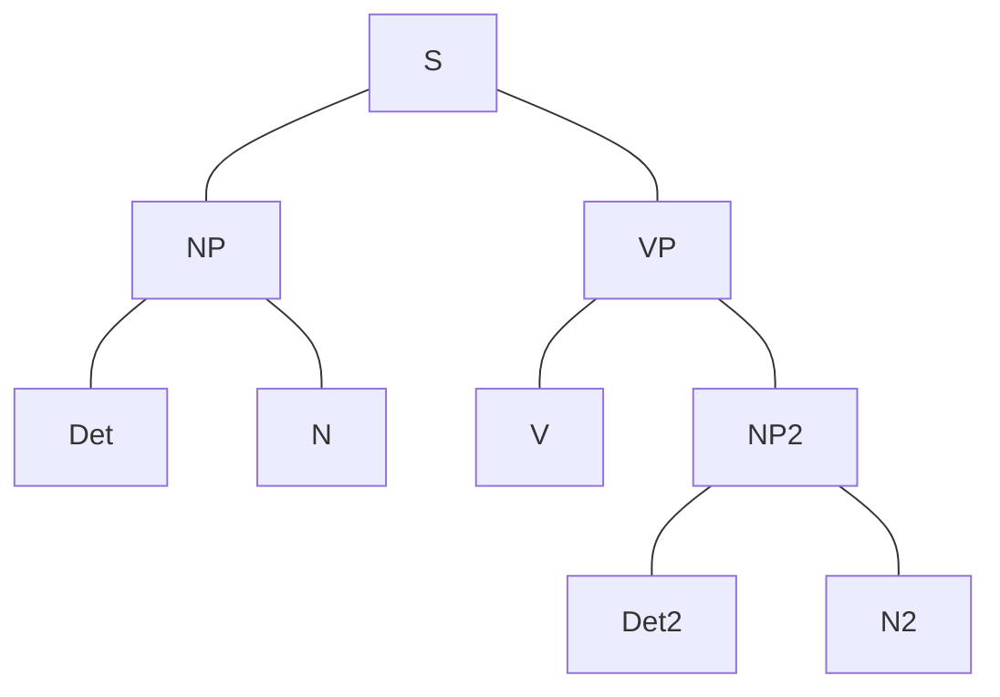
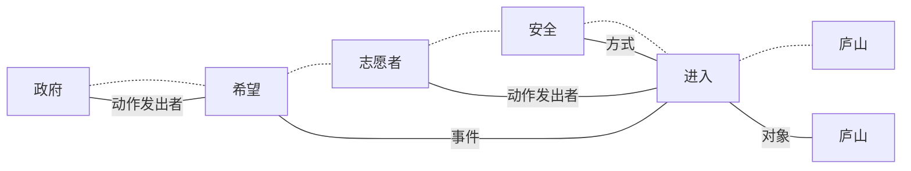

# 语言学基础

## 语言

### 人类语言

> “狗不能在这里叫45分钟上一节课。”

- 常以口述或手语表达，但任何语言都可以用声音、视觉或触觉刺激来表现。
- 人类语言是独特的
  - 其他动物的交流系统是封闭系统
  - 人类语言没有上限且富有创造性，允许人类从优先元素中产生大量话语，并创造新的词语和句子
  - 人类语言存在语法范畴

> “大家可以思考一下‘一五一十’和‘二五一十’的区别。”

### 语言的起源

- 延续性发展理论：语言皆源自一处，现代口语之间存在亲缘关系，但是这种关系不可考。
- 非延续性发展理论：突变？

> “可以追溯到一个女人和——我当时看着纳闷儿——两个男人。”

### 语言系属分类

- 根据语言的演化关系，对语言进行分类的方法
- 分类依据为各语言语音、词汇、语法之间的对应特征和演变规律
- 语系
  - 语族
    - 语支
- 对于机器翻译而言，语言间的相似性就很关键。

#### 方言

- 某一种语言的一个变体，有时也可以指地方上使用的方言

> “C是一种C++方言。”

## 语言学

### 定义

- 语言学是一门关于人类语言的科学研究，涉及了对语言形式、语言含义和语境的分析

### 分类

- 从研究对象上
  - 个别语言学：某种语言
  - 普通语言学：人类语言，探讨语言的共同特点和一般规律
- 从结合科学的角度
  - 计算语言学
  - 认知语言学
  - 社会语言学
  - 等等

### 语言词汇的单位

#### 词汇

- 词
- 由次的固定组合构成的固定词语

#### 句子

- 句子或称语句
- 构成语言的基本单位
- 带有语调
- 大部分语言的句子带有限定动词按照一定的语法组织规则、具有完整的含义
  - 每个句子至少包含主语、谓语、宾语等成分

#### 篇章

##### 段落

- 由句子或者句群组成
- 在文章中用于体现作者的思路发展或全篇文章的层次

##### 篇章

### 语法

> ~~前面的都不太重要~~ 这段比较重要。

- 指任意自然语言的句子、短语以及词等语法单位的语法结构与语法意义的规律
- 本质上是音义结合体之间的规律

#### 单位

- 语素、词、词组、句子、段落

#### 词法

- 词在组合聚合中产生的关系意义
- 形态学
  - 黏着语
    - 土耳其语、日语、维吾尔语等
    - 字的尾部发生变化表示语法意义
    - 每一种变化只表示一种语法意义，多种语法意义需要多个变词语素
    - 词根与变词语素不紧密，两者有很大独立性
    - 食べる　食べさせる　食べさせられる
  - 孤立语
    - 汉语等
    - 缺乏词形变化
      - 没有过去时、现在时、完成时等
    - 虚词十分重要
      - 中国队大败美国、中国队大败于美国
      - “一般不这么说，一般都说‘中国队大败’”
    - 复合词多、派生词少
      - 复合词：肾结石、眉目、骨肉
      - 衍生词：`balance -> imbalance`
  - 屈折语
    - 印欧语系各语言
    - 词素趋向于连在一起，较为难以分割
    - 屈折语的一个词缀经常同时表达多种意思
    - 一般不允许无限地添加词缀，很少有超长词（德语：？）

#### 句法 Syntax

- 一门语言里支配句子结构，决定词、短语、从句等句子成分如何组成其上级成分。

##### 语序

- 主谓宾：中文、英语
- 主宾谓：日语
- ...

##### 生成语法

- 乔姆斯基转换-生成语法（Transformational-Generative Grammar）
- 深层结构
  - 构成句子结构基础的抽象语法关系
  - 借此解释句子的意思
- 表层结构

##### 依存语法

- 认为谓语中的动词是一个句子的中心
- 其他成分与动词直接或间接地产生联系
- 基本假设：句法结构本质上包含词和词之间的依存（修饰）关系。
  - 一个依存关系连接两个词，分别是核心词（head）和依存词（dependent）
- 依存关系可以细分成不同类型

`NotImplementedError: Buggya Too Fasta`
