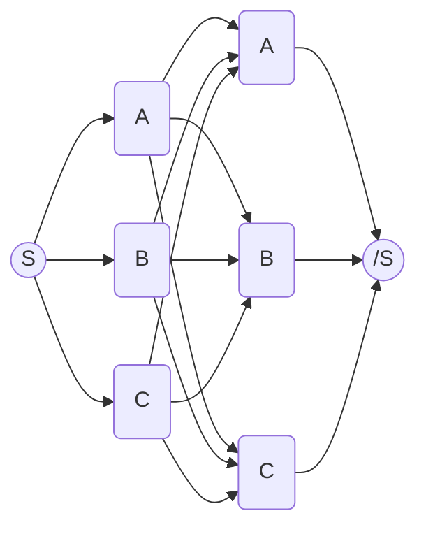

# N-Gram 语言模型

## 预处理与标注

### 数据获取

#### 开放域

##### 爬取

##### 数据清洗

- 噪声处理：处理爬取的数据中的其他语言
  - 例如中文网站中混入的英文广告
  - `langdetect` `Python` 库，用于识别一段文字的语言
- 简繁体转换
  - `OpenCC` 开源工具包
- 删除过短的评论
  - 英文评论可以统计空格数（间接统计单词数）
  - 中文评论可以分词后统计词数
- 标签对应
  - 根据任务类型建立文本数据与标签的对应关系
  - 例如网站抓取的评分是1-5分，但是情感只有褒贬两种

#### 封闭域

- 一般用于特定领域，直接从网上爬取的信息往往不能满足需。例如机器翻译。
- 平行语料：用于训练翻译模型
  - WMT: 世界机器翻译大会
  - UN: United Nations Parallel Corpus
- 单语语料：用于训练语言模型
  - `WikiExtractor` 开源工具

### 数据预处理

#### 词条化 Tokenization

- 对连续的字符串序列进行语言处理单元的划界和分类的过程
  - 屈折语/英语：Tokenization
  - 黏着语/汉语：分词
    - `jieba` 汉语分词库

#### 去停用词

- 去除在各类文档中出现频繁、附带信息极少的助词、介词、连词、语气词等高频词
  - the, which, at, 的, 了 等
  - 使用神经网络模型时基本已经不需要这一步骤
  - 但是使用简单的统计模型时仍有必要

#### 文本归一化

- 移除标点
- 统一日期、货币、数字等
- 统一缩写词

## 语言模型

- 发现语言使用的普遍规律：词频、词组频率统计
- 自动获取语言知识
- 对未知语言现象进行推测：预测下一个词出现的概率

### 基于规则的语法网络

- 一个语法网络是一个**加权有限状态机 (WFSM)**
- 语法包括词之间的回环、替代和重复等
- 对经常观测到的路径，可以在路径上赋予较高权重
  - 这个权重可以学出来

#### 限制

- 很难手工生成大量语法规则
- 自然口语很多时候时不符合语法的

### 统计语言模型

- 估计过程完全基于数据驱动

$$\mathbb{P}[W] = \mathbb{P}[w_1,w_2,\dots,w_K,w_{K+1}] = \prod_{k=1}^{K+1} \mathbb{P}[w_k|w_0,\dots,w_{k-1}]$$

- `<s> the overall operation ... string </s>`

### 统计语言模型的类别

- N-gram语言模型
  - 建模简单、速度快
  - 对未知词组预测能力低
- 神经网络语言模型
  - 速度较慢
  - 对未知词组预测能力高

## N-Gram 语言模型

- 近似地表示了在一个**较短历史**的情况下的条件概率

$$ \mathbb{P}[w_k|w_1,\dots,w_{k-1}] = \mathbb{P}[w_k|w_{k-1},\dots,w_{k-(n-1)}] $$

- 给定一个当前词的概率仅依赖于**这个词之前的 $n-1$ 个前驱词**。
- Unigram: $n=1$
- Bigram: $n=2$
- Trigram: $n=3$
- Quadrigram: $n=4$

一个 Bigram 语言模型

### N-Gram语言模型的最大似然估计

$$ \mathcal{L}(\theta|x_1,\dots,x_n) = \mathbb{P}_{\theta}[x_1,\dots,x_n] $$

- 参数 $\theta$ 和观测数据 $x_1,\dots,x_n$ 的函数

#### 参数估计

- 数据：词序列 $W_{[1,N]} = [w_1,\dots,w_N]$
- 模型: $\mathbb{P}[w_k|W_{[k-n+1,k-1]}]$, $w\in\mathcal{V}$
  - $\mathcal{V}$ 是词表

$$\begin{aligned}
    \mathcal{L}(\theta) &= \frac{1}{K}\sum_{k=1}^K\log\mathbb{P}[w_k|W_{[k-n+1,k-1]}]\\
    &= \frac{1}{K}\sum_{v\in\mathcal{V}}\sum_{y\in\mathcal{Y}}\sum_{w_k=v, y=W_{[k-n+1,k-1]}}\log\mathbb{P}[v|y]\\
    &= \frac{1}{K}\sum_{v\in\mathcal{V}}\sum_{y\in\mathcal{Y}}C(y,v)\log\mathbb{P}[v|y]
\end{aligned}$$

- $\mathcal{Y}$: 所有可能的 n-gram 历史集合
- $C(y,v)$: 训练集中历史为 $y$，当前词为 $v$ 的条目数

#### 优化

$$\begin{aligned}
    &\argmax_{\mathcal{P}[v|y]}\sum_{v\in\mathcal{V}}\sum_{y\in\mathcal{Y}}\log\mathbb{P}[v|y]\\
    &\text{s.t.}\quad \sum_{v\in\mathcal{V}}\mathbb{P}[v|y] = 1
\end{aligned}$$

- 拉格朗日乘数法（后略）

#### 求解

$$ \hat{\mathbb{P}}[v|y] = \frac{C(y,v)}{C(y)} $$

- $C(y)$ 是历史 $y$ 出现的次数

## 评估

### 前置知识

#### 信息（离散）

$$ I(x) = -\log_2\mathbb{P}[x] $$

#### 熵（离散）

- 随机变量信息的期望
- 熵时分布 $p(x)$ 的函数

$$ H = \mathbb{E}[I(x)] = -\sum_{x \in X}\mathbb{P}[x]\log_2\mathbb{P}[x] $$

#### 条件熵

- 条件分布 $p(y|x)$ 的熵的期望

$$H(y|x) = \sum_{x'}\mathbb{P}[x]H(y|x=x') = -\sum_x\mathbb{P}[x]\sum_y\mathbb{P}[y|x]\ln\mathbb{P}[y|x] $$

#### 联合熵

- 条件熵和边缘熵之和

$$ H(x,y) = H(y|x) + H(x) $$

### KL散度

$$\mathrm{KL}(p\|q) = -\int p(x)\ln q(x)\mathrm{d}x - \left( -\int p(x)\ln p(x)\mathrm{d}x \right) $$

$$ \mathrm{KL}(p\|q) = -\int p(x)\ln\left( \frac{q(x)}{p(x)} \right) \mathrm{d}x $$

- $\mathrm{KL}(p\|q) \ge 0$
- $\mathrm{KL}(p\|q) \neq \mathrm{KL}(q\|p)$

### 交叉熵

- 两个分布 $p$ 和 $q$ 之间信息的期望

$$ H_c(P,Q) = -\sum_x P(x)\log_2Q(x) $$

#### 语言模型中的交叉熵

- 在 N-Gram 模型 $P$ 和实际的开发文本集合上的实际词分布 $P_{data}$ 之间的交叉熵

$$\begin{aligned}
    H(P,Q) &= -\sum_{v\in\mathcal{V}}\sum_{y\in\mathcal{Y}}P_{data}(v|y)\log_2P(v|y)\\
    &\approx -\frac{1}{K}\sum_{v\in\mathcal{V}}\sum_{y\in\mathcal{Y}}C(y,v)\log_2\mathbb{P}[v|y]\\
    &\approx -\frac{1}{K}\sum_{k=1}^K\log_2\mathbb{P}[w_k|W_{[k-n+1,k-1]}]\\
    &= -\mathcal{L}(\theta)
\end{aligned}$$

### 困惑度 Perplexity

$$ \mathrm{PPL} = 2^{-\mathcal{L}(\theta)} = \left( \prod_{k=1}^K\frac{1}{\mathbb{P}[w_k|W_{[k-n+1,k-1]}]} \right)^{1/K} $$

- PPL越低则模型预测能力越强
- 在训练集较小时，PPL可能炸到 `inf`
  - $\mathbb{P}[w_k|W_{[k-n+1,k-1]}] = 0 $

## 平滑算法

> “好像智能语音识别都讲过，但是我当时没有认真听”

- 处理 N-gram 语言模型中的数据稀疏问题
  - 零概率
    - 导致无穷大的PPL
  - 低频次
    - 导致不可靠估计
- 解决方法
  - 折扣法 Discounting
    - 修正 N-gram 的频次，使得概率重新分布
    - 从通常容易观测到的分布调整到频次较低或根本没有的 N-gram 上
  - 回退及插值 Backing-off and Interpolation
    - 回退到较低阶的 N-gram 模型上
    - 直到得到一个鲁棒的估计

### 折扣法

#### 拉普拉斯平滑

$$ P(w)' = \frac{P(w) + 1}{P_{total} + K} $$

#### 折扣法框架

$$ \hat{P}_{ML}(v|y) = \frac{C(y,v)}{C(y)} \Longrightarrow \hat{P}_{discount} = d(y,v)\cdot\frac{C(y,v)}{C(y)} $$

- $d(y,v)$ 为折扣系数
- 需要保证修正后的概率求和仍然为 1

#### Good Turing Discounting

- 将训练数据中出现次数为 $r+1$ 次的 N-gram 概率重新分配给出现次数为 $r$ 次的 N-gram

$$ r^* = (r+1)\cdot\frac{N_{r+1}}{N_r} \qquad d(r)=\frac{(r+1)N_{r+1}}{rN_r} $$

- $N_r$: 训练集中出现次数为 $r$ 次的 N-gram 的数量

#### Jelinek-Mercer Smoothing (Interpolation)

- Good Turing 的问题
  - `C(Be, Happy) = 0` 和 `C(ZZZ, Happy) = 0` 会被赋予相同的频次
  - 但是 `ZZZ` 似乎不太合理
- 解决方法
  - 在低阶 N-gram 和高阶 N-gram 之间插值
  - 例如 unigram 和 bigram

$$ \mathbb{P}[] $$

## 大作业：语言模型回退算法

- 实现语言模型回退算法
  - 构建语言模型、测试PPL
  - 报告、结果
