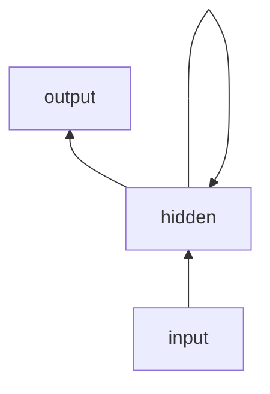

# 神经网络语言模型

## 语言模型基本概念

### 基本任务

已知前文，预测下一个字

- 输入
  - 单词序列 $x_1,x_2,\dots,x_{k-1}$
- 输出
  - 对下一个单词预测的概率 $\mathbb{P}[x_k|x_1,\dots,x_{k-1}]$

或者从另一个角度：推测句子的合理程度

$$ \prod_{k=1}^K \mathbb{P}[x_k|w_1,\dots,w_{k-1}] = \mathbb{P}[w)1,\dots,w_K] $$

### 评价标准

#### 困惑度

困惑度越小，则交叉熵越小，表明模型性能越优秀

### 统计语言模型

#### N-Gram模型

##### N-Gram的不足

- 存储空间
  - 模型存储需要的数据规模为 $|\mathcal{V}|^n$ 量级
  - 不能建模远距离依赖关系
- 数据稀疏
  - 低频词
  - 零概率
  - 需要 Discount 和 Back-off

## 神经网络概述

### 简单的MLP语言模型

#### 前馈

- 输入
  - 每个字的独热向量
- 查询拼接相应的词向量
- 经过隐藏层后输出

#### 优势

- 缓解数据稀疏，学习单词分布式表示
- 避免维度灾难，相比N-Gram占用更少的存储空间
- 可以并行计算

#### 不足

- 神经网络需要保存大量参数
- 权重矩阵的大小仍然会随着 $n$ 的增大而增大
  - 不能完全解决存储问题
  - 仍然不能很好地建模长序列

### 循环神经网络

- 详见AI2651智能语音技术

每个时刻 $t$ 的输入由两部分组成

- 输入序列在当前时刻的取值 $x_{t-1}$
- 上一时刻的网络输出 $o_{t-1}$ 或隐层状态 $h_{t-1}$

每个时刻网络的隐层状态 $h_t$ 为
$$ h_t = \sigma_h(Ux_{t-1} + Vh_{t-1} + b_h) $$

每个时刻的输出 $o_t$ 为
$$ o_t = \sigma_o(Wh_t + b_o) $$

#### 参数更新

$$ \mathcal{L}(r, o) = \sum_{t=1}^T \mathcal{L}_t(r_t, o_t) $$
其中 $t$ 是时间戳，$r$ 是标签，$o$ 是模型输出

#### 问题

- 容易出现梯度消失或梯度爆炸
  - 时间维度上的深度神经网络
  - 所有历史共享权重，加剧了梯度消失和梯度爆炸的问题
- 解决思路
  - 考虑当前时刻上下文的情况

### LSTM 长短期记忆网络

- 核心思想：长期记忆与短期记忆分离
  - 长期记忆用来存储和传递整个表达过程的状态
    - 每一时刻根据上下文情况更新
    - 不能被外界观察
  - 短期记忆根据当前上下文情况，从长期记忆中获取
    - 指导当前时刻的输出以及下一时刻长期记忆变化的部分
    - 相当于当前时刻被激活的长期记忆

#### 数学模型

- 长期记忆 Cell State $c^{(t)} \in \mathbb{R}^n$
- 短期记忆 Hidden State $ h^{(t)} \in \mathbb{R}^n $
- 门控机制
  - 控制记忆的消除、传递和读写
  - 门是一个和记忆向量同维度的向量
  - 每个元素是0到1之间的实数
  - 在使用时，将门向量与其控制的元素按元素相乘
  - 门根据每个时刻的上下文动态生成

##### 遗忘门

$$ f^{(t)} = \sigma(W_f [h^{(t-1)}; x^{(t)}] + b_f) $$

##### 输入门

$$ i^{(t)} = \sigma(W_i[h^{(t-1)};x^{(t)}] + b_i) $$

##### 输出门

$$ o^{(t)} = \sigma(W_o[h^{(t-1)};x^{(t)}] + b_o) $$

##### 候选单元状态

$$ \tilde{c}^{(t)} = \tanh(W_c[h^{(t-1)};x^{(t)}] + b_c) $$

##### 单元状态

$$ c^{(t)} = f^{(t)} \circ c^{(t-1)} + i^{(t)} \circ \tilde{c}^{(t)} $$

##### 隐藏状态

$$ h^{(t)} = o^{(t)} \circ \tanh(c^{(t)}) $$

##### LSTM与梯度消失

- LSTM让网络能够较好地保存远距离的信息
  - 较好地缓解了梯度消失的问题
- 类似深度神经网络的跳连

### GRU 门控循环单元

- 简化版 LSTM

#### GRU的门控机制

##### 更新门

- 控制原隐藏状态中内容的更新与保留

$$ z^{(t)} = \sigma(W_z[h^{(t-1)};x^{(t)}] + b_z) $$

##### 重置门

- 控制原隐藏状态中什么部分被用来和当前时刻的输入一起计算新的隐藏状态内容

$$ r^{(t)} = \sigma(W_r[h^{(t-1)};x^{(t)}] + b_r) $$

##### 候选状态

$$ \tilde{h}^{(t)} = \tanh(W_h[r^{(t)}\circ h^{(t-1)}; x^{(t)}]+b_h) $$

##### 隐藏状态

$$ h^{(t)} = (1-z^{(t)}) \circ h^{(t-1)} + z^{(t)} \circ \tilde{h}^{(t)} $$
