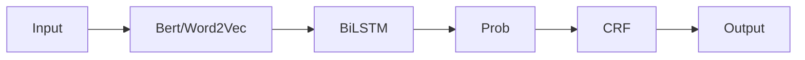

# 基于深度学习语言模型的序列标注

- 分词
- 词性标注 POS Tagging
- 命名实体识别 Name Entity Recognition
- 关键词抽取
- 语义角色标注 Semantic Role Labeling
- 槽位抽取 Slot Filling

## 深度学习词性标注框架

### 条件随机场回顾

- 对标签之间的转移概率进行建模
- 特征函数 $f$
  - 输入序列 $\mathbf{X}$
  - 当前输入的位置信息 $i$
  - 前一个标签 $l_{i-1}$
  - 当前标签 $l_i$

$$ f(\mathbf{X}, i, l_{i-1}, l_i) $$

可以使用特征函数计算分数

$$ score(l|s) = \sum_{j=1}^m\sum_{i=1}^n \lambda_j f_j(s,i,l_{i-1},l_i) $$

对分数归一化后得到概率

$$ p(l|s) = \frac{\exp(score(l|s))}{\sum{l'}\exp(score(l'|s))} $$

### 训练

#### 发射概率

- 时刻 $i$ 处在状态 $h_i$ 下生成观测 $y_i$ 的概率
- 在LSTM-CRF框架中，$h_i$ 是 $x_i$ 一一对应的隐层状态，所以发射概率也可以理解为从序列 $x_i$ 到标签 $y_i$ 的概率

$$ \bm{e}_i = p(y_i|x_i) = \frac{\exp(score(y_i))}{\sum_y\exp(score(y))} $$

或者取对数之后

$$ \log p(y|x) = score(y) - log\left( \sum_y\exp(score(y)) \right) $$

- 将词 $x_i$ 输入LSTM之后，得到对应的发射概率 $e_i$
- 将整个序列输入后可以得到发射矩阵 $E$

$$ e_i = E[i] \in \mathbb{R}^m $$

- 其中 $m$ 是标签 $y$ 的种类数

#### 转移概率

- 标签序列 $\mathbf{Y}$ 是一个序列，相邻元素（前后几个词的标签）之间有依赖关系
- 将标签 $y_{t-1}$ 转移到 $y_t$ 的概率定义为标签转移概率 $T[i-1, i]$

#### 综合打分

$$ score(\mathbf{Y}) = \sum_{i=1}^n \bm{e}_i + \sum_{i=2}^n (T[i-1, i]) $$

$$\log p(\mathbf{Y}|x) = score(\mathbf{Y}) - log\left( \sum_{\bm{y}}\exp(score(\bm{y})) \right) $$

- 其中 $score(\mathbf{Y})$ 已经可以计算，只需要再计算 $log\left( \sum_{\bm{y}}\exp(score(\bm{y})) \right)$
  - 但是可能的标签序列一共有 $m^n$ 个，穷举并不可行

##### 动态规划求解

- 对于 $t$ 时刻的输出 $y_t$，共有 $m$ 种可能
- 对于每种可能，我们记录从开始时刻到 $t$ 时刻时，$y_t$ 取某个值 $i$ 时经过的所有路径的分数的指数和的对数

$$ \log Z(y_t = i) = \log\sum_{y_t}\exp\left( score(start \to y_t) \right) $$

- 在 $t+1$ 时刻，假设 $y_{t+1}=j$
- 从 $i$ 到 $j$，路径得分的变化是在原有基础上加上 $T[i,j] + E[t+1,j]$

$$ \log Z(y_{t+1}=j) = \log\left( \sum_{y_t=0}^{m-1}\exp(score(start\to y_t)) + (T[i,j] + E[t+1, j]) \right) $$

### 推理

给定一个训练好的LSTM-CRF模型和输入 $\mathbf{X}$，求最有可能的标注 $\mathbf{Y}$

- 只需要知道得分最高的概率经过的节点，即可回溯得到需要的序列
- 需要保存各个节点的得分最高的路径和得分
- 假设已知LSTM输出的发射矩阵 $E$ 和标签转移矩阵 $T$

令 $t_0$ 时的节点最大路径得分

$$ \beta_0 = E[:, 0] \in \mathbb{R}^m $$

节点 $i$ 的最大路径得分到节点 $j$ 的路径得分为

$$ M_1[i,j] = \beta \circ T + E $$

- 其中 $\circ$ 表示逐项相乘（对数时相加）

此时只需要对 $M_1[:,j]$ 求最大值，即可知道 $t=1$ 时刻到节点 $j$ 的最大的分路径

$$ \beta_1 \in \mathbb{R}^m $$

以及最大路径在 $t=0$ 时对应的节点向量

$$ P_1 \in \mathbb{R}^m $$

$$ I_0 = P_1[I_1] $$

重复直到 $t=n-1，然后反向求出 $I_n$，最终输出序列为

$$ I = [I_0,\dots,I_n] $$
