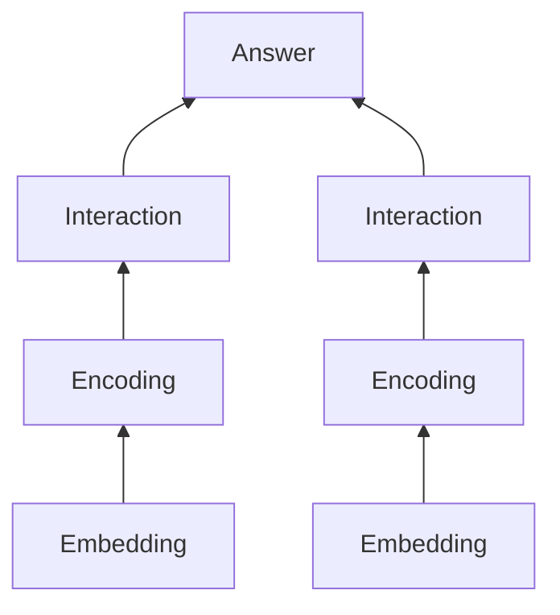

# 智能问答

## 社区问答

- 从已有的问答库中检索出最匹配的问答对来回答问题

### 事实类问题和非事实类问题

- 事实类问题询问的室关于实体或客观事实的信息
- 非实时类问题主观性较强，可能不适合统计模型
  - 通过人为构造问答库+问答对匹配的社区问答方法可以有效解决机器较难回答的非事实类问题

### 基于问答库的问答

- 在问答库较大时，通常采用问答对检索和问答对匹配两步
- 检索过程初步筛选出部分候选问答对
  - 要求较高检索速度
  - 通常基于信息检索
- 匹配过程进行精细筛选
  - 需要较高的匹配精度
  - 通常基于神经网络

### 问答对检索

- 采用信息检索 Information Retrieval 技术；从问答库中检索出若干个和问题相关的问答对，并给出相关性排序
- 重点在于给出输入问题和问答库中候选问题的特征表示，并进行打分

#### TF-IDF Term Frequency-Inverse Document Frequency

- TF 词频
  - 某个词$t$在文档$d$中出现的频率
  - $TF(t,d) = Count(t,d)$
  - 通常会对词频进行一些缩放
    - $TF(t,d) = \log_{10}(Count(t,d)+1)$
- IDF 逆文档频率
  - 对于只在少量文档中出现的词给出更多权重；对于在很多甚至所有文档中都出现的词给出较低权重
  - 假设有 $N$ 个文档，词 $t$ 在 $DF(t)$ 个文档中出现过
  - $IDF(t) = \log_{10}\left( \frac{N}{DF(t)} \right)$
- TF-IDF
  - $TFIDF(t,d) = TF(t,d) \cdot IDF(t)$

#### 文档打分

文档 $d$ 和 $n$ 个词汇的TF-IDF可以构成文档的 $n$ 维特征向量。通过问题 $\mathbf{q}$ 和 文档向量 $\mathbf{d}$ 之间的余弦距离进行打分

$$ score(q) = \sum_{t\in q} = \frac{TFIDF(t,q)}{\sqrt{\sum_{q_i\in q} TFIDF^2(q_i,q)}} \cdot \frac{TFIDF(t,d)}{\sqrt{\sum_{d_i \in d} TFIDF^2(d_i,d)}} $$

由于通常问题比较短，每个词常常只出现一次，所以可以采取近似

$$ score(q,d)\approx \sum_{t\in q}\frac{TFIDF(t,d)}{|\mathbf{d}|} $$

#### BM25

- TF-IDF改进版

$$ BM25(q,d) = \sum_{t\in q}\log_{10}\left( \frac{N}{DF(t)} \right)\frac{TF(t,d)}{k\left( 1-b+b\left( \frac{|d|}{|d_{avg}|} \right) \right) + TF(t,d)} $$

- $k$ 调整TF和IDF之间的平衡
- $b$ 控制文档长度归一化的重要程度
  - $b=1$ 时根据文档长度进行缩放
  - $b=0$ 时不考虑文档长度归一化
  - 常用 $b=0.75$

#### 倒排索引

- 针对每个词汇，存储一个链表，链表按每个文档中该词出现的频率倒序排序

### 问答对匹配

#### 基本架构

#### BiMPM

输入两个 $d$ 维向量 $v_1$, $v_2$，返回一个 $l$ 维向量 $\mathbf{m}$ 作为两个向量间的相似度

$$ \mathbf{m} = f_m(v_1,v_2;\textbf{W}) $$

- $\textbf{W}$ 是 $l\times d$ 的参数矩阵
- $m_k = \cos(W_k \circ v_1, W_k \circ v_2)$

## 开放领域问答

- 又称检索式问答，通过在网页等大规模文档库中检索相关文档来回答问题
- 可以分为文档检索和文档阅读理解两个阶段

### 文档检索

- 利用信息检索技术从知识库中检索出若干文档
  - TF-IDF、倒排索引、BM25等均可使用
- 使用n-gram作为term来计算的TF-IDF在实际应用中效果更好，更能反应文档特征

## 文档阅读理解

### 任务类型

- 抽取式
  - 答案是文章中的连续片段
- 多选式
  - 答案是提供的若干个选项的一个
- 生成式
  - 答案不一定在文章中出现，需要模型生成
- 填空式
  - 答案是对问题的完形填空

### 抽取式阅读理解 SQuAD

- 评价指标
  - EM Exact Match
  - F1 Scorec

### 多选式阅读理解 RACE

- 评价指标
  - Acc

### 生成式阅读理解 NarrativeQA

- 评价指标
  - BLEU
  - Meteor

### 填空式阅读理解 CBT

- 评价指标
  - Acc
