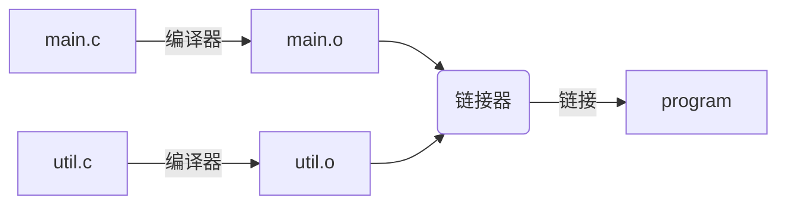

# 链接

## 什么是链接

### 单个源文件

- 效率低下：每次修改都需要重新编译整个源代码
- 模块化差：难以实现代码复用

> “你的老板可能不知道怎么实现这个事情，但是他会提这个需求。”
> “一个上进的程序员也会提这样的需求。”


### 文件拆分



- 将整个 `main.c` 拆分成多个源文件
  - 每个文件分别编译
- 单独编译后，只有跨文件的函数调用（跳转）尚未确定

### 链接器

#### 链接器做什么

- 将来自于不同文件的代码和数据组合成一个单独的可执行文件

#### 何时执行

- 编译时：将源代码翻译为机器码时
- 加载时：加载到内存并执行时 `dll`
- 运行时：执行过程中

#### 编译器驱动程序 (driver)

- 负责总体协调翻译和连接过程中的所有阶段
- 通常包含在编译系统中 (e.g. `gcc`)
  - `cpp` 预处理
  - `cc1` 编译
  - `as` 汇编
  - `ld` 链接

#### 静态链接

- 输入
  - 一组可重定位目标文件
  - 一些命令行参数
- 输出
  - 完全链接后的可执行目标文件（可加载至内存并运行）

#### 可重定向目标文件 (Relocatable Object File)

- 包含二进制代码和数据
- 可以与其他可重定向目标文件链接成为可执行文件

#### 节

- 可重定向目标文件中的代码和数据被划分为不同节
- `.text` 指令代码
- `.data` 初始化的全局变量和静态变量
- `.bss` 未初始化的全局变量和静态变量

#### 符号解析

- 解析对当前文件之外的引用
- 外部引用
  - 引用定义在其他文件中的符号
  - 在可重定位目标文件中填充为 `0`
  - 在链接时需要解析

#### 重定位

- 将可重定向文件的相对地址解析为绝对位置，将引用更新到真实的绝对位置

## ELF文件格式（可执行可链接格式）

### ELF文件概述

- `Linux` 下统一的目标文件格式
  - 可执行目标文件（对应于 `Windows` 下的 `.exe` 格式）
  - 可重定向目标文件 `.o`
  - 共享目标文件 `.so`
    - 可以加载到内存中
    - 无需在编译时链接，支持动态连接

#### 可执行可链接格式 ELF

- 目标文件的标准二进制格式
  - 适用于三种目标文件的统一格式
- 又称为ELF二进制文件

### ELF文件的Metadata

```text
┌───────────────────────┐
│       ELF Header      │
├───────────────────────┤
│       .text           │
├───────────────────────┤
│       .rodata         │
├───────────────────────┤
│       .data           │
├───────────────────────┤
│       .bss            │
├───────────────────────┤
│       .symtab         │
├───────────────────────┤
│       .rel.text       │
├───────────────────────┤
│       .rel.data       │
├───────────────────────┤
│       .debug          │
├───────────────────────┤
│       .line           │
├───────────────────────┤
│       .strtab         │
├───────────────────────┤
│     Section Header    │
└───────────────────────┘
```

#### ELF Header

- ELF文件的第一部分
- 通常用于存放元数据
  - Magic Number
    - 常见的是 `0x7f` `E` `L` `F` 等
  - 类型（`.o`，`.so`，可执行）
  - 机器架构
  - 字节顺序（大小端）
  - 头部表的位置（文件内偏置）
  - ...

#### 节头部表 Section Header Table

- 节
  - 除Header和头部表外划分为若干区域
  - 每个节在文件中是一块连续的字节（可能为空）
  - 互不重叠
- 每个节都有一个节头部描述，记录在节头部表中
  - `sh_name` 节名称 (`.strtab` 中的偏移量)
  - `sh_addr` 节加载到内存后的起始地址
  - `sh_offset` 节在文件中的偏移（字节数）
  - `sh_size` 节的大小
  - `sh_addralign` 对齐要求

#### 字符串表 `.strtab`

- 集中ELF文件中所有C风格字符串（以`\0`结尾的字符数组）
  - 字符串原有的位置替换为内存地址
  - 使文件更规整

#### 调试信息 `.debug` `.line`

- 便于调试的节
- `.debug`
  - 调试符号表，包括变量、`typedef`、C源文件
  - 使用 `gcc -g` 生成
- `.line`
  - C源文件的行数与 `.text` 节中指令的映射
  - 指示一段高级代码被翻译成了哪几段汇编代码

#### 只读段 `.text` `.rodata` 和读写段 `.data` `.bss`

- `.text` 代码
- `.rodata` 只读数据
- `.data` 初始化的全局和静态变量
- `.bss` 未初始化的全局和静态变量
  - Q: Why `bss`? A: `block started by symbol` / `better save space`
  - 不占文件空间，但是在节头部表中有记录
  - 运行时分配内存，默认初始值为 `0`
    - 会导致加载进内存的文件大小比ELF文件大小更大一些
    - 因为载入内存后增加了一些初始化后的变量
  - 初始化为 `0` 的全局变量也可能被编译器优化到 `.bss` 中

#### 符号表 `.symtab`

- 每个可重定位目标文件有一个符号表，记录符号的定义和引用信息
- 编译器将符号输出到汇编文件
- 汇编器将符号构建成符号表
  - 存放在ELF的 `.strtab` 节

##### 符号

- 定义(defined)的全局符号
- 引用(referenced)的全局符号
- 局部（静态）符号
  - 局部非静态变量不作为ELF符号表的符号，而是直接放置在运行时栈或寄存器上

```cpp
extern int a; // a referenced

int f() { // f defined
  static int x = 1; // x local static defined
  int b = 2; // not recorded in .symtab
  return x + b;
}

int g() { // g defined
  static int x = 1; // another local static defined
  return x + a;
}
```

#### 重定位 `.rel.text` `.rel.data`

> `.rel` 表示 relocation

- 对于每个未知的引用，在链接时需要重新定位

##### 重定位

- 合并各个模块，给每个符号分配运行时的地址
- 符号解析
- 地址填充

## 可执行目标文件

```text
┌───────────────────────┬───
│       ELF Header      │
├───────────────────────┤
│     Program Header    │
├───────────────────────┤
│       .init           │ Read Only
├───────────────────────┤
│       .text           │
├───────────────────────┤
│       .rodata         │
├───────────────────────┼───
│       .data           │
├───────────────────────┤ Read/Write
│       .bss            │
├───────────────────────┼───
│       .symtab         │
├───────────────────────┤
│       .rel.text       │
├───────────────────────┤ Does not
│       .rel.data       │ load into
├───────────────────────┤ memory
│       .debug          │
├───────────────────────┤
│       .line           │
├───────────────────────┤
│       .strtab         │
├───────────────────────┤
│     Section Header    │
└───────────────────────┴───
```

### ELF Header

- 整体信息
- 程序入口 `e_entry`：会被加载到 `PC`中
- 程序头部表信息
  - 在文件中的起始位置 `e_phoff`
  - 大小 `e_ehsize`
  - 每个条目的大小 `e_phentsize`
  - 条目数目 `e_phnumber`
  - ...

### 程序头部表 Program Header Table

- Program (Segment) Header Table
  - `p_type`
  - `p_flags` 运行时权限 `rwx`
  - `p_offset` 段在文件中的起始偏移
  - `p_filesz` 段在文件中的大小
  - `p_vaddr` 内存中的起始虚拟内存地址
  - `p_memsz` 段在内存中的大小
    - 由于有 `.bss`，内存大小和文件大小可能不一样
  - `p_align` 段起始地址的对其要求
    - 通常为 `4K` 或 `2M`

### 加载到内存后

#### 启动代码 `_start`

- 所有C程序都相同的程序入口
- 定义在 `crt1.o` 中
- `__libc_start_main`
  - 初始化执行环境
  - 调用 `main`
  - 处理返回值
  - 返回控制权

#### 加载器

- 通过 `execve` 调用操作系统提供的功能
- 将代码和数据加载到内存中
- 跳转到程序入口

## 链接与库

### 静态库 `.a`

- 将一组可重定位目标文件拼接成一个单独的文件
- 链接器在打包的 `.o` 文件中找未解析的外部符号
- 然后链接对应的 `.o` 文件

#### 问题

- 库改动后需要重新链接
- 在可执行文件中会有许多常用代码的拷贝，造成文件较大

### 共享库

- 代码和数据被所有可执行文件共享
  - 需要操作系统协助
    - `Linux` 中的 `.so`
    - `Windows` 中的 `.dll`
- 共享库在编译时只进行部分链接
  - 代码和数据不会被拷贝到可执行文件中
  - 只拷贝部分重定位和符号表信息
- 加载至内存时完成最后的链接
  - 将共享库的数据和代码拷贝到某个内存段
  - 重定位引用动态库的代码和数据
  - 链接后的执行过程中，共享库在内存中的位置固定不变

#### 生成共享库

```shell
gcc -shared -fPIC -o libvector.so addvec.c multvec.c
```

- `-shared` 共享目标文件
- `-fPIC` 位置无关代码
