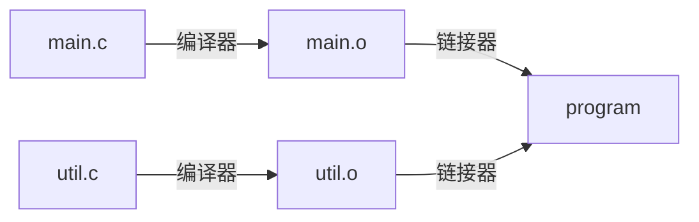

# 链接

## 什么是链接

### 单个源文件

- 效率低下：每次修改都需要重新编译整个源代码
- 模块化差：难以实现代码复用

> “你的老板可能不知道怎么实现这个事情，但是他会提这个需求。”
> “一个上进的程序员也会提这样的需求。”

### 文件拆分

- 将整个 `main.c` 拆分成多个源文件
  - 每个文件分别编译
- 单独编译后，只有跨文件的函数调用（跳转）尚未确定

### 链接器

#### 链接器做什么

#### 何时执行

- 编译时：将源代码翻译为机器码时
- 加载时：加载到内存并执行时
- 运行时：执行过程中
