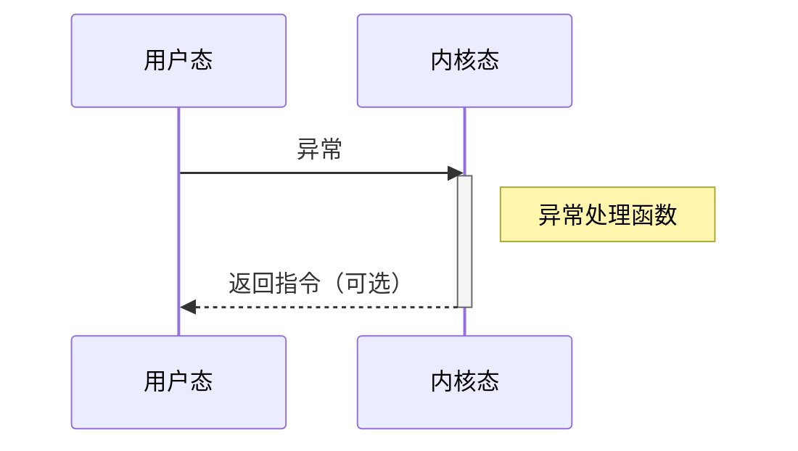

# 操作系统

> “程序是写死在那边的，也不能和他交流。”
> “操作系统劝你别访问这个。”

操作系统的主要功能

- 保护硬件不被应用程序滥用
- 为应用提供简单、统一的接口来操作硬件

## 三个基本抽象

> “抽象这个东西本身非常抽象”

- 进程 process
- 虚拟内存 virtual memory
- 文件 file

```kkkkk
| <-------------Process--------------> |
            | <----Virtual Memory----> |
                          | <--File--> |
| Processor | Main Memory | IO Devices |
```

### 进程

程序执行需要依赖处理器，但是处理器资源有限，而且每个程序并不是时刻都需要使用处理器。大部分操作系统让各个程序“轮流”使用处理器。

程序运行时，操作系统会提供一种假象

- 操作系统中**只有**这个程序在运行
- 一个程序看起来独占了所有处理器、主存、IO设备
  - 无间断地依次执行指令
  - 独占了所有内存
  - 独占了所有IO
- 当一个程序在操作系统上运行了一段时间后，会被系统打断执行，把处理器让给其他程序
- 当一个程序需要等待外部资源（IO、磁盘等），操作系统也会暂时把该程序调走，等到该程序等待的资源准备完毕后在切换回来

#### 进程概述

进程
: 一个正在运行的程序。操作系统提供的抽象之一。

- 一个程序可以对应多个进程
  - 一个程序开好几个
  - 一个程序使用多线程
- 多个程序也可以对应一个进程
  - 比如GPU Code fusion

进程由两个部分组成

- 用户部分
- 操作系统部分
  - （狭义上）又称为内核 kernel
  - 由所有进程共享

#### 进程切换

进程之间进行切换的步骤称为**上下文切换**。

- 操作系统为每个进程维护了一个称为 **进程控制块(Process Control Block PCB)** 的区域，用于记录每个进程的基本信息
- 上下文切换时，操作系统将当前进程的各种状态保存到PCB，并读取下一个进程的PCB，将上下文恢复到处理器中

#### 进程树

在 Linux 系统中，新的进程都是由现有的进程创建出来的，从而构成了进程之间的父子关系，所有进程最终都来自一个父进程

### 虚拟内存

#### 虚拟内存的动机

- 现代操作系统中，常常有数十上百个应用程序想要同时运行
  - 如果允许每个应用程序访问所有内存资源，则需要在上下文切换时将整个内存保存到磁盘，时间开销巨大
  - 如果每个应用程序独立使用物理内存的一部分
    - 无法保证不同应用程序使用物理内存之间的隔离性
    - 无法保证应用程序运行时使用的内存地址是连续且统一

#### 虚拟内存机制概述

- 每个进程都独占了虚拟内存
- 应用程序通过虚拟内存来间接访问物理内存
- 虚拟地址空间
  - 程序的代码与数据、堆、共享库、运行时栈
  - 内核
- 通过处理器中专门的硬件和操作系统协同完成地址翻译
  - 现代处理器通常使用专门的内存管理单元 MMU 来进行地址翻译
  - MMU 的地址翻译规则和策略由操作系统决定

#### 进程的虚拟地址空间

每个进程都拥有各自的私有地址空间，这是一段从0开始的连续的地址空间。除去内核代码、内核数据、内核栈外，该地址空间的布局从上到下依次为

- 内核代码及数据、内核栈
  - 用户态应用程序通常无法访问这部分内存
  - 只有通过中断或者系统调用机制进入到内核的代码后，才能由操作系统来操作这部分内存
- 用户栈
  - 保存临时数据（局部变量等）
  - 可伸缩，扩展方向**自顶向下**（从高地址向低地址扩展）
- 代码库
  - 共享的代码库
  - 只读
- 用户堆
  - 运行时动态分配的地址
  - 扩展方向**自底向上**，与栈相反
- 数据与代码段
  - 原本保存在需要执行的二进制文件中
  - 在进程执行之前，操作系统会将它们载入到虚拟地址空间
  - 数据段主要保存全局变量的值
  - 代码段保存进程执行的指令

### 文件

文件是一个存储设备中的、有名字的字节序列，用于给不同的存储设备提供统一的操作接口

- 每个打开的文件都有一个独立的编号 File Descriptor, FD
- 字节序列的内容称为**文件数据**
- 操作系统同时保存长度、修改时间等其他信息，称为**文件元数据**
- 每个文件拥有自己的**文件名**，被组织在**目录**中
- 由**文件系统**管理

#### IO的文件抽象

> Linux “一切皆是文件” 的设计哲学

除了存储设备中的字节序列之外，其他设备（IO等）也可以被抽象为文件，从而可以使用操作系统提供的文件操作接口统一操作

- 每个IO设备都被抽象为一个文件
- Unix IO
  - 提供有限的系统调用来读写“文件”
  - 所有输入输出都通过这些系统调用完成

## 用户态与内核态

### 处理器特权级

现代处理器提供**特权级**机制，限制处理器可以执行哪些指令，通常由处理器中特殊的状态位表示

AArch64提供4个特权级

- `EL0`
  - aka 用户态。最低的特权级。一般的应用程序通常运行在这一级别
  - 不能执行特权指令
  - 不能直接访问地址空间中的内核部分
  - 只能通过**系统调用**来间接（且可控）地达成上述目的
    - 系统调用是应用程序实现这些目的的唯一合法方式
    - “你除个零能进kernel，触发Segmentation Fault也能进kernel”
- `EL1`
  - aka 内核态。操作系统通常运行在这一级别
  - 可以执行任何指令
  - 可以访问任何内存地址
- `EL2`
  - 在虚拟化场景下，虚拟机监控器（Virtual Machine Monitor, aka. Hypervisor）通常运行在这一级别
- `EL3`
  - 和体系结构的TrustZone特性相关。用于普通世界和安全世界的切换，安全世界可以不受限地访问所有计算资源，而普通世界不能访问安全世界的资源。

## 异常 Exception

### 用户态与内核态的控制流转换

- 跳转指令 `b` 和过程调用/返回指令 `bl` `ret` 都只能在同一种模式内跳转
- 需要新的指令 `svc` `eret`

### 系统调用

- 系统调用参数不超过8个，放置于寄存器 `x0` 至 `x7`
- 寄存器 `x8` 用于存放系统调用编号
  - `svc` 指令将直接根据 `x8` 跳转至系统调用
- 返回值存放于 `x0`

### 事件 Event 与异常 Exception



- 事件与当前指令可能有关，也可能无关
  - 事件可以理解为触发异常的行为
  - `svc` `eret`（有关）
  - 缺页、溢出（有关）
  - 定时器结束、IO请求完成（无关）
- 异常处理结束后，将通过以下某种方式之一返回控制权
  - 回到异常发生时正在执行的指令
  - 回到异常发生时的下一条指令
  - 结束当前进程

### 异常向量表

- 操作系统内核预先在一张表中准备好不同类型异常的处理函数
  - 基地址存储在 `VBAR_EL1` 寄存器中
- 发生异常时自动跳转到对应位置
- 一共16项，其中4条最为常用
  - 各个处理函数根据各自处理的异常类型进一步调用其他函数
- 处理器将异常类型存储在指定寄存器 `ESR_EL1` 中

### 异常类型

#### 同步异常

- 由于执行指令而发生时间引起的异常
  - 同步：与当前进程有关
- 陷阱 Trap
  - 有意触发的异常
  - 例如断点、系统调用
  - 异常处理函数返回到下一条指令
- 故障 Fault
  - 非有意触发，但是可能可以恢复（但是不一定能成功恢复）
  - 例如缺页异常、保护错误
  - 控制权将返回到当前指令，或终止当前进程
- 终止 Abort
  - 非有意触发、不可恢复
  - 当前进程将被终止

#### 异步异常：中断 Interrupt

- 由处理器外部的事件导致
  - 外部设备设置处理器的中断引脚
  - 处理函数返回到被中断的下一条指令
- 例子
  - IO中断
    - `CTRL + C` Keyboard interrupt
    - 网络收到数据包
    - 磁盘从某个扇区读取完成
  - 硬复位
    - 重启按钮
  - 软复位
    - `CTRL + ALT + DEL`
- 流程
  - IO设备通过设置处理器引脚来发起终端
  - IO设备向总监发送一个信号，表示发起中断的是哪个设备
  - 处理器将打断当前执行流，跳转到中断处理函数

### 信号

- 操作系统向应用程序发送的信息
  - 例如 `Segmentation Fault` 发生时，向应用程序发送 `SIGSEG` 信号

### 内存映射IO

- IO设备抽象为内存地址，对IO设备的操作抽象为读写内存的操作
- 每个设备可以被映射到多个IO端口
