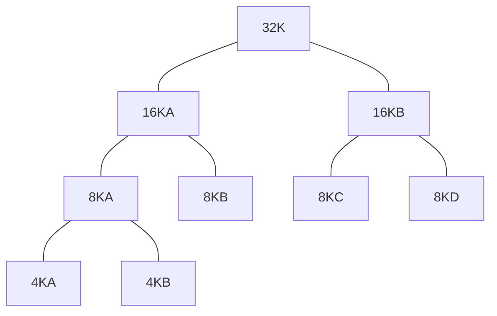

# 物理内存管理

## 物理内存管理概述

### 什么时候考虑物理内存

引入虚拟内存后，物理内存主要出现在以下四个场景

1. 用户态程序出现 `Page Fault`
   - 需要找到空闲的物理页、分配页表并重新执行访存代码
2. 内核自己申请内存并使用时
   - 使用 `kmalloc` 函数完成
   - 出于性能考虑，与 `malloc` 机制不同，不会按需分配内存页
3. 内核申请用于设备的DMA缓存
   - 设别绕过CPU直接访存
   - 通常需要大段连续的内存
   - 需要有能力分配连续的物理页用于缓存
4. 换页（Swapping）时
   - 需要实现换入、换出操作

### 直接映射机制

- 一次性将所有物理内存映射到一段虚拟地址空间
  - 物理地址和虚拟地址之间只相差一个偏移量
    - 可以快速进行物理地址和虚拟地址的映射
  - 类似最早期的内存分配机制，但是实际通过配置页表实现
- 特点
  - 内核使用直接映射的虚拟地址，不会触发`Page Fault`
  - 可以更方便地找到连续的物理页
  - 内核并没有占有这段空间，只是建立了映射关系便于查找
  - 内核需要使用时仍然要调用 `kmalloc` 分配内存
  - 但是与一般应用程序不同，内核可以直接访问映射范围内的任何地址（而不会触发 `Segmentation Fault`）

#### 对于内核

- 已经映射的地址不一定正在使用（需要`kmalloc`后才能用）
- 正在使用的地址通常已经映射
  - 例外：使用`vmalloc`分配内存，`vmalloc`行为类似用户态的`malloc`

#### 对于应用

- 正在使用的地址（已有VMA）不一定已经有映射（按需分页）
- 已经映射的地址一定正在使用（否则不会被映射）

#### 直接映射机制下的虚拟地址

- 同一个物理地址可能有多个虚拟地址
  - 应用程序下任意一个已经映射的虚拟地址，在内核的直接映射下也有一个虚拟地址

## 伙伴系统

### 空闲物理内存的简单管理方法

- 通过bitmap记录物理页是否空心啊
- 分配时，找到空闲的物理页，并在bitmap中标记为非空闲
- 回收时，在bitmap中把对应页标记为空闲

#### 问题

- 如果只考虑以“页”为粒度的分配，则没有问题
- 但是要分配大段连续内存时，可能造成外部碎片，且查找效率较低

### 伙伴系统 Buddy System

#### 分裂与合并

- 一个伙伴块可以分裂为下一级的两个伙伴块
- 两个连续伙伴块可以合并成一个上级伙伴块

#### 分配

- 当一个请求需要$m$个物理页时，伙伴系统将寻找一个合适的块，该块包含 $2^n$ 个物理页，且$2^{n-1} < m \le 2^n$
- 释放时，OS会找到被释放块的伙伴块，如果伙伴块为空闲状态，则直接合并

#### 数据结构

- 使用链表，第$n$个节点记录 $2^n$ 大小的块
- 需要分配内存时
  - 先查找最合适的大小的节点是否为空
    - 即有无可分配的块
  - 如果有则分配
  - 没有则查找更大的节点，并将更大的节点分裂成合适的大小

#### 伙伴机制的特点

- 可以高效地找到伙伴块
- 互为伙伴地两个块只有1位地址不同
- 且块的大小决定了哪一位地址不同

#### 优势与弊端

- 优势
  - 缓解外部碎片问题
  - 可以快速查找同层的伙伴页，使合并机制性能提高
- 问题
  - 一次内存页释放可能导致大量合并操作，造成时间开销
  - 内部碎片依然存在

## SLAB/SLUB/SLOB：细粒度内存管理

内核大量数据结构都只有几十Byte，直接分配一个4KB的页会导致内存利用率极低，因此需要更细粒度的内存管理

### SLAB 分配器家族

- 目标：快速分配小内存对象
- 以主流的SLUB为例

### 基本思路

- 操作系统频繁分配的对象的大小相对比较固定
- 从操作系统获得大块内存（称为一个slab）
- 把一个slab进一步细分为固定大小的小块（slot）内存进行管理
- 块的大小通常是$2^n$字节

### SLUB设计

- 只分配固定大小的块
- 对每组固定大小的块（32B、64B、128B等），SLUB使用独立的资源池进行分配
- 采用best-fit策略选择合适的资源池
  - 例如`14Byte`的使用`16B`块，`17Byte`的使用`32B`块

#### 空闲链表

- 使用空闲链表组织一组固定大小的空闲块
- 分配时，先找到合适的大小，然后取走链表头指向的内存小块
- 若当前大小的块已经全部分配完，则从伙伴系统申请一个新的slab并划分成slot继续分配
- 释放时，根据被释放object的地址找到当前slab的起始地址即可

### 总体架构

- 三个指针
  - `current` 指向当前正在使用的slab
  - `partial` 指向所有未满的slab
  - `full` 指向所有已经分配完的slab
- 分配时使用 `current` slab
  - 若满则当前slab移动到 `full`
  - 然后从 `partial` 里抓一个 slab 作为新的 `current`
  - 如果没有空余的 `partial`，则重新申请一个slab放到 `current`
- 释放时释放到对应slab
  - 如果一个 `full` 的slab的一个slot得到释放，则移动到 `parital`
  - 如果一个slab释放完之后为空，则归还给伙伴系统

### 小结

#### 伙伴系统

- 分配单个或连续的物理页
- 缓解外部碎片

#### SLUB

- 分配比页小的内存请求
- 缓解内部碎片

## 换页策略

### 理想策略（OPT）

#### 策略

- 假如已知完整的物理页面访问顺序，则从最小化缺页异常的角度
  - 先替换不再使用的页
  - 再替换短时间内不再使用的页

#### 问题

- 理想情况，实际上无法知道完整的物理页面访问顺序

### FIFO策略

> “做Lab不考虑性能的时候可以用”

#### 策略

- 维护一个队列
- 先读入的物理页面先被替换

#### 问题

- 性能问题
  - Belady's Anomaly
    - 物理页增加反而可能导致某些情况下效率下降

### Second Chance

#### 策略

- 从FIFO策略改进
- 为每个物理页号维护一个访问标识
- 如果访问的页面号已经处于队列中，则置上其访问标识位
- 换页时仍然查看队头
  - 如果没有标识位，则换出
  - 否则去除标识并将其放入队尾，继续寻找

### Least Recent Used LRU

#### 策略

- 维护一个链表
- 每次内存访问后，把刚访问的内存页调整到链表尾端
- 每次都选择换出链表头部的页面

#### 问题

- 对于特定序列，效果可能非常差（例如循环访问内存）
- 需要排序的内存页可能非常多，会造成额外负载

#### 实现

- 在应用程序运行时，应用程序占用了CPU
- 因此OS此时不在运行
- 因此OS并不知道应用程序访问了哪些页
- 因此对页访问的监控需要依赖硬件

##### 精准排序

- CPU在访问某个页时，在页表项上大时间戳
- OS遍历每个内存页的页表项，根据时间戳排序
- 缺点
  - 遍历所有页表项过于费时
  - 在有多个CPU时，不同CPU的时间戳不一定能全局排序，无法保证完全精确

##### 时钟算法

- LRU精准排序的近似实现
- 物理页组织成一个环形队列
- 每个物理页页表项中有一个访问位 `AccessBit`
- OS把所有 `AccessBit` 抹去为 `0`
- 然后交给 CPU，每当物理页被访问时，CPU将 `AccessBit` 设为 `1`
- 当需要踢出一页时，操作系统按序访问页表
  - 如果 `AccessBit` 为 `1`，则置零
  - 否则踢出该页
- OS只需要维护一个指针，标记当前扫描到哪里
  - 换页时不需要遍历整个页表
  - 扫描到第一个 `0` 即可
- 如果所有 `AccessBit` 均为 `1`，则遍历一圈后会访问到 `0`

###### 反向映射

- 在踢出一个物理页后，需要修改所有页表中映射到该物理页的虚拟页
- 当物理页被填写到某张页表时，把页表项的位置记录在元数据中
  - Linux 中称为 Reverse Mapping
- 根据物理页对应的页表项中的 `AccessBit` 判断是否要驱逐该项
- 踢出该页时清空所有对应的页表项

!!!note
    在实际应用中找不到 one-size-fit-all 的策略。但是 LRU 在大部分情况下的表现都很良好。

## 工作集模型

### Thrashing Problem

- 直接原因
  - 对物理内存的需求过大，导致频繁的缺页异常
- 导致大部分CPU时间都被用来处理缺页异常
  - 等待缓慢的磁盘读写
  - 只有少部分时间在执行真正有用的计算操作
- 调度器使问题加剧
  - CPU等待磁盘读写导致CPU利用率下降
  - 调度器载入更多进程，以期提高CPU利用率
  - 结果造成更多缺页异常，陷入恶性循环

### 工作集

- $W(t,x)$ 表示进程在 $[t-x, t]$ 时间段内使用的内存页集合
- 也用于估计该进程在下一个 $x$ 时间段内将要使用的内存页集合
  - 即使用过去的内存页访问记录预测未来可能的内存访问
- All-or-Nothing
  - 一个进程的工作集要么完整地保存在物理内存中，要么整个从物理内存中换出

#### 跟踪工作集

- 工作集时钟中断固定间隔发生，调用处理函数扫描内存页
- 若某页访问位为 `1`，则记录访问时间为当前 tick
- 若某页访问位为 `0`，则 $Age = tick - 上次使用时间$
  - 若 $Age > x$，则该页不在工作集中
- 最后，OS将所有访问位清零
