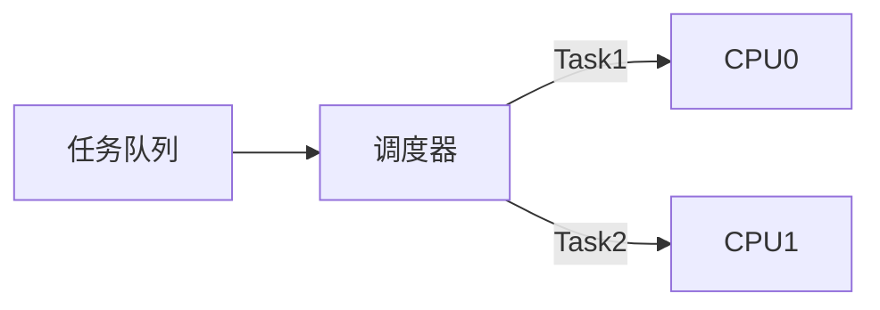
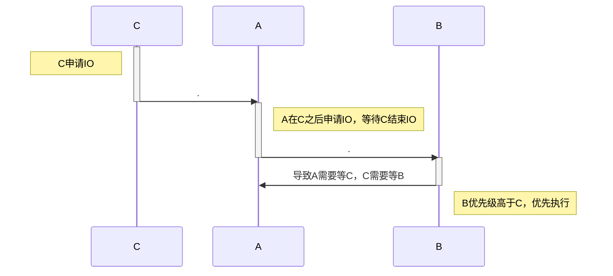
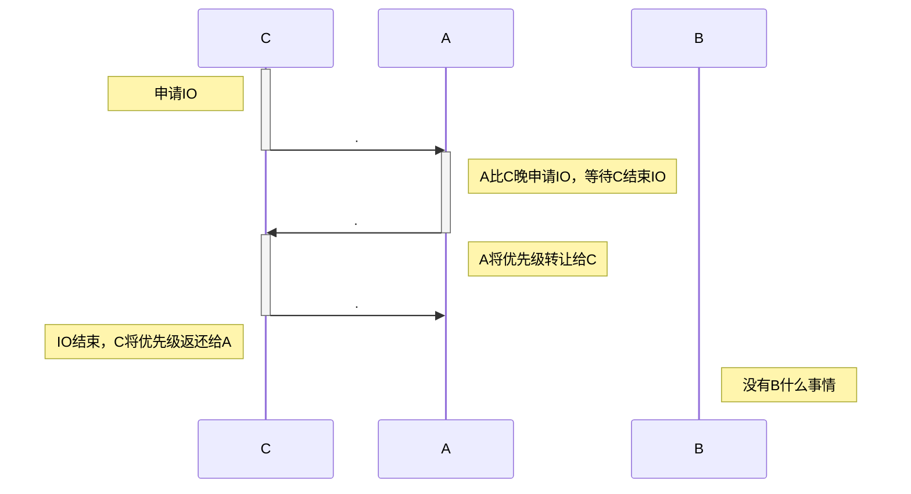

# 处理器调度

## 调度概述

调度器从任务队列中选择任务，放置到对应的CPU上执行

- 虽然任务队列叫做队列，但是实际上并不一定是一个先进先出的数据结构
- 具体的数据结构取决于调度策略的需求
  - 例如Linux的完全公平调度器使用的是红黑树

### 调度对象

- 调度的对象是CPU执行的最小单元
  - 早期是进程
  - 现代操作系统的调度对象通常是线程

### 调度决策

- 下一个要执行的任务
- 执行任务的CPU
- 执行的时间

### 调度时机

从代码角度，操作系统可以在内核代码的各种位置触发一次调度，因此，可以认为只要进程进入内核态，理论上就有可能触发一次调度，而具体的调度时机则取决于系统设计。调度时机可以根据调度是否由当前执行的任务**主动发起**而分为**协作式(non-preemptive)**和**抢占式(preemptive)**

#### 协作式调度

- 当前任务执行到结束时
- 当前任务通过某些系统调用主动放弃CPU时
  - 等待I/O
  - 睡眠

#### 抢占式调度

- 执行时间结束（时间片中断）

## 调度器指标

不同调度策略适用于不同应用场景。在评判一个调度策略的优劣时，一定是评判该策略在某个特定场景下的优劣。

### 不同场景下的调度目标

- 批处理程序：高吞吐
  - 无需与用户交互，目标是尽快完成
  - 主要指标是平均周转时间（即任务在系统中总共花费的时间）
    - 从创建到终止的时间
    - 注意周转时间包括了进程执行和等待执行的时间
- 交互式应用：低响应时间
  - 需要在执行过程中及时响应用户操作
  - 主要指标是响应时间
    - 从任务被创建到第一次被执行的时间
- 网络服务器：可扩展性
- 移动设备：低功耗
- 实时系统：实时性

### 调度器的目标

- 降低周转时间：任务进入系统到执行结束的时间
- 降低响应时间：任务进入系统到第一次给用户响应的时间
- 实时性：在截止时间内完成任务
- 公平性：每个任务都应该有机会执行
- 开销低：优化系统，而不是增加资源占用
- 可扩展：随着任务增加仍能正常工作
  - “两百个lab下来，大家就崩溃了。不work了。”
- 能耗、资源利用率...

### 调度器设计的挑战

- 缺少信息
  - 工作场景动态变化，但是调度器并不知道现在是什么场景
- 任务间复杂交互
- 调度目标多样
- 取舍
  - 调度开销 vs 调度效果；优先级 vs 公平；能耗 vs 性能

## 经典调度

> 单核处理器调度策略

### 协作式调度

- 系统需要等待一个任务执行完或者退出才能执行调度

#### 先到先服务 First Come First Served

> aka 先进先出 任务队列真的是一个队列

- 简单、直观
- 常见于批处理应用场景
  - 但是很难直接应用在复杂任务场景下

##### 弊端

- 长短任务混合场景下，对短任务不友好
- 对 IO 密集型任务不友好
- 平均周转、响应时间过长

#### 短任务优先 Shortest Job First

- 通常平均周转时间短

##### 弊端

- 需要预知任务所需的执行时间
  - 在一些比较固定的应用场景，这个假设是合理的，但是在更复杂的场景下则显得不现实
- 依赖任务到达时间
  - 如果长任务比短任务先到，那么还是会先执行长任务
- 平均响应时间过长
- 不公平，任务饿死（starvation）

### 抢占式调度 Preemptive Scheduling

- 每次任务执行一段时间后会被切换到下一个任务
- 通过定时触发的时钟中断实现

#### 最短完成时间优先 Shortest Time-to-Completion First

- 短任务优先的抢占式版本
  - 允许晚到的短任务抢占长任务
- 解决了SJF调度依赖任务到达时间的问题

##### 弊端

- 仍然需要预先知道任务执行时间
- 长任务饥饿

#### 时间片轮转 Round Robin RR

- 每个进程运行一个时间片
- 公平、平均响应时间短
- 总体上是一个非常通用的调度策略，但是部分应用场景下表现不佳

##### 弊端

- 牺牲了周转时间
  - 每个进程的运行时间被“拉长”
  - 周转时间问题在耗时接近的任务同时到达时最为显著

##### 时间片长度

- 时间片太长会导致响应时间变长
- 时间片太短会造成频繁切换，导致周转时间变长

## 优先级调度

- 操作系统中的任务优先级是不同的
  - 系统、用户
  - 前台、后台
- 优先级用于确保重要的任务被优先调度
- 事实上FCFS和SJF也有优先级概念；RR中优先级的概念较弱
  - “大部分时间下，后台程序都会阻塞`ls`指令，小明会感觉整个系统很卡顿，就连`ls`都需要很长时间才能响应。如果小明脾气不好，他很有可能马上通过`kill`指令将他的后台程序终止。”

### 多级队列 Multi Level Queue

- 维护多个队列，每个队列静态设置好优先级
- 高优先级的任务优先执行
- 同优先级内的调度策略可以视情况决定，例如使用 RR 调度

适用于静态场景（任务的大致运行时间、需要的资源等信息可以提前获知），此时可以为每个任务计算出静态优先级用于调度。

#### 高优先级的任务

- IO密集型任务
  - 占用CPU时间少，在该任务访问IO时可以处理其他任务
  - 优先执行该类任务提高IO利用率
- 用户主动设置的重要任务
- 对时延要求极高的任务
  - 视频等

#### 问题

- 低优先级任务可能饥饿
- 资源利用率低
  - 例如多个低优先级的任务要访问IO时，将会导致低优先级的任务等着依次访问IO而CPU没有任务
  - 本质上还是优先级设置的问题

##### 优先级反转

- 高优先级的任务被低优先级的任务阻塞
  - 例如低优先级的任务C先访问了IO
  - 导致IO资源被C抢占
  - 同样需要访问IO的高优先级任务A只能等待C完成IO访问
  - 同时不需要访问IO的任务B占用了CPU，导致C访问完IO后无法执行
  - 进而导致优先级最高的A一直无法执行
- 结果造成高优先级的任务等待低优先级的任务

#### 优先级的动态调整

- 操作系统中的工作场景动态变化
- 静态的优先级不一定能灵活适应场景变化

##### 动态优先级继承

- A将优先级暂时转移给C，让C尽快完成

### 多级反馈队列 Multi Level Feedback Queue

#### 特点

- 无需先验知识的通用调度策略
- 周转时间低、响应时间低
- 调度开销低

#### 概述

- 维护多个优先级队列
- 倾向于给短任务更高的优先级
  - 优先调度短任务有利于提高平均周转实现
  - 同时相当于提高IO密集型任务的优先级
    - 因为IO密集型任务占用CPU时间也很短
  - 同时还相当于提高交互式任务的响应时间
- 动态分析任务运行历史，总结任务特征
  - 类似思想：分支预测、缓存
- 如果工作场景变化频繁，则效果可能会很差

#### 基本算法

- 有8个不同优先级
- 优先级高的任务会抢占优先级低的任务
- 每个任务会被分配时间片，优先级相同的任务按照RR调度
  - 优先级低的任务时间片相对较长
    - 减少任务调度的次数，缓解调度开销
    - 由于MLFQ支持抢占，低优先级任务时间片较长也不是什么问题
- 每个任务被创建时，先假设该任务是短任务，为它分配最高优先级
  - 一个短任务在短暂的CPU访问后会放弃CPU（例如去访问IO）
  - 例如 MacroHard OnFire Word
    - 大部分时间在等用户输入，而用户输入后需要立刻响应
    - “只有用word的人会摸鱼，word不会摸鱼”
- 一个任务时间片耗尽后，它的优先级会被降一级
- 如果一个任务在时间片耗尽前放弃CPU，则优先级不变
  - 任务重新执行时，会被分配新的时间片

##### 基本算法的问题

- 长任务饿死
  - 大量短任务和IO密集型任务可能占用所有CPU时间
  - “比如说我们放10个电影——谁会同时放——呃我们先不管”
- 任务特征可能动态变化
  - 从CPU密集任务转换为交互式任务

#### 定时优先级提升

- 在某个时间段S后，将系统所有任务优先级重新提到最高
  - 避免长任务饿死
  - 可以适应任务特征动态变化
- 细节
  - S长度
  - 时间片长度
  - 调参！

##### 问题

- 无法应对抢占CPU时间的攻击
  - 恶意任务在时间片用完之前发起IO请求
  - 按现有规则，不会被降低优先级，但是几乎独占了所有CPU资源

#### 更准确记录执行时间

- 一个任务的累计执行时间超过一个任务时间片后，降低任务优先级
  - 无论这期间任务放弃了多少次CPU
- 额外记录任务在当前优先级累计使用CPU的时间长度

#### MLFQ参数调试

> “系统调参通常还是可解释的”

- 不同场景下，不同参数会有不同表现

##### 不同队列的时间片长度

- 高优先级的队列对应的时间片短一些
  - 提升高优先级任务的响应时间
  - 降低低优先级任务的调度开销
    - 反正大家都在吃CPU，换来换去也没意思（bushi

#### MLFQ小结

- 无需先验知识即可动态确定任务优先级
- 同时达到周转时间和响应时间两方面要求
  - 对于短任务，周转时间指标接近SJF
  - 对于交互式任务，响应时间指标接近RR
- 避免长任务饿死

## 公平共享调度

- 应用场景：共享服务器
- 注重用户级的公平，而非任务级的公平
  - 每个用户占用的资源是和用户各自的权重成比例的，而非被任务数量决定

!!! info 份额的层级化分配方式
    可以认为每个用户占有一定的份额，而用户可以将自己的份额根据需求分配给自己要执行的任务。在实际场景中，可以将任务分组，每个任务组可以分配到一些份额，任务会在组内进一步分摊该组的份额

### 彩票调度 Lottery Scheduling

> “彩票，大家知道，是公平的”
> “……”
> “理想彩票。”

- 每次调度时，生成随机数 $R \in [0,T)$
  - $T$ 是 $ticket$ 总数
  - 每个任务 $i$ 有各自的 $ticket_i$
  - $ticket_i / T$ 表示任务 $i$ 可以占用CPU的时间比例
- 根据 $R$ 找到对应的任务
- 例如 ABC 三个任务的 $ticket$ 分别是 20、30、50，在$R=51$时执行任务C
- 只能期望它是公平的（x

#### Ticket Transfer

- 场景示例
  - 客户端等待服务端返回才能继续执行
- 客户端将自己的所有ticket移交给服务端，确保服务端尽可能多享用资源

与优先级传递类似，但是两者不同

- 权重影响对CPU的占用比例
  - 除非权重为0，否则任务不会饿死
  - 权重10:1和2:1决定了两个任务占用CPU的比例
- 优先级影响任务对CPU的使用顺序
  - 可能导致任务饿死
  - 优先级10:1和2:1只影响顺序，不影响比例

#### 彩票调度的利弊

- 简单
- 计算机采用伪随机，不精确
- 各个任务对CPU时间的占比会有误差

### 步幅调度 Stride Scheduling

- 确定版本的彩票调度

#### 步幅

- 任务执行一次增加的虚拟时间

$$ stride_i = \frac{MaxStride}{ticket_i} $$

- $MaxStride$ 是一个足够大的整数
  - 例如所有 $ticket$ 的最小公倍数
    - 此时 $stride$ 和 $ticket$ 成反比

#### 步幅调度

- 每次调度时，选择累计运行 $stride$ 最短的任务
- 虽然每个任务每次运行的物理时间是一样的，但是 $stride$ 不同
- $ticket$ 高的任务 $stride$ 累计更慢，更容易被执行到
- “步幅”可以理解为“虚拟时间”
  - OS人很喜欢虚拟.jpg

## 实时调度

- 每个任务有截止时间
- 软实时
  - 超过截止时间不会有非常严重的后果
  - 例如视频渲染，超时导致帧数下降
- 硬实时
  - 超过截止时间会有严重后果
  - 例如自动驾驶，超时就寄了

### 最早截止时间优先 Earliest Deadline First

> 广大人民群众最喜欢的经典算法

- $C_i$：任务所需的执行时间
- $P_i$：任务触发的时间周期
  - 同时假设 $P_i$ 是任务的截止时间
  - 例如一个月一次、一次一个月的强化学习小作业

#### EDF可调度的条件

$$ \sum_{i=1}^n \frac{C_i}{P_i} \le 1 $$

- “大家回去可以自己算一下，如果大于一，那可能得少睡一些”
- 如果超过1，则可能需要拒绝新的任务
- **多米诺效应**：一旦有任务超过deadline，可能导致后续多个任务也都超过deadline
  - 因为调度任务时，调度器不知道任务的执行时间信息，不能提前拒绝该任务
  - 而任务超过截止时间时，也没有中断机制通知调度器放弃当前任务去执行其他任务
