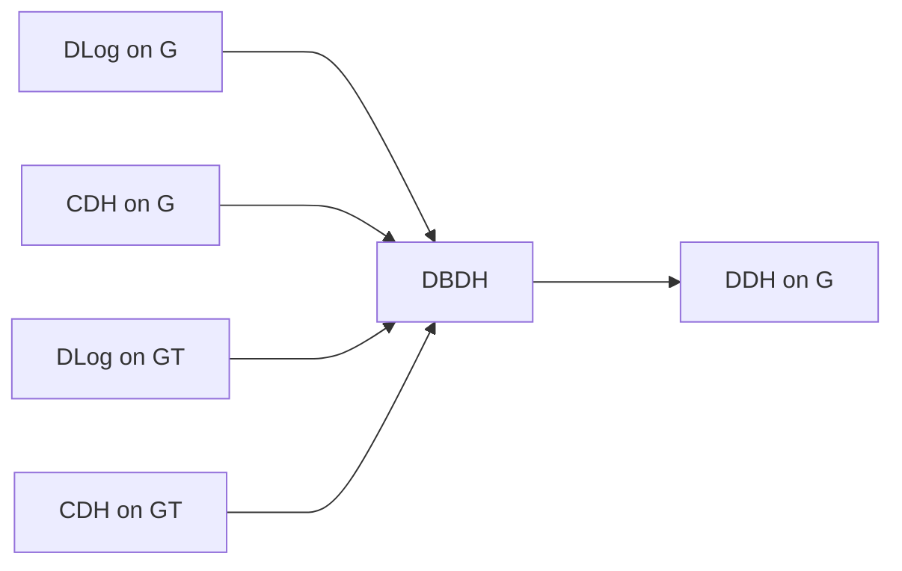

# Identity-Based Encryption

## Introduction to IBE

### IBE

- Does not require exchanging private or public keys
- Does not require keeping key directories
- Does not require a third party
- Requires a trusted key generation center
  - Suitable for communication between branches of international companies, where the headquarter can serve as this center

## Syntax of IBE

### Setup

$$ \mathrm{Setup}(\lambda) \to (mpk, msk) $$

- Takes as input a security parameter $\lambda$.
- Outputs a system master key pair $(mpk, msk)$.

### Encryption

$$ \mathrm{Enc}(mpk, id, m) \to c $$

- Takes as input the system's master public key $mpk$, an identity string $id$, and a message $m$ from message space $M$
- Outputs a ciphertext $c$

Note that the encryption does not require the user's public key (or private key). Instead it only requires a string $id$. That is, the ciphertext can be generated *before* the generation of a user's key.

### KeyGen

$$ \mathrm{KeyGen}(mpk, msk, id) \to sk_{id} $$

### Decryption

$$ \mathrm{Dec}(mpk, sk_{id}, c) \to m $$

## Correctness

## Security Model

## Construction

### Math: Bilinear Map Groups

#### Bilinear Map

Let $G$ and $G_T$ be two (multiplicative) cyclic groups of prime order $p$, $g$ be a generator of $G$. A map $e: G \times G \mapsto G_T$ is referred to as a **bilinear map** if the following properties hold,

- **Bilinear.** For all $u, v \in G$ and $a, b \in Z$, it holds that $e(u^a, v^b) = e(u, v)^{ab}$.
- **Non-degenerate.** $e(g, g) \neq \mathbf{1}_{G_T}$. (Or otherwise bilinearity would be trivial).

Note that $e(\cdot,\cdot)$ is symmetric.

#### Bilinear Group

We say $G$ is a **bilinear group** if the group operation in $G$ can be *computed efficiently* and there exists a group $G_T$ and an efficiently computable bilinear map $e: G \times G \mapsto G_T$. 

#### (Computational) Bilinear Diffie-Hellman Assumptions

GIven a bilinear group generation algorithm $\mathrm{GenGroup}$, $(G, G_T, p, g, e) \leftarrow \mathrm{GenGroup}(1^\lambda)$. The advantage of an algorithm $A$ in solving Bilinear Diffie-Hellman (BDH) problem relative to $\mathrm{GenGroup}$ is defined as

$$ \mathrm{Adv}_{A}^{BDH} = \mathrm{Pr}[] $$

#### On the Hardness of Assumptions

On a bilinear group $G$,

- DDH is NOT difficult on a bilinear group $G$, by simply checking whether $e(g^a, g^b) = e(g, T)$: if $T = g^{ab}$ then the equation should hold.

## An IBE Instance

> An instance with non-standard assumption

### Anonymous IBE

**Intuition.** The challenger chooses one of $id_0, id_1$ and one of $m_0, m_1$. The adversary guesses the $(id, m)$ pair, with a random guess chance of $1/4$.

$$ \mathrm{Adv}_{A}^{ANON-IND-ID-CPA} = \left| \mathrm{Pr} [b = b' \land c = c'] - \frac{1}{4} \right| $$

An IBE scheme is $(t, q_{ID}, \epsilon)$-ANON-IND-ID-CPA secure if all $t$-time IND-ID-CPA adversaries making at most $q_{ID}$ private key queries have an advantage of at most $\epsilon$ in winning the game.

## Reducing the Trust on PKG in IBE (White-box Traceable IBE)

The IBE scheme assumes the existence of a PKG who generates and distributes the keys for users.

- The PKG can decrypt and read messages meant for any user, *without being detected*.
- The PKG can generate and distribute private keys for *any* entity.
  - This implies that the PKG can also use the keys of the users. Others cannot tell who is using the key.

### Definition

- Does not change $\mathrm{Setup}$, $\mathrm{Enc}$ and $\mathrm{Dec}$.
- Updates $\mathrm{KeyGen}$ and adds a $\mathrm{Trace}$ to ensure traceability.

#### KeyGen

$$ \mathrm{KeyGen}\langle Pkg(mpk, msk, ID; w_m), Usr(mpk, ID; w_u)  \rangle \to \langle \pi, sk_{ID} \rangle $$

- An *interacitve protocol* between $Pkg$ and a user $Usr$.
- Both $Pkg$ and $Usr$ use a random number ($w_m, w_u$) ad private inputs.
- At the end of the protocol, $Usr$ receives $sk_{ID}$ as its private output.
  - Note. $Pkg$ should not know $sk_{ID}$, or otherwise it can still create fake messages of $Usr$.

#### Trace

$$ \mathrm{Trace}(sk_{ID}) \to n_F $$

- Takes as input a *well-formed* private key $sk_{ID}$.
- Outputs a family number $n_F$.
- For $sk_{ID}$ and $sk_{ID}'$, if $\mathrm{Trace}(ID) \neq \mathrm{Trace}(ID')$, then $(sk_{ID}, sk_{ID}')$ will serve as an evidence that $Pkg$ has generated and distributed private keys for $ID$ maliciously.

### White-box Traceability

- The $\mathrm{Trace}()$ method requires a *well-formed* secret key as its input (i.e., the key should "look like" a real key).
- However, in practice, what the adversary cares is not the appearance of the key, but the usability of the key (i.e., whether it can decrypt the message).
- The adversary might as well wrap the key $sk_{ID}'$ and make it a *black-box*. In this way the $\mathrm{Trace}()$ algorithm will not be able to detect the leaked key.

## Black-box Accountable IBE

White-box IBE is not very practical due to its requirement of well-formed keys as inputs. A stronger (black-box) scheme should be able to detect the secret key regardless of the form of the key.

### Definition

#### KeyGen

$$ \mathrm{KeyGen}\langle Pkg(mpk, msk, ID; w_m), Usr(mpk, ID; w_u)  \rangle \to \langle \pi \backslash \bot, sk_{ID} \backslash \bot \rangle $$

#### Trace

$$ \mathrm{Trace}^D(ID, sk_{ID}, \epsilon) \to Pkg / Usr / Fail $$

- While we still require $sk_{ID}$ to be "well-formed", this requirement is reasonable because the $sk_{ID}$ is provided by $Usr$, who is assumed to be honest. In contrast, in white-box IBE, the input $sk_{ID}$ can be provided by either the user or the adversary.
