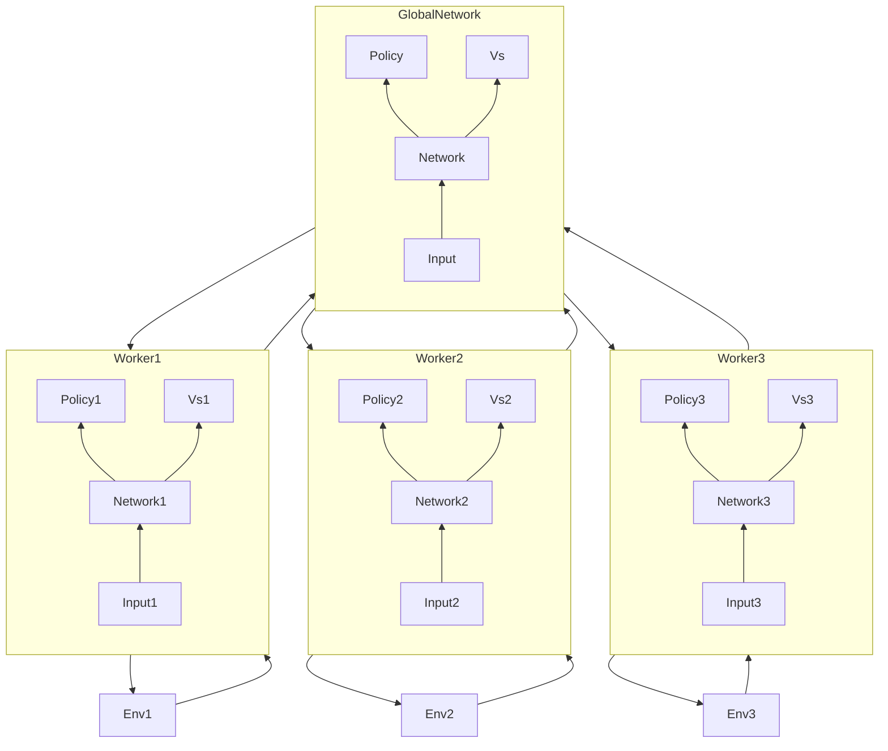

# 深度策略评估网络

## 基于神经网络的策略梯度

### 策略网络的梯度

$$ \nabla J(\theta) = \mathbb{E}_{\pi_\theta}\left[ \frac{\partial\log\pi_\theta(a|s)}{\partial\theta}Q_{\pi_\theta}(s,a) \right] $$

在使用Softmax输出层时

$$ \frac{\partial\log\pi_\theta}{\partial\theta} = \frac{\partial f_\theta(s,a)}{\partial\theta} - \mathbb{E}_{a'\sim\pi_\theta(a'|s)}\left[ \frac{\partial f_\theta(s,a')}{\partial\theta} \right] $$

故

$$ \nabla J(\theta) = \mathbb{E}_{\pi_\theta}\left[\left( \frac{\partial f_\theta(s,a)}{\partial\theta} - \mathbb{E}_{a'\sim\pi_\theta(a'|s)}\left[ \frac{\partial f_\theta(s,a')}{\partial\theta} \right] \right) Q_{\pi_\theta}(s,a) \right] $$

#### 策略梯度与Q学习的对比

- Q学习算法学习一个以$\theta$为参数的Q函数 $Q_\theta$
  - 优化目标为最小化TD误差
- 策略梯度学习一个以$\theta$为参数的策略 $\pi_\theta$
  - 优化目标直接为策略的价值
    - 比Q学习更加直接

## Asynchronous Advantageous Actor-Critic A3C

$$ \nabla_{\theta'} \log\pi(a_t|s_t;\theta')A(s_t,a_t;\theta_v) $$

$$ A(s_t,a_t;\theta_v) = \sum_{i=0}^{k-1}\gamma^ir_{t+i} + \gamma^kV(s_{t+k};\theta_v) - V(s_t;\theta_v) $$

### A3C 架构

- Asynchronous 表现在该算法采用分布式计算
  - Worker独立地计算各自的梯度并push到Server
  - 然后从Server端pull最新的参数继续更新
  - 可以在大规模计算集群上展开训练

> “交换机非常重要”
> 万 兆 交 换 机

## 确定性策略梯度

- 随机策略
  - 输出的策略是概率，根据概率采样
- 确定性策略
  - 对于离散动作，$\arg\max_{a}Q_\theta(s,a)$（不可微）
  - 对于连续动作，$a=\pi(s;\theta)$

### 确定性策略的Actor-Critic

- Critic没有变化，因为Critic只需要关心Actor得到的$Q(s,a)$

$$ Q^w(s,a) \simeq Q^\pi(s,a) $$

$$ L(w) = \mathbb{E}_{s\sim p^\pi,a\sim\pi_\theta}[(Q^w(s,a)-Q^\pi(s,a))^2] $$

#### 确定性策略梯度定理

$$ J(\pi_\theta) = \mathbb{E}_{s\sim p^{\pi}}[Q^w(s,a)] $$

$$ \nabla J = \mathbb{E}_{s\sim p^\pi}[\nabla_\theta \pi_\theta(s)\nabla_a Q^w(s,a)|_{a=\pi_\theta(s)}] $$

### 深度确定性策略梯度 DDPG

- 对于确定性策略的梯度

$$ \nabla_\theta J(\pi_\theta) = \mathbb{E}_{s\sim p^\theta}[\nabla_\theta \pi_\theta(s)\nabla_a Q^w(s,a)|_{a=\pi_\theta(s)}] $$

- 实际应用中，如果使用神经网络拟合，在面对有挑战性的问题时是不稳定的
- DDPG给出了一系列对应的解决方案
  - 经验重放
  - 目标网络
  - 批标准化 Batch Normalization
  - 添加连续噪声
