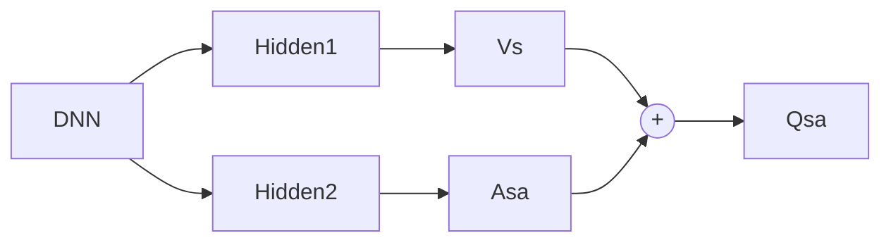

# 深度强化学习

## 深度Q网络 DQN

- 直观想法
  - 使用神经网络拟合 $Q_\theta(s,a)$
  - 不work
    - 连续采样的 $s_t,a_t,s_{t+1},r_t$ 不满足独立同分布
    - $Q_\theta(s,a)$ 频繁更新
- 解决方法
  - 经验回放
  - 双网络结构
    - 评估网络 Evaluation Network
    - 目标网络 Target Network

### 经验回放

- 存储训练过程中的每一步 $e_t = (s_t,a_t,s_{t+1},r_t)$
  - 从训练数据中采样，采样时服从均匀分布

#### 优先经验回放

以 Q 函数的值与目标值的差异来衡量学习的价值

$$ p_t = |r_t + \gamma\max_{a'}Q_\theta(s_{t+1},a')-Q_\theta(s_t,a_t)| $$

- 为了保证每个样本都有机会被采样，存储时使用 $p_t + \varepsilon$

选择样本的概率

$$ P(t) = \frac{p_t^\alpha}{\sum_kp_k^\alpha} $$

- 重要性采样
  - $\omega_t = \frac{(N\times P(t))^{-\beta}}{\max_i \omega_i}$

#### 目标网络

- 使用较旧的参数 $\theta_-$，每隔 $C$ 步和训练网络的参数同步一次
- 让目标网络的更新慢一些，防止新数据的偏差导致训练不稳定

$$L_i(\theta_i) = \mathbb{E}[\frac{1}{2}\omega_t(r_t + \gamma\max_{a'}Q_{\theta_-}(s_{t+1}, a') - Q_{\theta_i}(s_t,a_t))^2]$$

- 其中 $r_t + \gamma\max_{a'}Q_{\theta_-}(s_{t+1}, a')$ 为目标价值函数

## Double DQN

### DQN的过估计

- $y_t = r_t + \gamma\max_{a'}Q_{\theta_-}(s_{t+1}, a')$
  - $\max$ 操作使 $Q$ 函数值越来越大甚至高于真实值

#### 过估计的原因

- 对随机变量 $X_1,X_2$，有 $\mathbb{E}[\max(X_1,X_2)] \ge \max(\mathbb{E}[X_1], \mathbb{E}[X_2]) $

于是

$$ \begin{aligned}
  \max Q_{\theta'} &= Q_{\theta'}(s_{t+1}, \arg\max_{a'}Q_{\theta'}(s_{t+1},a'))\\
  &= \mathbb{E}[R|s_{t+1}, \arg\max_{a'}Q_{\theta'},\theta']\\
  &\ge \max(\mathbb{E}[R|s_{t+1},a_1,\theta'], \mathbb{E}[R|s_{t+1},a_2,\theta'],\dots)
\end{aligned} $$

- 直觉上
  - 选择策略和评估策略来自同一个网络，因此该网络会更倾向于选择自己错误地过估计的动作
- 随着候选行动数量的增加而越发严重
- 在Q-Table方法中也存在，但是在引入DQN之后情况更加严重

### Double DQN架构

- 使用不同的网络来估计价值和选择决策

$$ y_t = r_t + \gamma Q_{\theta'}(s_{t+1}, \arg\max_{a'}Q_\theta(s_{t+1}, a')) $$

- 注意到DQN中本身就有两套网络，因此可以直接使用DQN中的评估网络来选择策略

## Dueling DQN

- 假设动作值函数服从某个分布 $Q(s,a)\sim\mathcal{N}(\mu,\sigma)$
- $V(s)=\mathbb{E}[Q(s,a)] = \mu$
- $Q(s,a) = \mu + \varepsilon(s,a)$
  - $\varepsilon(s,a)$ 是偏移量

### 优势函数

定义优势函数 Advantage Function

$$ A^{\pi}(s,a) \triangleq \varepsilon(s,a) = Q(s,a) - V(s) $$

### 网络架构

#### 优势函数聚合形式

$$ Q(s,a) = V(s) + (A(s,a) - \max_{a'}A(s,a')) $$

- 强制最优动作的优势函数输出为0
  - 解决神经网络对 $A$ 和 $V$ 建模不稳定的问题

或

$$ Q(s,a) = V(s) + (A(s,a) - \frac{1}{|A|}\sum_{a'}A(s,a')) $$
