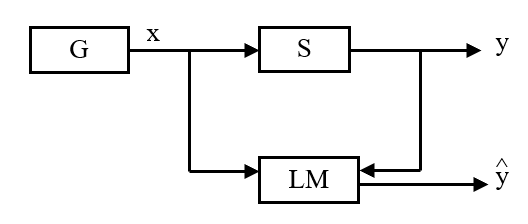

# 01. Introduction

## Big Data

**3V Interpretation.** Big data are **high-volume**, **high-velocity** and **high-variety** information assests.

## Function Estimation Model

- **Generator ($G, F(x)$).** Generates observations $x$, which are independently sampled from a certain distribution $F(x)$.
- **Supervisor ($S, F(y|x)$).** Labels each input $x$ with an output value $y$ according to some fixed distribution $F(y|x)$.
- **Learning Machine ($LM, f(x; \alpha)$).** "Learns" from $(x, y)$ pairs from $G$ and $S$, by choosing a function that *best approximates* $S$ from a parametrized function class $f(x; \alpha) = \hat{y}$.

### Risk Minimization

- **Loss Functional.** The loss functional $(L, Q)$ is the error of a given function on a given example.
  - $L(x, y, f_{\alpha}) \rightarrow L(y, f(x, \alpha))$.
  - $Q(z, \alpha) \rightarrow L(z_y, f(z_x, \alpha))$, where $z = (x,y)$ (if we want to merge $x$ and $y$)
- **Risk Functional.** The risk functional $R$ is the expected loss of a given example when drawn from $F(x, y)$.
  - **Generalization Error.** The generalization error of a given function is usually defined as $R(\alpha) = \int Q(z, \alpha) \mathrm{d}F(z)$. (Integral over all pairs of possible $(x,y)$)

#### Three Main Learning Problems

> All aim to minimize certain kinds of risks

- **Pattern Recognition.**
  - $y \in \{ 0, 1 \}$ and $L(y, f(x, \alpha)) = \mathbb{I}[y \neq f(x,a)]$.
- **Regression Estimation.**
  - $y \in \mathbb{R}$ and $L(y, f(x, \alpha)) = (y - f(x, \alpha))^2$.
- **Density Estimation.**
  - $L(p(x, \alpha)) = -\log p(x, \alpha)$.

#### General Formulation of Learning

- Given an i.i.d. $k$ samples, $z_1, \dots, z_k$ where $z_i = (x_i, y_i)$ drawn from a distribution $F(z)$.
- We wish to find a function $\alpha^*$ such that the risk is minimized
  - $\arg\min_{\alpha} R(\alpha)$

##### Emprical Risk Minimization

Calculating the integral is usually not practical.

$$ R(\alpha) = \int Q(z, \alpha) \mathrm{d}F(z) \Rightarrow R_{emp}(\alpha) = \frac{1}{k} \sum_{i = 1}^k Q(z_i, \alpha) $$

- **Emprical Risk Minimizer (ERM).** $\alpha_k = \arg\min_{\alpha} R_{emp}(\alpha)$.
  - ERM approximates $Q(z, \alpha^*)$ with $Q(z, \alpha_k)$
  - ERM approximates $\alpha^*$ with $\alpha_k$
- Many loss functions / methods are realizations of ERM.
  - **Least-squares.** $\min_\alpha \sum_i L(y_i, f(x_i, \alpha)) = \min_\alpha \sum_i(y_i - f(x_i, \alpha_i))$
  - **Maximum-likelihood.** $\min_\alpha \sum_i L(p(x_i, \alpha)) = \min_\alpha - \sum_i \log(p(x_i, \alpha))$

#### Error Bounds

The **error bound** is the maximum possible error of a model on an unseen test set.

$$ R_T(h) \le R_S(h) + \frac{1}{2} d_{H\Delta{}H}(S,T) + \lambda \le R_S(h) + \frac{1}{2} d_H(S, T) + \lambda $$

- Basically "test error = training error + distance between training and testing set"

## Classification

> Classification tasks will be the focus of this course.

**Classifiers.** The task of a **classifier** is to use the feature vector provided by a feature extractor to assign the object to a category.

- Essentially the classifier divides the feature space into regions corresponding to different categories.
- The degree of difficulty of the classification problem depends on *within-category feature variability* relative to *cross-category feature variability*.
