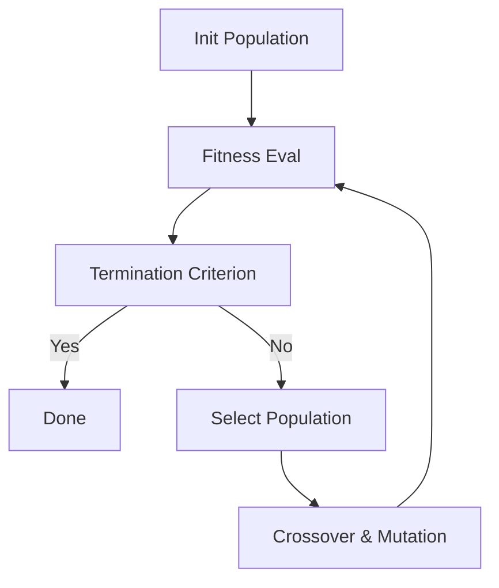

# Linear Regression and Model Regularization

- Linear Regression
- Model Assessment
- Model Regularization
  - **Feature Selection.** Selects a subset of features.
  - **Coefficient constraint.** Selects a "subset" of model parameters.
  - **Dimensionality Reduction.** Projects the features to a lower dimension.

## Linear Regression

### Preliminaries

- Assume $N$ pairs of training data $(x_1, y_1), \dots, (x_N, y_N)$ where $x_i$ is the input and $y_i$ is the output.
- Denote the regression function by $f(x) = \mathbb{E}[Y|X=x]$,
  - which is the conditional expectation of $Y$ given $x$.
- The linear regression model assumes a specific linear form of $f(x) = \beta_0 + \beta x$
  - which is usually thought of as an approximation to the truth.

#### Fitting by Least Squares

$$ \hat{\beta_0}, \hat{\beta} = \arg\min \sum_{i=1}^N (y_i - \beta_0 - \beta x_i)^2 $$

- $\hat{y_i} = \hat{\beta_0} + \hat{\beta}x_i$ are the fitted (or predicted) values
- $\xi_i = y_i - \hat{\beta_0} - \hat{\beta}x_i$ is called the **residual**.
  - We want the residual to be as small as possible.

### Multivariate Linear Regression

$$ f(\bm{x}_i) = \beta_0 + \sum_{j=1}^{p-1} x_{ij}\beta_j, $$

where $p-1$ is the feature dimension.

Equivalently, its matrix representation is

$$ \mathbf{f} = \mathbf{X}\bm{\beta} $$

- $\mathbf{f}$ is a $N$-dim vector of predicted values.
- $\mathbf{X}$ is an $N \times p$ input matrix.
- $\bm{\beta}$ is a $p$-dim vector for model parameters.

#### Optimization by Least Squares

Minimize the residual of sumed squares,

$$ \argmin \sum_{i}\left( y_i - \beta_i \sum_{j=1}^{p-1}x_{ij}\beta_i \right)^2 $$

which in its equivalent matrix form is

$$ \argmin (\mathbf{y} - \mathbf{X}\bm{\beta})^T(\mathbf{y} - \mathbf{X}\bm{\beta})$$

- Solution $\hat{\bm{\beta}} = (\mathbf{X}^T\mathbf{X})^{-1}\mathbf{X}^T\mathbf{y} $.
- Prediction $\hat{\mathbf{y}} = \mathbf{X}\hat{\bm{\beta}}$.

### Bias-Variance Trade-off

Let $f_0(x)$ be the ground truth of $f(x)$ and $\hat{f}(x)$ be an estimator.

$$ \mathrm{MSE}[\hat{f}(x)] = \mathbb{E}[\hat{f}(x) - f_0(x)]^2 $$

$$ \begin{align*}
    \mathrm{MSE}[\hat{f}(x)] &= \mathbb{E}[\hat{f}(x)^2] - 2\mathbb{E}[\hat{f}(x)]f_0(x) + f_0(x)^2 \\
    &= \mathbb{E}[\hat{f}(x)^2] - (\mathbb{E}[\hat{f}(x)])^2 + (\mathbb{E}[\hat{f}(x)])^2 - 2\mathbb{E}[\hat{f}(x)]f_0(x) + f_0(x)^2\\
    &= \mathrm{Var}(\hat{f}(x)) + (\mathbb{E}[\hat{f}(x)] - f_0(x))^2
\end{align*} $$

- **Tradeoff**
  - Given a fixed MSE value, increasing variance results in decreased bias, and vice versa.
- If the linear model is correct for a given problem, then the least squares prediction $f$ is unbiased, and has the lowest variance among all unbiased estimators.
  - However, there often exists biased estimators with smaller MSE.
- Usually a regularization method is added.
  - Reduce variance at the cost of some error.
  - If the cost in bias is small, the regularization is worthwhile.

## Model Assessment

- Objectives
  - Choose a value of a tuning parameter
  - Estimate the performance of a given model
- The best approach is to run the procedure on an independent test set (if available).
- Usually a *validation set* is used for tuning and a *test set* is used for evaluation.
- In case of insufficient data for independent validation set, *cross-validation* could be used.

### K-fold Cross-Validation

- Common method for estimating hyper-parameters.
- Divide the data into $K$ roughly equal parts (e.g., $K=5, 10$).
  - Use one of the splits for validation and the rest $K-1$ for training.

Compute the error in predicting the $k$-th test split

$$ \mathbb{E}_k(\lambda) = \sum_{i \in D_k} (y_i - x_i \hat{\beta}^{-k}(\lambda))^2 $$

where $\lambda$ denotes the hyperparameters.

This gives the cross validation error over all splits

$$ CV(\lambda) = \frac{1}{K} \sum_{k=1}^K \mathbb{E}_{k}(\lambda) $$

Choose the $\lambda$ that minimizes $CV(\lambda)$.

### Bootstrapping

- Assume the dataset $\mathcal{D}$ contains $N$ samples.
- Sample $N$ times with replacement from the original training set $\mathcal{D}$ to form a new bootstrap dataset $\mathcal{D}'$.
- Train the model on $\mathcal{D}'$ and evaluate it on $\mathcal{D} \backslash \mathcal{D}' $.
- For each sample, the chance of it not being sampled $N$ times in a row is $(1 - 1/N)^N$, which converges to $1/e$ as $N\to\infty$.
  - Therefore around $1/e \approx 36.8\%$ samples will not be in $\mathcal{D}'$.

## Regularization

### Variable Subset Selection

- Retain only a subset of the coefficients and set the reset to zero.
  - i.e., only use a subset of features.

#### Subset Selection Methods

- **All subsets regression.** Finds for each $s \in \{0, 1,\dots, p\}$ the subset of size $s$ that gives the smallest residual sum of squares.
  - Expensive. Have to enumerate over all possible subsets.
- **Forward stepwise selection.** Starts with an empty model and sequentially add variables.
- **Backward stepwise selection.** Starts with a full model and sequentially deletes variable.
- **Hybrid stepwise selection.** Add in the best variable and delete the least important variable sequentially.

##### Foward Selection

```py
def forward_selection(F: Fullset, U: Measure):
    S = {}
    while True:
        f = find_next(F)  # random or heuristic
        S.add(f)
        F.delete(f)

        if S satisfies U or F == {}:
            return S
```

##### Backward Selection

```py
def backward_selection(F: Fullset, U: Measure):
    S = {}  # stores the removed features
    while True:
        f = get_next(F)
        F.delete(f)
        S.add(f)

        if F does not satisfy U or F == {}:
            F.add(f)  # restore the last removed feature
            return F
```

#### Genetic Algorithm for Subset Selection



##### Crossover & Mutation

```plain
Crossover
[000|000] + [111|111] -> [111|000] + [000|111]
```

```plain
Mutation
[111|000] -> [111|010]
[000|111] -> [010|111]
```

### Coefficient Constraint

#### Ridge Regression

The ridge estimator is defiend by

$$ \argmin (\mathbf{y} - \mathbf{X}\bm{\beta})^T(\mathbf{y} - \mathbf{X}\bm{\beta}) + \lambda \bm{\beta}^T\bm{\beta} $$

which is equivalent to

$$ \begin{align*}
    \argmin &\quad (\mathbf{y} - \mathbf{X}\bm{\beta})^T(\mathbf{y} - \mathbf{X}\bm{\beta})\\
    \mathrm{s.t.} &\quad \| \bm{\beta} \|^2 \le s
\end{align*} $$

The minimizer is given by

$$ \hat{\bm{\beta}} = (\mathbf{X}^T\mathbf{X} + \lambda\mathbf{I} )^{-1}\mathbf{X}^T\mathbf{y} $$

- If $\lambda = 0$, it gives the ordinary least squares.
- If $\lambda \to \infty$, it penalizes $\bm{\beta}$ to $\bm{0}$.

##### Analysis

An SVD on $X$ would provide more insights into Ridge regression (as a shrinkage method),

$$ X = UDV^T $$

For ordinary regresssion

$$ X\hat{\beta}^{(ls)} = X(X^T)^{-1}X^Ty = UU^Ty $$

For Ridge

$$ X\hat{\beta}^{(ridge)} = X(X^TX + \lambda I)^{-1} X^Ty = UD(DD + \lambda I)^{-1}DU^TY $$

which could be rewritten as

$$ \sum_{j=1}^p u_j\frac{d_j^2}{d_j^2 + \lambda}u_j^Ty, $$

where $d_j$ is the $j$-th eigenvalue.

Like ordinary least squares, Ridge regression computes the coordinates of $y$ w.r.t. the orthonormal basis $U$. It then shrinks the coordinates by $d_j^2 / (d_j^2 + \lambda)$: greater shrinkage is applied to smaller $d_j^2$.

#### LASSO

> Least Absolute Shrinkage and Selection Operator

$$ \argmin (\mathbf{y} - \mathbf{X}\bm{\beta})^T(\mathbf{y} - \mathbf{X}\bm{\beta}) + \lambda \|\bm{\beta}\|_1 $$

or equivalently

$$ \begin{align*}
    \argmin &\quad (\mathbf{y} - \mathbf{X}\bm{\beta})^T(\mathbf{y} - \mathbf{X}\bm{\beta})\\
    \mathrm{s.t.} &\quad \| \bm{\beta} \|_1 \le t
\end{align*} $$

- Could be solved by quadratic programming solvers.
- LASSO tends to produce sparse results.
  - If a small enough $t$ is chosen, LASSO will set some coefficients to exactly zero.

#### A Family of Shrinkage Operators

- $L_p$-Norms: $\|\bm{x}\|_p = (\sum_i x_i^p)^{1/p}$

$$ \argmin (\mathbf{y} - \mathbf{X}\bm{\beta})^T(\mathbf{y} - \mathbf{X}\bm{\beta}) + \lambda \|\bm{\beta}\|_p $$

- $p=1$ gives LASSO
- $p=2$ gives Ridge Regression

### Dimensionality Reduction

> Only focus on projection-based dimensionality reduction
> 
> $$ \hat{\mathbf{x}} = \mathbf{P}\mathbf{x} $$
> 
> where $\hat{\mathbf{x}}$ is in a lower-dimension space

#### Principle Component Analysis (PCA)

Two equivalent interpretations of PCA (Assume we are interested in a projection direction $\mathbf{v}$)

- **Maximize variance direction.** Consider when $\mathbf{X}$ is decentralized (assume zero-mean).
  - I.e., the projected points should separate as far as possible (so that they are still distinguishable after projection).

$$ \frac{1}{n} \sum_{i=1}^n(\mathbf{v}^T\mathbf{x}_i)^2 = \frac{1}{n}\mathbf{v}^T\mathbf{X}\mathbf{X}^T\mathbf{v} $$

- **Minimize reconstruction error.**

$$ \frac{1}{n}\sum_{i=1}^n \| \mathbf{x}_i - (\mathbf{v}^T\mathbf{x}_i)\mathbf{v} \|^2 $$

##### Derivation of the First Formulation

$$ \begin{align*}
    \max_{\mathbf{v}} &\quad \mathbf{v}^T\mathbf{X}\mathbf{X}^T\mathbf{v} \\
    \mathrm{s.t.} &\quad \mathbf{v}^T\mathbf{v} = 1
\end{align*} $$

Solve by Lagrangian Multipliers,

$$ \mathcal{L}_v = \mathbf{v}^T\mathbf{X}\mathbf{X}^T\mathbf{v} + \lambda(1 - \mathbf{v}^T\mathbf{v}) $$

Taking gradient w.r.t. $\mathbf{v}$ and setting gradient to zero,

$$ \mathbf{X}\mathbf{X}^T\mathbf{v} = \lambda\mathbf{v} $$

$\mathbf{v}$ is given by the eigenvalue decomposition of $\mathbf{X}\mathbf{X}^T$

The projection matrix is given by the top-$k$ eigenvectors.

#### Linear Discriminant Analysis (LDA)

> Find the component axis that maximizes the class separation (and meanwhile minimize the within-class distances).

We assume a binary classification with class mean vector $\mu_1, \mu_2$ and variances $\sigma_1^2, \sigma_2^2$. Denote the projection by $v$.

The goal is to mmaximize the distance between two centroids after projection

$$ \max \quad (v^T\mu_1 - v^T\mu_2)^2 $$

meanwhile minimize the separation within each class

$$ \min \quad \sigma_1^2 + \sigma_2^2 $$

We therefore model the objective as

$$ \begin{align*}
  J(v) &= \frac{(v^T\mu_1 - v^T\mu_2)^2}{\sigma_1^2 + \sigma_2^2} \\
  &=\frac{(v^T\mu_1 - v^T\mu_2)^2}{\sum_{i=1}^{n_1} (v^Tx_{1,i} - v^T\mu_1)^2 + \sum_{i=1}^{n_2} (v^Tx_{2,i} - v^T\mu_2)^2}\\
  &= \frac
  {v^T(\mu_1-\mu_2)(\mu_1-\mu_2)^Tv}
  {v^T(\sum_{i=1}^{n_1}(x_{1,i}-\mu_1)(x_{1,i}-\mu_1)^T + \sum_{i=1}^{n_2}(x_{2,i}-\mu_1)(x_{2,i}-\mu_2)^T)v}\\
  &= \frac{v^TS_Bv}{v^TS_Wv}
\end{align*} $$

Notice that $\sum_{i=1}^{n_1}(x_{1,i}-\mu_1)(x_{1,i}-\mu_1)^T$ and $\sum_{i=1}^{n_2}(x_{2,i}-\mu_1)(x_{2,i}-\mu_2)^T$ are the covariance matrices.

- $\mathbf{S}_B = (\bm{\mu}_1 - \bm{\mu}_2)(\bm{\mu}_1 - \bm{\mu}_2)^T$ is the **between-class scatter matrix**
- $\mathbf{S}_W = \Sigma_1 + \Sigma_2$ is the **within-class scatter matrix**.

##### Solving by Gradient

Our goal is to *maximize* $J(\mathbf{v})$. Take gradient w.r.t. $\mathbf{v}$,

$$ \nabla J = \frac{2(v^TS_Wv)S_Bv-2(v^TS_Bv)S_Wv}{(v^TS_Wv)^2} = 0 $$

$$ (\mathbf{v}^T\mathbf{S}_B\mathbf{v})\mathbf{S}_W\mathbf{v} = (\mathbf{v}^T\mathbf{S}_W\mathbf{v})\mathbf{S}_B\mathbf{v} $$

which yields

$$ S_Bv = J(v)S_Wv \Rightarrow S_W^{-1}S_Bv = J(v)v $$

and can be solved by eigenvalue decomposition.

##### Solving by Lagrangian

We can also reformulate the problem into an equality constrained optimization

$$ \begin{align*}
  \min &\quad -v^TS_Bv\\
  \text{s.t.} &\quad v^TS_Wv=1
\end{align*} $$

Therefore,

$$ S_Bv = \lambda S_Wv $$

$S_B = (\mu_1 - \mu_2)(\mu_1 - \mu_2)^T$, so $S_Bv$ is in the direction of $(\mu_1 - \mu_2)$.

Drop the scaling factors $(v^TS_Bv)$ and $(v^TS_Wv)$ in the gradient,

$$ v \propto S_W^{-1}(\mu_1 - \mu_2) $$

### Stochastic Neighborhood Embedding (SNE)

> Maintain the *transition probability* from $i$-th to $j$-th sample

The transition probability before reduction is

$$ p(j|i) = \frac{\exp(-\| \mathbf{x}_i - \mathbf{x}_j \|^2)}{\sum_{k \neq i}\exp(-\| \mathbf{x}_i - \mathbf{x}_k \|^2)} $$

The transition probability after reduction is

$$ q(j|i) = \frac{\exp(-\| \tilde{\mathbf{x}}_i - \tilde{\mathbf{x}}_j \|^2)}{\sum_{k \neq i}\exp(-\| \tilde{\mathbf{x}}_i - \tilde{\mathbf{x}}_k \|^2)} $$

We expect $p(j|i)$ and $q(j|i)$ to be close to each other, measured by **KL-Divergence**.

$$ \min L = \sum_i \mathrm{KL}(P_i || Q_i) = \sum_i\sum_j p(j|i) \log\frac{p(j|i)}{q(j|i)} $$

- The optimization is typically performed using gradient descent.

#### t-SNE

> Replace the Gaussian distribution in SNE with t-distribution with degree of freedom of 1.

$$ p(j|i) = \frac{\exp(-\| \mathbf{x}_i - \mathbf{x}_j \|^2)}{\sum_{k \neq i}\exp(-\| \mathbf{x}_i - \mathbf{x}_k \|^2)} \Longrightarrow p(j|i) = \frac{(1 + \| \mathbf{x}_i - \mathbf{x}_j \|^2)^{-1}}{\sum_{k \neq i}(1 + \| \mathbf{x}_i - \mathbf{x}_k \|^2)^{-1}} $$

t-distribution is more robust to outliers

- t-distribution is heavy-tail while Gaussian distribution is thin-tail (does not allow many outliers).
- t-SNE is commonly used for visualizing high-dimentional data.

### Local Linear Embedding (LLE)

> Aims to maintain the local linear relationship between samples before and after reduction.

The first step is to construct the locally linear relationships in the original space (i.e., solve for $\mathbf{W}$).

$$ \begin{align*}
    \min_{\mathbf{W}} &\quad \| \mathbf{x}_i - \sum_{j \in N(i)} w_{ij}\mathbf{x}_j \|^2 \\
    \mathrm{s.t.} &\quad \sum_j w_{ij} = 1
\end{align*} $$

The second step is to use $\mathbf{W}$ to find points $\mathbf{y}$ in the projected space.

$$ \begin{align*}
    \min_{\mathbf{Y}} &\quad \| \mathbf{y}_i - \sum_{j \in N(i)} w_{ij}\mathbf{y}_j \|^2 \\
    \mathrm{s.t.} &\quad \mathbf{Y}^T\mathbf{Y} = \mathbf{I}
\end{align*} $$

### Sparse Coding

Use a sparse $\mathbf{X}$ to represent $\mathbf{Y}$.

$$ \min_{\mathbf{X},\mathbf{D}} \| \mathbf{Y} - \mathbf{D}\mathbf{X} \|^2_F + \lambda \| \mathbf{X} \|_1 $$

where $\mathbf{D}$ is a dictionary matrix, which could be known or unknown.

- If $\mathbf{D}$ is unknown, it is treated as another optimization variable
  - Solved by alternating minimization of $\mathbf{X}$ and $\mathbf{D}$
  - I.e, first fix $\mathbf{D}$ and minimize $\mathbf{X}$, and then fix $\mathbf{X}$ and minimize $\mathbf{D}$.