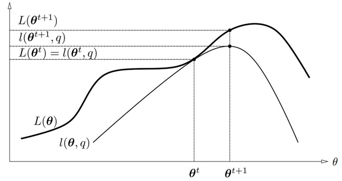

# Model Inference

## Bootstrap and Maximum Likelihood Methods

### Bootstrap

Assume we fit a cubic spline to the data with 3 knots placed at quartiles of a set of $X$ values, which is a 7-dimensional linear space of functions. We represent the function with a linear expansion of B-Splines,

$$ \mu(x) = \sum_{i=1}^7 \beta_jh_j(x) $$

Let $H$ be the $N \times 7$ matrix with $H_{ij} = h_j(x_i)$, the estimate of $\beta$ by minimizing the squared error is given by

$$ \hat{\beta} = (H^TH)^{-1}H^Ty $$

The estimated covariance matrix is

$$ \widehat{\mathrm{Var}}(\hat{\beta}) = (H^TH)^{-1} \hat{\sigma}^2 $$

where we estimate the noise variance by $\hat{\sigma}^2 = \sum_{i=1^N} (y_i - \hat{\mu}(x_i))^2 / N$

The standard error of a prediction $\hat{\mu}(x) = h(x)^T\hat{\beta}$.

$$ \widehat{se}[\hat{\mu}(x)] = [h(x)^T(H^TH)^{-1}h(x)]^{1/2}\hat{\sigma} $$

#### Nonparametric Boostrap

Sample with replacement from the training data to form a bootstrap dataset.

#### Parametric Boostrap

Assume the model errors are Gaussian,

$$ Y = \mu(X) + \epsilon, \quad \epsilon \sim N(0, \sigma^2) $$

For parametric boostrap, we simulate new responses by adding Gaussian noises to the predicted values,

$$ y_i^* = \hat{\mu}(x_i) + \epsilon_i^*, \quad \epsilon_i^* \sim N(0, \hat{\sigma}^2) $$

Repeat this process for some $B$ times, and compute fit for each round. A function estimated from the bootstrap samples $y^*$ is given by

$$ \hat{\mu}^*(x) = h(x)^T (H^TH)^{-1}H^Ty^* $$

and has distribution

$$ \hat{\mu}^*(x) \sim N(\hat{\mu}(x), h(x)^T(H^TH)^{-1}h(x)\hat{\sigma}^2) $$

Note that the mean of the distribution is the least squares estimate, and the standard deviation is the same as the approximated value.

### Maximum Likelihood Inference

It turns out that the parametric bootstrap agrees with least squares in the
previous example because the model has additive Gaussian noises. In general, parametric bootstrap agrees with maximum likelihood (instead of least squares).

#### Recap. Maximum Likelihood Estimation

Assume we have $n$ measurements of $X = \{ x_1,\dots,x_n \}$, and we know the probability distribution function $f(x,a)$ where $a$ is an unknown parameter we aim to estimate.

The maximum likelihood method (MLM) picks an $a$ that maximizes the probability of getting the measurements $X$.

If the measurements are independent, the probability of getting the measurements is given by

$$ L = \prod_{i=1}^n f(x_i; a) $$

The goal is to pick an $a$ that maximizes $L$. For numerical stability and convenience, we usually maximize $\ln L$.

$$ l = \ln L = \sum_{i=1}^n \ln f(x_i; a) $$

We compute $a$ by

$$ \nabla_a l = \sum_{i=1}^n \nabla_a \ln f(x_i; a) = 0 $$

- MLE estimates are usually consistent.
  - For large $n$ the estimates converges to the true value of the parameters.
- MLE estiamtes are usually unbiased.
  - For all sample sizes, the parameters of interest is computed correctly.
- MLE is efficient.
  - The estimate has the smallest variance.
- MLE is sufficient.
  - It uses all the information in the observations.
- The solution for MLE is unique.
- However, we must know the correct probability distribution for the problem at hand, which might not always be the case.

##### MLE for Gaussian

If $a$ is the mean of a Gaussian distribution with variance $\sigma^2$, by MLE we have

$$ a = \frac{1}{n}\sum_{i=1}^n x_i $$

If $\sigma$ is different for each data point, then $a$ is simply the weighted average.

$$ a = \frac{\sum_{i=1}^n \frac{1}{\sigma_i^2}x_i}{\sum_{i=1}^n \frac{1}{\sigma_i^2}} $$

##### MLE for Poisson

If $f(x;a)$ is given by a Poisson distribution

$$ f(x;a) = \frac{\exp(-a)a^x}{x!} $$

The maximizer is again

$$ a = \frac{1}{n}\sum_{i=1}^n x_i $$

#### Maximum Likelihood Inference

Assume we want to maximize the likelihood $g_\theta(z)$ of some observations $z_i$,

$$ L(\theta;Z) = \prod_{i=1}^N g_\theta(z_i) $$

The log-likelihood function is

$$ \ell(\theta; Z) = \sum_{i=1}^N \ell(\theta;z_i) $$

The likelihood function can be used to assess the precision of $\hat{\theta}$, using the **score function**

$$ \dot{\ell}(\theta;Z) = \sum_{i=1}^N \dot{\ell}(\theta;z_i) \quad \dot{\ell}(\theta;z_i) = \frac{\partial l(\theta;z_i)}{\partial \theta} $$

If $L$ is maximized in the interior parameter space, then

$$ \dot{\ell}(\hat{\theta;Z}) = 0 $$

Define the **information matrix**, which is the negative sum of second derivatives

$$ \mathbf{I}(\theta) = -\sum_{i=1}^N \frac{\partial^2 \ell(\theta;z_i)}{\partial \theta \partial \theta^T} $$

The **Fisher Information** (a.k.a. expected information) is given by

$$ \mathbf{i}(\theta) = \mathbb{E}_\theta[\mathbf{I}(\theta)] $$

Assume $\theta_0$ is the true value of the parameter, the **sampling theory** states that the sampling distribution of the MLE estimator approaches

$$ \hat{\theta} \to N(\theta_0, \mathbf{i}(\theta)^{-1}) $$

as $N \to \infty$ when we sample independently from $g_{\theta_0}(z)$.

The sampling distribution of $\hat{\theta}$ could be approximated by

$$ N(\hat{\theta}, \mathbf{i}(\hat{\theta})^{-1}) $$

## Bayes Methods

In the Bayesian method for inference, we specify a sampling model $\mathrm{Pr}(Z|\theta)$ for our data given the parameters, and a prior $\mathrm{Pr}(\theta)$ for the parameters. We compute the posterior

$$ \mathrm{Pr}(\theta|Z) = \frac{\mathrm{Pr}(Z|\theta)\mathrm{Pr}(\theta)}{\int \mathrm{Pr}(Z|\theta)\mathrm{Pr}(\theta)\mathrm{d}\theta} $$

The posterior distribution affords also a predictive distribution of seeing future values $z^{new}$

$$ \mathrm{Pr}(z^{new} | Z) = \int \mathrm{Pr}(z^{new} | \theta)\mathrm{Pr}(\theta|Z)\mathrm{d}\theta $$

In contrast, the MLE method would predict future data on the basis of $\mathrm{Pr}(z^{new}|\theta)$, not accounting for the uncertainty in the parameters.

## The EM Algorithm

The expectation-maximization (EM) algorithm is a popular tool for simplifying difficult maximum likelihood problems. Especially when there are *hidden random variables*.

### Gaussian Mixture Model

The general formulation for a Gaussian Mixture Model (GMM) is

$$ f(x) = \sum_{m=1}^M \alpha_m \phi(x; \mu_m, \Sigma_m) $$

For simplicity, we start from a 2-component GMM. Given $n$ samples, the log-likelihood is

$$ l(y, \theta) = \sum_{i=1}^N \log[\alpha \phi_{\theta_1}(x_i) + (1-\alpha)\phi_{\theta_2}(x_i)] $$

Suppose we were able to observe the latent binary $z$ (which indicates which component a given sample $x$ belong to), we can perform MLE rather easily

$$ L(x,z,\theta) = \sum_{z_i=1}\log[\phi_{\theta_1}(x_i)] + \sum_{z_i=0}\log[\phi_{\theta_2}(x_i)] $$

where

$$ z_i = 1 \Rightarrow x_i \sim \phi_{\theta_1} \quad z_i = 0 \Rightarrow \sim \phi_{\theta_2} $$

Unfortunately, $z$ is usually not observable. Therefore we need new tools for this estimation problem.

### The EM Algorithm in General

Consider the log-likelihood of a discriminative model

$$ \begin{align*}
    L(\theta) &= \log p(y | x; \theta) \\
    &= \sum_z q(z|x,y) \log p(y|x;\theta) \\
    &= \sum_z q(z|x,y) \log \frac{p(y,z|x;\theta)}{p(z|x,y;\theta)} \\
    &= \sum_z q(z|x,y) \log \left[ \frac{p(y,z|x;\theta)}{p(z|x,y;\theta)} \frac{q(z|x,y)}{q(z|x,y)} \right] \\
    &= \sum_z q(z|x,y) \log \frac{p(y,z|x;\theta)}{q(z|x,y)} + \sum_z q(z|x,y) \log \frac{q(z|x,y)}{p(z|x,y;\theta)} \\
    &= l(\theta, q) + \mathrm{KL}[q(z|x,y) \| p(z|x,y;\theta)]
\end{align*} $$

where

- In the second row, we introduce the latent variable $z$ by $\sum_z q(z|x,y)$. Note that this summation equals to $1$ so it does not affect the equation.
- In the third row we use
  $$ \frac{p(y,z|x)}{p(z|x,y)} = \frac{p(y,z,x)}{p(x)}\frac{p(x,y)}{p(y,z,x)} = \frac{p(x,y)}{p(x)} = p(y|x)$$
- In the forth row, we multiply and divide with the same term $q(z|x,y)$.

Note that the KL-Divergence is nonnegative (as a distance metric), and $l$ is a lower bound of $L$.

$$ l(\theta,q) \le L(\theta), \quad l(\theta, q) = L(\theta) \Leftrightarrow q(z|x,y) = p(z|x,y;\theta) $$

#### The E-Step

In the E-Step, we find $q(z|x,y) = p(z|x,y;\theta^{(t)})$ so that $L(\theta^{(t)}) = l(\theta^{(t)}, q)$.

Given model parameters $\theta^{(t)}$ from the $t$-th iteration.

$$ q(z|x,y) = p(z|x,y;\theta^{(t)}) $$

#### The M-Step

In the M-Step, we optimize $l(\theta, q)$ over $\theta$, so that $L(\theta^{(t+1)}) \ge l(\theta^{(t+1)}) \ge L(\theta^{(t)})$.

Since we only care about $\theta$ in the M-Step, we can omit $p(z|x,y;\theta)$ on the demonimator, and the lower bound $l(\theta, q)$ can be written as

$$ Q(\theta; \theta^{(t)}) = \sum_z q(z|x,y) \log p(y, z|x;\theta) $$

We can update $\theta$ by taking its derivative

$$ \nabla_{\theta} Q = \sum_z q(z|x,y) \nabla_{\theta}\log p(y,z|x;\theta) $$

#### EM Algorithm for Generative Model

$$\begin{align*}
   L(\theta) &= \sum_z q(z|x)\log p(x;\theta) \\
   &= \sum_z q(z|x) \log \frac{p(x,z;\theta)}{p(z|x;\theta)} \\
   &= \sum_z q(z|x) \log\left[ \frac{p(x,z;\theta)}{p(z|x;\theta)}\frac{q(z|x)}{q(z|x)} \right]\\
   &= \sum_z q(z|x) \log\frac{p(x,z;\theta)}{q(z|x)} + \sum_z q(z|x) \log\frac{q(z|x)}{p(z|x;\theta)} \\
   &= l(\theta, q) + KL[q(z|x)\| p(z|x;\theta)]

\end{align*}$$

## Markov Chain Monte Carlo

- Given a set of samples, we can fit a distribution on the samples. (E.g., maximum likelihood estimation).
- Having fit a distribution, we can draw samples from it.

The Markov chain Monte Carlo algorithm draws samples from a target distribution $p(x)$ by performing a biased random walk to explore the distribution.

### Metropolis-Hastings Algorithm (Univariate)

1. Initialize
   1. Pick an initial state $x_0$
   2. Set $t=0$
2. Iterate
   1. Randomly generate a candidate state $x'$ according to $g(x'|x_t)$, where $g$ is a pre-defined hyperfunction.
   2. Calculate the acceptance probability $A(x', x_t) = \min\left( 1, \frac{p(x')}{p(x_t)}\frac{g(x_t|x')}{g(x'|x_t)} \right)$
   3. Generate $u \in [0,1]$ uniformly at random.
   4. If $u \le A(x', x_t)$, then we accept $x_{t+1} = x'$. Otherwise we reject the candidate $x_{t+1} = x_t$.
   5. $t=t+1$

### Gibbs Sampling (Multivariate)

Consider a multivariate sampling problem where we want to sample

$$ x = (x_1,\dots,x_d) $$

The idea of the Gibbs sampler is to divide elements in $x$ into two groups and update each group iteratively

1. Initialize
   1. Pick an initial state $x^{(0)}$.
   2. Set $t= 0$.
2. Iterate
   1. $j = \mathrm{mod}(t, d)$.
   2. Generate $x_{j}^{(t+1)}$ according to $p(x_{j}|x_1,\dots,x_{j-1},x_{j+1},\dots,x_d)$.
   3. $x^{(t+1)} = (x^{(t)}_1,\dots,x^{(t+1)}_j,\dots,x^{(t)}_d)$. Note that only one element $x_j$ in $x^{(t+1)}$ is changed.

In the above algorithm, we choose one element as one group, and all other elements as the other group.

## Model Averaging and Stacking

Assume we have $M$ models for predictions

$$ \hat{f}_1(x), \dots, \hat{f}_M(x) $$

and we seek for a set of weights $w = (w_1,\dots,w_M)$ to combine the models, such that the square loss of the aggregated models are minimized

$$ \min_w \mathbb{E}_P\left[ Y - \sum_{m=1}^M w_m\hat{f}_m(x) \right]^2, \quad (x,y) \sim P $$

The solution is given by the population linear regression of $Y$ on

$$ \hat{F}(x)^T = [\hat{f}_1(x), \dots, \hat{f}_M(x)] $$

The optimal $w$ is given by

$$ w = \mathbb{E}_P \left[ \hat{F}(x)\hat{F}(x)^T \right]^{-1}\mathbb{E}_P[\hat{F}(x)Y] $$

For each $m$, the aggregated model can achieve better performance than any of the single model

$$ \mathbb{E}_P \left[ Y - \sum_{m=1}^M w_m\hat{f}_m(x) \right]^2 \le \mathbb{E}_P\left[ Y - \hat{f}_m(x) \right]^2 $$

Since the population linear regression over all $(x,y)\sim P$ is not available, we can use the samples in the training set as an approximation.

However, the optimal $w$ might be biased towards complex models. This could be solved by stacked generalization

$$ w^{st} = \arg\min_w \sum_{i=1}^N \left[ y_i - \sum_{m=1}^M w_m\hat{f}_{m}^{-1}(x_i) \right] $$

where $\hat{f}_m^{-1}$ is the model fitted with the $i$-th data removed (leave-one-out scheme).
