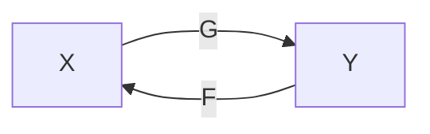

# Domain Adaptation

## Introduction

- The turning point of underfitting and overfitting depends on the difference in the distribution of the training and testing set.

### Data Distribution Mismatch

Denote the source domain (training set) and target domain (testing set) by $s$ and $t$.

The mismatch in source and target domains can be represented by

$$ p^s(x^s, y^s) = p^s(y^s | x^s) p(x^s) \quad \textrm{v.s.} \quad p^s(x^t, y^t) = p^t(y^t | x^t) p(x^t) $$

The differences can thus lie in

1. the marginal distribution $p^s(x^s)$ and $p^t(x^t)$.
2. the posterior distribution $p^t(y^s|x^s)$ and $p^t(y^t|x^t)$.

Most existing work focus on the marginal distribution.

### Domain Adaptation

Tries to adapt the model to the test set to achieve better performance.

- Different domains: different data sources, different devices for capturing data, different camera viewpoints.

## Traditional Methods

- In this section, we assume *Labeled Source Domain + Unlabeled Target Domain*
- **The basic assumption.** At training stage, we have labeled source domain data and unlabeled target domain data.

### Projection to Common Subspace

#### Domain Invariant Projection (DIP)

> Unsupervised domain adaptation by domain invariant projection

- The goal is to find a representation of the data that is invariant across different domains.
  - The classifier trained on such representation should perform well on the target domain.
- Learn a projection matrix $W$ to a low-dimensional subspace where the source domain and target domain are similar.
  - I.e., A projection that minimizes a distance between two distributions.

Let $X_s \in \mathbb{R}^{D \times n_s}, X_t \in \mathbb{R}^{D \times n_t}$, we look for a $W \in \mathbb{R}^{D \times d}$ to minimize

$$ d(W^TX_s, W^TX_t)^2 = \| \frac{1}{n_s} \sum_{i=1}^{n_s} \phi(W^T x_i^s) - \frac{1}{n_t} \sum_{i=1}^{n_t} \phi(W^Tx_i^t) \|^2 = \mathrm{Tr}(K_WL) $$

where

$$ K_w = \begin{bmatrix}
    K_{ss} & K_{st} \\
    K_{ts} & K_{tt}
\end{bmatrix},
\quad L_{ij} = \begin{cases}
    \frac{1}{n_s^2} &\quad i,j \in \mathcal{S} \\
    \frac{1}{n_t^2} &\quad i,j \in \mathcal{T} \\
    -\frac{1}{n_sn_t} &\quad o.w.
\end{cases}
$$

$$ K_{ss} = \phi(X_s)^T\phi(X_s), K_{tt} = \phi(X_t)^T\phi(X_t), K_{st} = \phi(X_s)^T\phi(X_t), K_{ts} = \phi(X_t)^T\phi(X_s) $$

$d$ is also referred to as the **maximum mean discrepancy (MMD)**.

##### DIP Formulation

Using the fact that $d(W^TX_s, W^TX_t)^2 = \mathrm{Tr}(K_W L)$, the optimization problem could be formluated as

$$ \begin{align*}
    \min_W &\quad \mathrm{Tr}(K_WL) \\
    \mathrm{s.t.} &\quad W^TW = I
\end{align*} $$

##### DIP with Class Clustering (DIP-CC)

The oridinary DIP learns $W$ in a purely unsupervised manner. We can further exploit the labeled data of the source domain to learn $W$.

$$ \begin{align*}
    \min_W &\quad \mathrm{Tr}(K_WL) + \lambda \sum_{c=1}^C \sum_{i=1}^{n_c} \| W^T x_{i,c}^s - \mu_c \|^2 \\
    \mathrm{s.t.} &\quad W^TW = I
\end{align*} $$

which adds a class-clustering penalty to encourage the projected data points to be close to the class centroids.

#### Transfer Component Analysis (TCA)

> Domain adaptation via transfer component analysis

- TCA uses the same formulation of $K$ and $L$ as DIP.
- Actually the formulation of $K$ and $L$ come from an earlier work called MMDE[^MMDE]. MMDE directly learns $K$ by minimizing $\mathrm{Tr}(KL) - \lambda \mathrm{Tr}(K)$ subject to some constraints on $K$.
  - This must be solved by an expensive SDP solver, and TCA lightens the computational burden.

[^MMDE]: Transfer Learning via Dimensionality Reduction

Note that $K$ could be decomposed as

$$ K = (KK^{-1/2})^T(KK^{-1/2}) = \tilde{\phi}(X_{st})^T\tilde{\phi}(X_{st}), $$

where $\tilde{\phi}(X_{st}) = KK^{-1/2}$ (a.k.a. the empirical kernel map).

Further introduce a transformation matrix $\tilde{W} \in \mathbb{R}^{(n_s + n_t) \times m}$ that maps $\tilde{\phi}(X_{st})$ into an $m$-dimensional space. The resulting kernel matrix is

$$ \tilde{K} = (KK^{-1/2}\tilde{W})(\tilde{W} K^{-1/2}K) = KWW^TK, $$

where $W = K^{-1/2}\tilde{W}$.

Therefore,

$$ \mathrm{Tr}(\tilde{K}L) = \mathrm{Tr}(KWW^TKL) = \mathrm{Tr}(W^TKLKW), $$

and the optimization problem can be formulated as

$$ \begin{align*}
    \min_W &\quad \mathrm{Tr}(W^TKLKW)\\
    \mathrm{s.t.} &\quad W^TW = I
\end{align*} $$

However, this formulation only *minimizes the distance between the projected distributions*, which could be suboptimal in certain cases. An improved version is given by

$$ \begin{align*}
    \min_W &\quad \mathrm{Tr}(W^TW) + \mathrm{Tr}(W^TKLKW)\\
    \mathrm{s.t.} &\quad W^TKHKW = I
\end{align*} $$

where $H = I - \frac{1}{n_s + n_t} 11^T$.

After obtaining $K$, we can use the new kernel $\tilde{K} = KWW^TK$ to project the features.

##### DIP vs TCA

- DIP applies projection $W$ *before* kernelization.
- TCA applies projection $\tilde{W}$ *after* kernelization.

##### TCA Implementation

Directly solving the optimization problem of TCA involves a non-convex contraintk, but it can be efficiently solved by converting into a eigenvalue decomposition problem.

$W$ can be obtained by eigendecomposing $(KLK + \mu I)^{-1} KHK$ and selecting the $m$ leading eigenvectors.

#### Correlation Alignment (CORAL)

> Return of frustratingly easy domain adaptation

Construct a projection matrix $A$ by aligning the covariance matrices of the projected domains.

Consider a projection matrix $A$. Let $C_s$ and $C_t$ be the covariance matrix of $X_s$ and $X_t$, and let $\hat{C}_s$ be the covariance matrix of $A^TX_s$.

$$ \min_A \quad \| \hat{C}_s - C_t \|^2_F \Rightarrow \min_A \quad \| A^TC_sA - C_t \|^2_F $$

Can be solved by SVD on $C_s$ and $C_t$,

$$ C_s = U_s\Sigma_s U_s^T, \quad C_t = U_t \Sigma_t U_t^T $$

$$ A^* = U_s\Sigma_s^{-1/2}U_s^T U_t[1:r]\Sigma_t[1:t]^{1/2} U_t[1:r]^T, $$

where $r = \min(\mathrm{rank}(C_s),\mathrm{rank}(C_t))$.

After obtaining $A^*$, use $(A^*)^T X_s$ and $X_t$ as features.

##### DIP vs CORAL

- DIP aligns first-order information (mean vector in the kernelized space)
- CORAL aligns second-order information (covariance matrix)

#### Summary on Projection-based Methods

- Projects the source and target domains into a common feature space for alignment across domains.

$$ \min_{W_s, W_t} \quad d(W_s\phi(X_s),W_t\phi(X_t)) $$

When $W_s = W_t$, it is a symmetric projection; when $W_s \neq W_t$, it is an asymmetric projection.

### Interpolation on the Manifold

#### Sampling Geodesic Flow (SGF)

> Domain adaptation for object recognition: An unsupervised approach

- The general idea is to think of $X_s$ and $X_t$ as two points on a manifold.
- Perform domain adaptation by "shifting from the point $X_s$ to $X_t$".
- This is done by selecting a series of points on the *geodesic*[^geodesic] from $X_s$ to $X_t$ on the manifold.
  - Compute a transformation for each two points along the path to move from $X_s$ to $X_t$.

The initial points on the manifold, $\bar{P}_s, \bar{P}_t$, are selected by PCA on $X_s$ and $X_t$. $\bar{P}_s, \bar{P}_t$ contains the pricipal vectors of $X_s, X_t$.

- Assume a function $\Phi(x)$ such that $\Phi(0) = \bar{P}_s$ and $\Phi(1) = \bar{P}_t$. 
- By choosing some $x \in [0, 1]$, we can interpolate between the source and target points (e.g., $\Phi(0.3), \Phi(0.6), \dots$).
  - The points are chosen manually.

The projected features can be obtained by

$$ \hat{X}_s = [\Phi(0)^T; \Phi(0.1)^T; \dots, \Phi(1)^T] X_s $$

$$ \hat{X}_t = [\Phi(0)^T; \Phi(0.1)^T; \dots, \Phi(1)^T] X_t $$

[^geodesic]: 测地线。在平面上两点之间线段最短，但是在一个球面上的两点之间测地线最短。

#### Geodesic Flow Kernel (GFK)

> Geodesic flow kernel for unsupervised domain adaptation

- One drawback of SGF is that the intermediate points need to be manually defined.
- GFK solves this problem by converting the discrete subspace in SGF into a continuous subspace by integral.

$$ Z_{GFK} = [\Phi(0)^T; \Phi(t)^T; \Phi(1)^T], \quad 0 \le t \le 1 $$

- The method is very complicated so the details are omitted.
- $Z_{GFK}$ is a "matrix" with infinite dimensions.
  - However, we do not need to explicitly compute $Z_{GFK}$.

$$ \hat{X}_s = Z_{GFK}X_s \Rightarrow \hat{X}_s^T\hat{X}_s = X_s^T Z_{GFK}^T Z_{GFK} X_s = X_s^T G X_s $$

- We only need to compute $G$.
- This is like the kernel method, where we can map features to "infinite dimensions" without actually computing the mapped feature vector.

### Sample Selection

#### Kernel Mean Matching (KMM)

> Correcting sample selection bias by unlabeled data

- Assign different weights to different source-domain samples.

We associate a weight vector $\beta_i$ for each source-domain samples

$$ \min_{\beta_i} \| \frac{1}{n_s} \sum_{i=1}^{n_s} \beta_i \phi(x_i^s) - \frac{1}{n_t} \sum_{i=1}^{n_t} \phi(x_i^t) \|^2 $$

After computing $\beta_i$, we can then apply $\beta_i$ to *any* classifier. We use SVM as an example,

$$ \begin{align*}
  \min_{w,b,\xi_i} &\quad \frac{1}{2}\|w\|^2 + C\sum_i \beta_i \xi_i \\
  \mathrm{s.t.} &\quad y_i (w^T\phi(x_i) + b) \ge 1 - \xi_i \\
  &\quad \xi_i \ge 0
\end{align*} $$

- **Intuition.** If the source domain sample is closer to the target domain samples, it should be assigned higher weight in the loss function $\beta_i \xi_i$.
- Assigning different weights is equivalent to minimizing the maximum mean discrepancy (MMD) between the weighted source domain center and the target domain center.

#### Selective Transfer Machine (STM)

> Selective transfer machine for personalized facial action unit detection

- An extension of KMM

$$ \begin{align*}
  \min_{w,b,\xi_i,\beta_i} &\quad \frac{1}{2}\|w\|^2 + C\sum_i \beta_i \xi_i + \| \frac{1}{n_s} \sum_{i=1}^{n_s} \beta_i \phi(x_i^s) - \frac{1}{n_t} \sum_{i=1}^{n_t} \phi(x_i^t) \|^2\\
  \mathrm{s.t.} &\quad y_i (w^T\phi(x_i) + b) \ge 1 - \xi_i \\
  &\quad \xi_i \ge 0
\end{align*} $$

- Simply merges the two objectives in KMM into a single objective function.
  - So that the two-step KMM can be simplified into a single step.
- First fix $w$ and update $\beta_i$.
- Then fix $\beta_i$ and update $w$.

#### Domain Adaptation SVM (DASVM)

> Domain adaptation problems: A DASVM classification technique and a circular validation strategy

- **Assumption.** Labeled source domain data + unlabeled target domain data.
- **Intuition.** Progressively train a adapted SVM.
- **Method.** 
  - Train a model on the labeled data.
  - Use the model to label unlabeled target domain data.
  - Use the labeled data to train a new model.
  - Repeat the process.

### Low-Rank Reconstruction

#### Low-rank Representation (LRR)

$$ \begin{align*}
    \min_{Z,E} &\quad \|Z\|_* + \|E\|_{2,1} \\
    \mathrm{s.t.} &\quad X = XZ + E
\end{align*} $$ (LRR)

where $Z$ is a low-rank matrix, and $\|E\|_{2,1}$ means computing $L_2$-norm along the columns, and $L_1$ norm along the rows.

Can be solved by the inexact Augmented Lagrangian Multipliers (ALM)

$$ \begin{align*}
    \min_{Z,E,J} &\quad \|J\|_* + \|E\|_{2,1}\\
    \mathrm{s.t.} &\quad X = XZ + E\\
    &\quad Z = J
\end{align*} $$

- Introduce a new variable $J$, and expect $J$ to be close to $Z$.
- Introduce Lagrangian multipliers $S$, $T$

$$ \mathcal{L} = \|J\|_* + \|E\|_{2,1} + S^T(X-XZ-E) + T^T (Z-J) + \frac{\mu}{2}\|X-XZ-E\|_F^2 + \frac{\mu}{2}\|Z-J\|_F^2 $$

We can break the entire optimization problem into several smaller problems that have standard forms and are easy to solve.

1. while not converged
   1. update $J$ by $J = \arg\min \|J\|_* + \frac{\mu}{2}\| J - (Z + \frac{1}{\mu}T) \|_F^2$
   2. Update $Z$
   3. Update $E$ by $E = \arg\min \|E\|_{2,1} + \frac{\mu}{2}\|E - (X-XZ + \frac{1}{\mu}S) \|_F^2$
   4. Update multipliers
      1. $S = S + \mu(X-XZ-E)$, $T= T + \mu(Z-J)$
   5. Update $\mu = \min(\rho\mu, \max_u)$ where $\mu, \rho$ are hyperparameters
   6. Check convergence condition $\|X-XZ-E\|_{\infty} < \epsilon$, $\|Z-J\|_{\infty} < \epsilon$

The update for $Z$ is straight forward and it has a closed-form solution

$$ \nabla_Z \mathcal{L} = 0 \Rightarrow Z = (I + X^TX)^{-1} (X^TX - X^TE + J + \frac{1}{\mu}(X^TS - T)) $$

The update for $J = \arg\min \|J\|_* + \frac{\mu}{2}\| J - (Z + \frac{1}{\mu}T) \|_F^2$ has a standard form of

$$ \min_F \lambda_1 \|F\|_* + \lambda_2 \|F - G\|_F^2 $$

which can be solved by performing SVD on $G$, $G = U \Sigma V'$. The solution is given by $UD(\Sigma)V'$, where $D(\Sigma)$ is a diagonal matrix with the $i$-th diagonal element being $\delta_i - \frac{\lambda_1}{2\lambda_2}$

The update for $E$ has a standard form of

$$ \min_W \lambda_1 \|W\|_{2,1} + \lambda_2 \|W - Q\|_F^2 $$

Assume the optimal solution is $W^*$, then the $i$-th column is

$$ W^*(:, i) = \begin{cases}
    \frac{\|q_i\|-\lambda}{\|q_i\|}q_i &\quad \lambda < \|q_i\|\\
    0 &\quad o.w.
\end{cases} $$

#### Robust Domain Adaptation with Low-rank Reconstruction (RDALR)

- An extension of LRR.
- Add an extra projection matrix $W$.

$$ \begin{align*}
    \min_{Z,E} &\quad \|Z\|_* + \|E\|_{2,1} \\
    \mathrm{s.t.} &\quad WX_s = X_tZ + E \\
    &\quad WW^T = I
\end{align*} $$

- Intuitively, after projection, the source domain samples could be reconstructed by the target domain samples.

#### Low-rank Transfer Subspace Learning (LTSL)

- A further extension of LRR.

$$ \begin{align*}
    \min_{Z,E} &\quad \|Z\|_* + \|E\|_{2,1} \\
    \mathrm{s.t.} &\quad WX_s = WX_tZ + E \\
    &\quad WW^T = I
\end{align*} $$

- Project source and target domain samples into a common subspace.

## Early Deep-Learning Methods

### Deep Feature + Traditional Methods

- Deep learning feature + SGF.
  - Dlid: Deep learning for domain adaptation by interpolating between domains
- Deep learning feature + GFK/SA.
  - One-shot adaptation of supervised deep convolutional models.

### Deep Network + Traditional Idea

#### "Deep MMD"

> Learning transferable features with deep adaptation networks

- Deep neural network + minimizing MMD.

#### Deep CORAL

> Deep coral: Correlation alignment for deep domain adaptation

- Train model with CORAL loss using source and target domain data.

#### Domain Separation Networks

> Domain separation networks

- Shared encoder across domains + Private encoders for each encoder.
- Shared encoder extract domain-invariant features.
- Private encoders extract domain-specific features.
- Difference Loss. The domain-invariant and -specific features should be different.
- Similarity Loss. The domain-invariant features from source and target domains should be similar.
- Use reconstruction loss on target features and classification loss on source features.

### Batch-Normalization Methods

#### Z-Score Normalization

Normalize each dimension by

$$ \tilde{x}_i = \frac{x_i - \mu_i}{\sigma_i} $$

#### Domain Adaptive Batch Normalization

> Revisiting batch normalization for practical domain adaptation

Use the unlabeled data of target domain to compute mean and variance for batch-normalization.

$$ BN(x_i^t) = \frac{x_t - \mu_t}{\sqrt{\epsilon + \sigma_t^2}} $$

> Autodial: Automatic domain alignment layers

Domain adaptive BN by linear combination.

$$ \mu_{st} = \alpha \mu_s + (1 - \alpha) \mu_t, \quad \mu_{ts} = \alpha \mu_t + (1 - \alpha) \mu_s $$

$$ \sigma_{st} = \alpha \sigma_s + (1 - \alpha) \sigma_t, \quad \sigma_{ts} = \alpha \sigma_t + (1 - \alpha) \sigma_s $$

### Adversarial Learning

- Not only classify labels, but also identify domains.
  - Simultaneous deep transfer across domains and tasks
  - Unsupervised domain adaptation by backpropagation

## GAN Methods

### Paired GAN

GAN networks for paired training data.

#### Pix2Pix

> Image-to-image translation with conditional adversarial networks

- The loss is essentially GAN loss + supervised image generation loss from paired data

$$ \min_G\max_D \mathbb{E}_x[\log D(G(x))] + \mathbb{E}_y [\log(1-D(y))] + \mathbb{E}_{x,y}[\|y - G(x)\|_1] $$

where $x$ is the source domain image and $y$ is the target domain image.

### Unpaired GAN

GAN networks for unpaired training data.

#### CycleGAN

Convert from source domain $X$ to target domain $Y$, and then convert back to source domain $X$.

Note that we actually have two different cycles, $X \to Y \to X$ and $Y \to X \to Y$.
