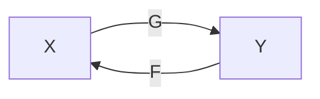

# Domain Adaptation

## Introduction

- The turning point of underfitting and overfitting depends on the difference in the distribution of the training and testing set.

### Data Distribution Mismatch

Denote the source domain (training set) and target domain (testing set) by $s$ and $t$.

The mismatch in source and target domains can be represented by

$$ p^s(x^s, y^s) = p^s(y^s | x^s) p(x^s) \quad \textrm{v.s.} \quad p^s(x^t, y^t) = p^t(y^t | x^t) p(x^t) $$

The differences can thus lie in

1. the marginal distribution $p^s(x^s)$ and $p^t(x^t)$.
2. the posterior distribution $p^s(y^s|x^s)$ and $p^t(y^t|x^t)$.

Most existing work focus on the marginal distribution.

### Domain Adaptation

Tries to adapt the model to the test set to achieve better performance.

- Different domains: different data sources, different devices for capturing data, different camera viewpoints.

## Labeled Source Domain + Unlabeled Target Domain

### Traditional Methods

#### Domain Invariant Projection (DIP)

Learn a projection matrix $W$ to project the samples from the source and target domains.

$$ d(W^TX_s, W^TX_t)^2 = \| \frac{1}{n_s} \sum_{i=1}^{n_s} \phi(W^T x_i^s) - \frac{1}{n_t} \sum_{i=1}^{n_t} \phi(W^Tx_i^t) \| = \mathrm{Tr}(K_WL) $$

where

$$ K_w = \begin{bmatrix}
    K_{ss} & K_{st} \\
    K_{ts} & K_{tt}
\end{bmatrix} $$

### Low-Rank Reconstruction

##### Low-rank Representation (LRR)

$$ \begin{align*}
    \min_{Z,E} &\quad \|Z\|_* + \|E\|_{2,1} \\
    \mathrm{s.t.} &\quad X = XZ + E
\end{align*} $$

where $Z$ is a low-rank matrix, and $\|E\|_{2,1}$ means computing $L_2$-norm along the columns, and $L_1$ norm along the rows.

Can be solved by the inexact Augmented Lagrangian Multipliers (ALM)

$$ \begin{align*}
    \min_{Z,E,J} &\quad \|J\|_* + \|E\|_{2,1}\\
    \mathrm{s.t.} &\quad X = XZ + E\\
    &\quad Z = J
\end{align*} $$

- Introduce a new variable $J$, and expect $J$ to be close to $Z$.
- Introduce Lagrangian multipliers $S$, $T$

$$ \mathcal{L} = \|J\|_* + \|E\|_{2,1} + S^T(X-XZ-E) + T^T (Z-J) + \frac{\mu}{2}\|X-XZ-E\|_F^2 + \frac{\mu}{2}\|Z-J\|_F^2 $$

We can break the entire optimization problem into several smaller problems that have standard forms and are easy to solve.

1. while not converged
   1. update $J$ by $J = \arg\min \|J\|_* + \frac{\mu}{2}\| J - (Z + \frac{1}{\mu}T) \|_F^2$
   2. Update $Z$
   3. Update $E$ by $E = \arg\min \|E\|_{2,1} + \frac{\mu}{2}\|E - (X-XZ + \frac{1}{\mu}S) \|_F^2$
   4. Update multipliers
      1. $S = S + \mu(X-XZ-E)$, $T= T + \mu(Z-J)$
   5. Update $\mu = \min(\rho\mu, \max_u)$ where $\mu, \rho$ are hyperparameters
   6. Check convergence condition $\|X-XZ-E\|_{\infty} < \epsilon$, $\|Z-J\|_{\infty} < \epsilon$

The update for $Z$ is straight forward and it has a closed-form solution

$$ \nabla_Z \mathcal{L} = 0 \Rightarrow Z = (I + X^TX)^{-1} (X^TX - X^TE + J + \frac{1}{\mu}(X^TS - T)) $$

The update for $J = \arg\min \|J\|_* + \frac{\mu}{2}\| J - (Z + \frac{1}{\mu}T) \|_F^2$ has a standard form of

$$ \min_F \lambda_1 \|F\|_* + \lambda_2 \|F - G\|_F^2 $$

which can be solved by performing SVD on $G$, $G = U \Sigma V'$. The solution is given by $UD(\Sigma)V'$, where $D(\Sigma)$ is a diagonal matrix with the $i$-th diagonal element being $\delta_i - \frac{\lambda_1}{2\lambda_2}$

The update for $E$ has a standard form of

$$ \min_W \lambda_1 \|W\|_{2,1} + \lambda_2 \|W - Q\|_F^2 $$

Assume the optimal solution is $W^*$, then the $i$-th column is

$$ W^*(:, i) = \begin{cases}
    \frac{\|q_i\|-\lambda}{\|q_i\|}q_i &\quad \lambda < \|q_i\|\\
    0 &\quad o.w.
\end{cases} $$

#### Robust Domain Adaptation with Low-rank Reconstruction (RDALR)

#### Low-rank Transfer Subspace Learning (LTSL)

### Early Deep-Learning Methods

### GAN Methods

#### Paired GAN

> GAN networks for paired training data.

##### Pix2Pix

> [CVPR 17] Image-to-image translation with conditional adversarial networks

#### Unpaired GAN

> GAN networks for unpaired training data.

##### CycleGAN

Convert from source domain $X$ to target domain $Y$, and then convert back to source domain $X$.

Note that we actually have two different cycles, $X \to Y \to X$ and $Y \to X \to Y$.
